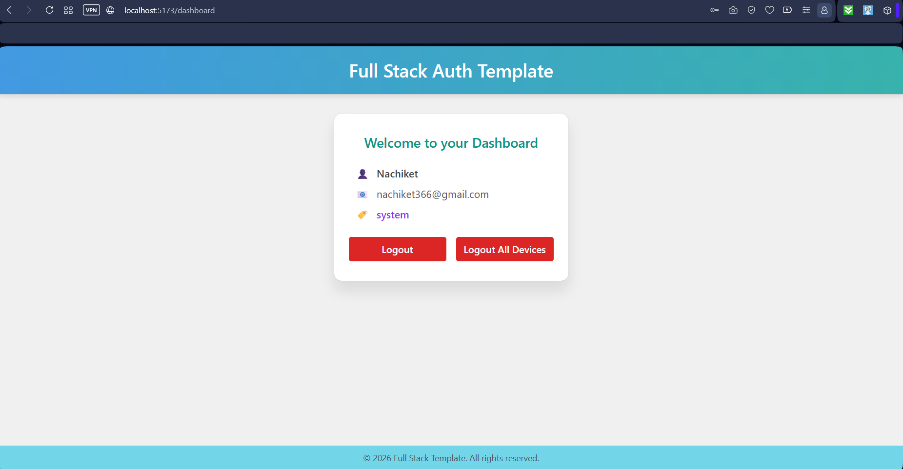

# Full Stack Template


---

## Overview

A scalable full-stack template with a FastAPI backend and a React + TypeScript frontend, built around a unified users table with role-based access control (RBAC). Supports email+password and Google (OAuth2) login, async operations, and JWT authentication with a three-tier role hierarchy: user → admin → system.

---

## 🖼️ Demo / Screenshot

Login page :


---

Signup Page :


---

Verify Account Page :


---

Dashboard Page :



---

## 🛠️ Stack

- **Backend:** FastAPI, SQLAlchemy (async), Alembic migrations
- **Authentication:** Email + Password (with JWT access & refresh tokens), Google OAuth2
- **Frontend:** TypeScript, React + Vite, Chakra UI
- **State Management:** Redux (main app state)
- **Database:** PostgreSQL (async)
- **Caching & Tasks:** Redis + Taskiq (async task queue)
- **Deployment:** Docker

---

## 👥 Role System

This template uses a single `users` table with a mutually exclusive role column. There are three roles arranged in a strict hierarchy:

| Role | Description |
|---|---|
| `user` | Default role assigned on signup. Can manage own profile only. |
| `admin` | Elevated role assigned by system. Can manage all regular users. |
| `system` | Superuser role. Can promote/demote admins and access all routes. Created via CLI only — never via API. |

### Role Hierarchy

```
system  →  full access, manages admins
  ↓
admin   →  manages regular users
  ↓
user    →  manages own profile only
```

---

## 📥 Installation

### 1. Clone the repository

```bash
git clone https://github.com/Nachiket-2024/full_stack_template.git
cd full_stack_template
```

### 2. Set up the environment (only if running locally; skip if using Docker)

> Instructions below assume that you are at the root of the repository while running the commands.

Install backend dependencies:

```bash
cd backend
pip install -r requirements.txt
```

Install frontend dependencies:

```bash
cd frontend
npm install
```

---

## ⚙️ Environment Variables

All environment variables are defined in `.env.example`.
Copy it to `.env` and update the values with your own credentials:

```bash
cp .env.example .env
```

---

## 🚀 Run the App

> Instructions below assume that you are at the root of the repository while running the commands.

> Configure your Google Cloud project and enable the OAuth API before use.

### Path 1. Docker (Recommended)

```bash
docker compose up
```

Once the services are running:

- **Backend:** [http://localhost:8000/docs](http://localhost:8000/docs) – FastAPI API docs and endpoints
- **Frontend:** [http://localhost:5173](http://localhost:5173) – React + Vite frontend
- **PostgreSQL:** `localhost:5432` – Database ready for connections
- **Redis:** `localhost:6379` – Cache and Taskiq broker
- **Taskiq worker:** Automatically listens for async tasks and queues
- **Alembic migrations:** Run automatically on container startup, ensures DB schema is up to date

---

### Path 2. Running Locally

> Make sure PostgreSQL is running locally and the database exists.
> Redis can be run locally or via Docker.

#### 1. Run Alembic Migrations

```bash
cd backend
alembic upgrade head
```

#### 2. Start the FastAPI backend

```bash
uvicorn backend.app.main:app --reload
```

- **Backend:** [http://localhost:8000/docs](http://localhost:8000/docs)
- **PostgreSQL:** `localhost:5432`
- **Redis:** `localhost:6379`

#### 3. Start the Taskiq Worker

```bash
taskiq worker backend.app.taskiq_tasks.email_tasks:broker --reload
```

#### 4. Run the React frontend

```bash
cd frontend
npm run dev
```

- **Frontend:** [http://localhost:5173](http://localhost:5173)

---

## 🔑 First-Time Setup — Creating the System Superuser

After starting the app for the first time, you need to create the system superuser. This is a one-time step that bootstraps the role hierarchy.

### Docker

```bash
docker exec -it backend python -m app.scripts.create_system_user
```

### Local

```bash
cd backend
python -m app.scripts.create_system_user
```

You will be prompted to enter a name, email, and password interactively:

```
--- System Superuser Creation ---
Enter system user name: Your Name
Enter system user email: you@example.com
Enter system user password:

System user 'you@example.com' created successfully.
```

This only needs to be run once. The system user persists in the database volume.

---

## 🔐 Auth Flow

| Feature | Details |
|---|---|
| Signup | Creates a `user` role account, sends email verification |
| Email Verification | Single-use JWT token stored in Redis |
| Login | Returns JWT access + refresh tokens as HTTP-only cookies |
| Google OAuth2 | Creates or logs in user, skips email verification |
| Token Refresh | Rotates refresh token, issues new access token |
| Logout | Revokes refresh token from Redis, clears cookies |
| Logout All | Revokes all refresh tokens for user across all devices |
| Password Reset | Single-use JWT token sent via email |

---

## 🛡️ Security Features

- JWT access and refresh tokens stored as HTTP-only cookies
- Refresh token rotation on every use
- Token revocation via Redis blacklist
- IP-based rate limiting on all auth endpoints
- Brute-force protection with account lockout via Redis
- Email verification required before login
- Password strength validation on reset
- System user protected from deletion and role changes via API

---

## 📝 Notes

- All credentials and secrets are loaded from `.env`
- **Alembic** is used for database migrations
- **Redis + Taskiq** are used for async tasks and caching
- OAuth2 setup requires Google credentials
- JWT access and refresh tokens are handled in the auth folder with modular files for clarity
- Redux manages global app state
- **Type Safety:** Full TypeScript support across frontend (components, hooks, Redux store)
- The system user can only be created via CLI — it is never exposed through any API endpoint

---

## 📄 License

This project is licensed under the MIT License - see the [LICENSE](LICENSE) file for details.