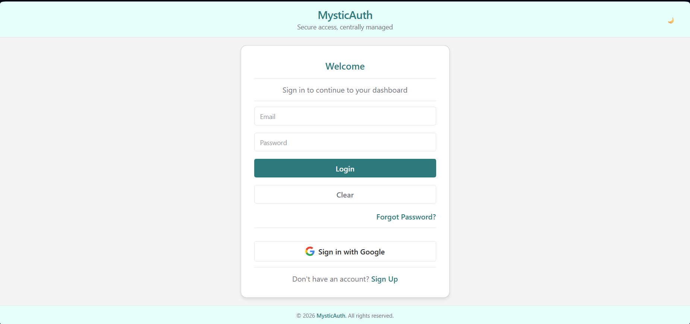
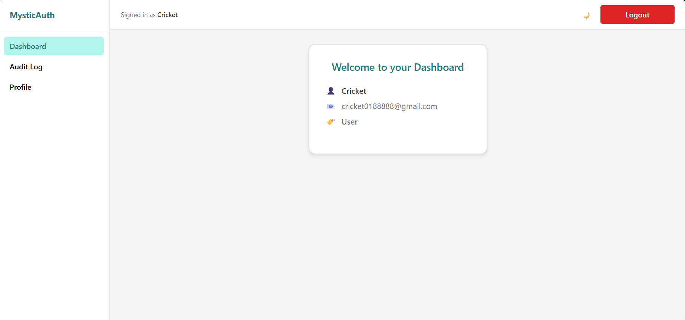
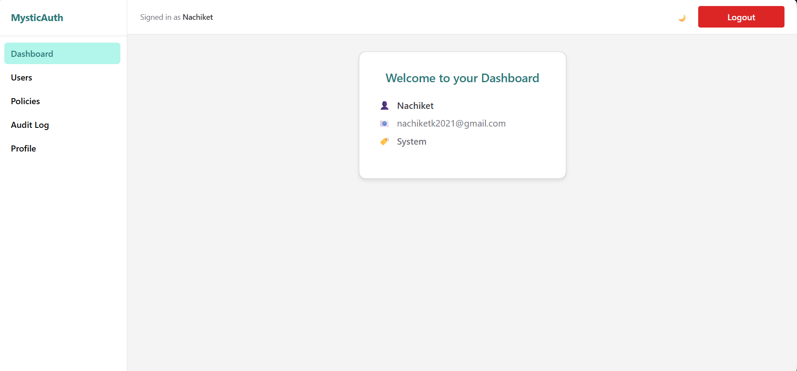
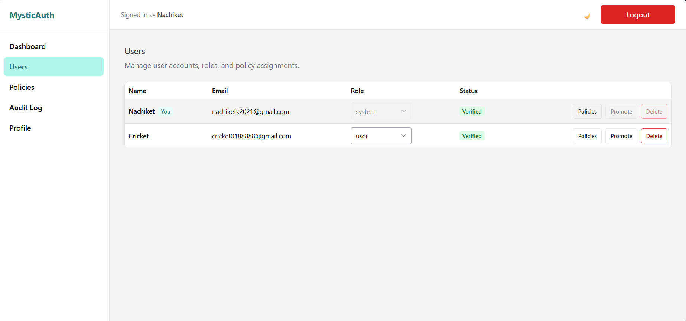
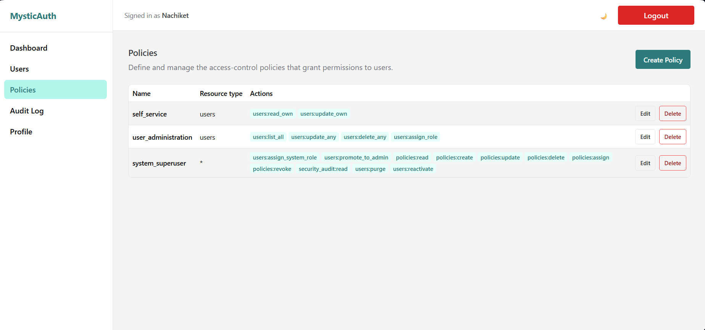
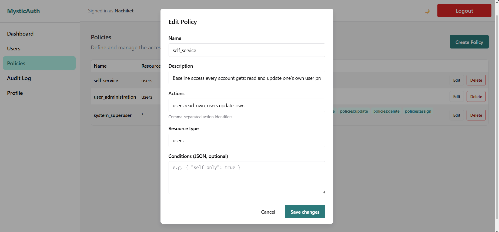
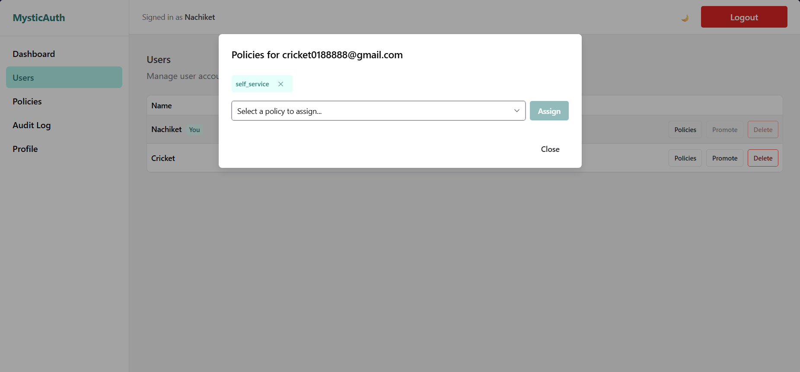
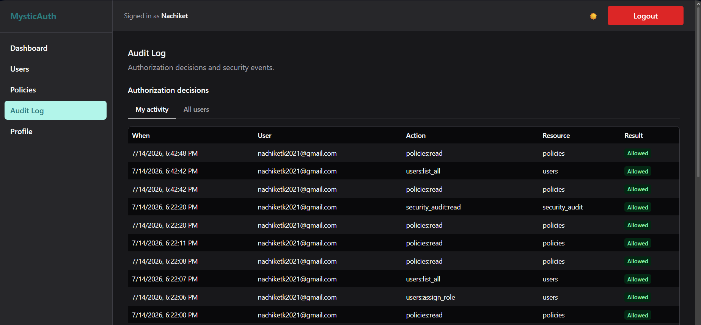

# MysticAuth


---

## Overview

A reusable full-stack identity and access management template with authentication, OAuth2/PKCE integration, fine-grained Policy-Based Access Control (PBAC), and self-hosted error monitoring — all enabled by default. Every access decision is made by an assigned, active `Policy`; a user's `role` column is display/grouping metadata only and is never consulted when deciding what someone can do. Supports email+password and Google OAuth2 (with PKCE) login, fully async operations, and JWT authentication delivered as httpOnly cookies.

The product name shown in the UI and emails is configurable via the `APP_NAME` / `VITE_APP_NAME` environment variables, not hardcoded.

See [`docs/mystic_auth/README.md`](docs/mystic_auth/README.md) for the full documentation set — architecture, authentication, authorization, database, API reference, background workers, security, testing, Docker, CI/CD, and deployment — and [`docs/mystic_auth/template-usage.md`](docs/mystic_auth/template-usage.md) for how to clone and customize this repo as a starting point for your own project.

### Why this exists

This started as the same authentication/authorization foundation getting rebuilt from scratch for every startup take-home assignment that needed some combination of auth, OAuth2, and roles. It grew from a planned "small reusable module" into a full exploration of what auth actually involves — refresh rotation, rate limiting, background email delivery, and a real test suite — as each rebuild kept surfacing another problem worth solving properly instead of again. See [Project Story](docs/mystic_auth/project-story/README.md) for the full history.

---

## Screenshots

### Login



---

### User Dashboard (Normal User)



---

### System User Dashboard



---

### User Management



---

### Policy Management



---

### Edit Policy (PBAC)



---

### Assign Policies



---

### Audit Logs (Dark Mode)



---

## 🛠️ Stack

- **Backend:** FastAPI (fully async), SQLAlchemy 2.0 (async, `asyncpg`), Alembic migrations
- **Authentication:** Email + Password (Argon2 hashing, JWT access & refresh tokens), Google OAuth2 with PKCE
- **Authorization:** Policy-Based Access Control (PBAC) — see [PBAC Architecture](docs/mystic_auth/authorization/architecture.md)
- **Frontend:** TypeScript, React 19 + Vite, Chakra UI v3
- **State Management:** Zustand (client/session state) + TanStack Query (server state/caching)
- **Database:** PostgreSQL (async)
- **Caching & Tasks:** Redis + Taskiq (async background email delivery)
- **Error Monitoring:** Self-hosted Bugsink, enabled by default — starts with `docker compose up` alongside everything else, no extra setup
- **Deployment:** Docker (dev and production Compose files)

---

## 🔐 Authentication & Authorization

- **Authentication** answers *who is calling* — email+password or Google OAuth2/PKCE, JWT access+refresh token pair delivered as httpOnly, secure, `SameSite=Strict` cookies. See [Authentication Overview](docs/mystic_auth/authentication/overview.md) and [OAuth2 / PKCE](docs/mystic_auth/authentication/oauth2-pkce.md).
- **Authorization** answers *what they're allowed to do* — every protected route depends on `require_authorization(action, resource_type)`, which checks the caller's assigned, active `Policy` rows (optionally condition-gated by time, network, ownership, and more). Nothing above that layer ever reads `role` to make an access decision. See [PBAC Architecture](docs/mystic_auth/authorization/architecture.md).
- New accounts (signup or first-time OAuth2 login) are granted access via an explicit `self_service` policy assignment, not a default role.
- `role` (`user` / `admin` / `system`) still exists on the `users` table as display/grouping metadata, and the reserved `system` account is excluded from OAuth2 login and from generic admin routes as a resource-protection invariant — but no route decides access by comparing `role`.

---

## 📥 Installation

### 1. Create your own repository from this template

Click **[Use this template](https://github.com/Nachiket-2024/mystic-auth/generate)** on GitHub (or the green "Use this template" button at the top of the repo page) to create your own repository with a copy of this codebase — no shared git history, no fork relationship, just your own fresh repo to build on. Then clone *your* new repository:

```bash
git clone https://github.com/<your-username>/<your-repo>.git
cd <your-repo>
```

See [Using This Repository as a Template](docs/mystic_auth/template-usage.md) for how to pull in future updates from this original template afterward.

### 2. Set up the environment (only if running locally; skip if using Docker)

> Instructions below assume that you are at the root of the repository while running the commands.

Install backend dependencies:

```bash
pip install -r backend/requirements.txt
```

Install frontend dependencies:

```bash
npm install --prefix frontend
```

---

## ⚙️ Environment Variables

All environment variables are defined in `.env.example`, prefilled with working (obviously-fake) values so the stack boots as-is — copy it and go:

```bash
cp .env.example .env
```

`SECRET_KEY`, `POSTGRES_*`, and the Bugsink secret key/admin login are all filled with `change_me_in_production`-style placeholders that pass validation and just work for local dev — swap them for real values before deploying anywhere real (see [Security Decisions](docs/mystic_auth/security/decisions.md)). Only Google OAuth2 and email credentials genuinely need your own values — see below.

`frontend/.env.example` also exists, but only matters if you run the frontend locally with `npm run dev` instead of Docker — under `docker compose up`, the frontend reads the root `.env`'s `VITE_*` values directly, so `frontend/.env` can be skipped.

---

## 🚀 Run the App

> Instructions below assume that you are at the root of the repository while running the commands.

> Configure your Google Cloud project and enable the OAuth API before use (see [OAuth2 / PKCE](docs/mystic_auth/authentication/oauth2-pkce.md) for the exact `GOOGLE_REDIRECT_URI` requirement).

### Path 1. Docker (Recommended)

```bash
docker compose up
```

Once the services are running:

- **Backend:** [http://localhost:8000/docs](http://localhost:8000/docs) – FastAPI API docs and endpoints
- **Frontend:** [http://localhost:5173](http://localhost:5173) – React + Vite frontend
- **PostgreSQL:** `localhost:5433` – Database ready for connections (non-default host port; containers reach it at `postgres:5432` internally)
- **Redis:** `localhost:6380` – Cache, rate limiting, and Taskiq broker (non-default host port; containers reach it at `redis:6379` internally)
- **Taskiq worker:** Automatically listens for async tasks (email sending)
- **Alembic migrations:** Run automatically on stack startup via the dedicated `alembic` service (`alembic upgrade head`); in production Compose, `backend`/`taskiq_worker` also wait for it to complete before starting (see [Docker Overview](docs/mystic_auth/docker/overview.md))

See [Docker Overview](docs/mystic_auth/docker/overview.md) for the full service breakdown and [Deployment Guide](docs/mystic_auth/deployment/guide.md) for production Compose usage and free/low-cost hosting options.

---

**Self-hosted error monitoring (Bugsink) is part of the command above** — `docker compose up` starts it by default alongside every other service. The `bugsink-seed` service then creates a "MysticAuth" project automatically and wires its DSN into `backend`/`frontend` for you — no manual project/DSN setup needed. See [Error Monitoring](docs/mystic_auth/error-monitoring/overview.md) for the full walkthrough.

---

### Path 2. Running Locally

> Make sure PostgreSQL is running locally and the database exists.
> Redis can be run locally or via Docker.

#### 1. Run Alembic Migrations

```bash
alembic -c backend/alembic.ini upgrade head
```

#### 2. Start the FastAPI backend

```bash
uvicorn backend.app.main:app --reload
```

- **Backend:** [http://localhost:8000/docs](http://localhost:8000/docs)
- **PostgreSQL:** `localhost:5432`
- **Redis:** `localhost:6379`

#### 3. Start the Taskiq Worker

```bash
PYTHONPATH=backend taskiq worker mystic_auth.taskiq_tasks.email_tasks:broker --reload
```

#### 4. Run the React frontend

```bash
npm run dev --prefix frontend
```

- **Frontend:** [http://localhost:5173](http://localhost:5173)

**Self-hosted error monitoring (Bugsink)** still runs via Docker even in this local-run path — there's no bare-metal Bugsink install documented, since it's a single lightweight container:

```bash
docker compose up -d bugsink bugsink-seed
```

`bugsink-seed` still creates the "MysticAuth" project automatically here, but can't wire the DSN into your backend for you the way it does for the fully-Dockerized path above — your backend isn't a container it can reach with a shared volume. Check `bugsink-seed`'s logs (`docker compose logs bugsink-seed`) for the DSN it printed, and set `SENTRY_DSN` in `.env` yourself using `http://<key>@localhost:8010/<id>` (same host Bugsink's UI gives you) rather than the `bugsink:8000` internal form. See [Error Monitoring](docs/mystic_auth/error-monitoring/overview.md) for the full setup.

---

## 🔑 First-Time Setup — Creating the System Superuser

After starting the app for the first time, create the reserved system account — a one-time step that seeds the account holding the `system_superuser` policy (see [PBAC Policy Examples](docs/mystic_auth/authorization/policy-examples.md)).

### Docker

```bash
docker compose exec -it backend python -m mystic_auth.scripts.create_system_user
```

### Local

```bash
PYTHONPATH=backend python -m mystic_auth.scripts.create_system_user
```

You will be prompted to enter a name, email, and password interactively:

```
--- System Superuser Creation ---
Enter system user name: Your Name
Enter system user email: you@example.com
Enter system user password:

System user 'you@example.com' created successfully.
```

This only needs to be run once. The system user persists in the database volume. It can never be created, modified, or promoted via any API endpoint — CLI only.

---

## 🔐 Auth Flow

| Feature | Details |
|---|---|
| Signup | Creates an account and assigns the baseline `self_service` policy; sends an email verification link |
| Email Verification | Single-use, Redis-backed token |
| Login | Timing-attack-resistant password check; returns JWT access + refresh tokens as httpOnly cookies |
| Google OAuth2 (PKCE) | Creates or logs in a user; Google's own email verification is trusted, so no separate verification step is needed |
| Token Refresh | Rotates the refresh token; reuse of an already-rotated token revokes every session for that account |
| Logout | Revokes the current refresh token, clears cookies |
| Logout All | Revokes every refresh token for the account, across every device |
| Forgot Password | User requests a reset link via email (same generic response whether or not the email is registered) |
| Reset Password | User redeems the link, sets a new password (strength-validated, can't reuse the current password), and every other session is logged out |

See [Authentication Overview](docs/mystic_auth/authentication/overview.md) for the full mechanics of each flow.

---

## 🛡️ Security Features

- Policy-Based Access Control — every action is gated by an assigned policy, never by `role`
- JWT access and refresh tokens stored as httpOnly, secure, `SameSite=Strict` cookies
- Refresh token rotation with reuse detection (a replayed token revokes every session for that account)
- Dual rate limiting (per-IP and per-account) plus a separate brute-force lockout on login
- Timing-attack-resistant login/signup/password-reset paths
- Email verification required before password-based login
- Password strength validation on signup and password reset, with same-password reuse prevention
- Security response headers (CSP, HSTS, X-Frame-Options, etc.) on every response
- Trusted-proxy-aware IP resolution (`TRUSTED_PROXY_IPS`) for rate limiting, lockout, and audit logging behind a reverse proxy
- `SECRET_KEY` minimum-length enforcement at startup
- Two independent audit logs: a security/session-event log and a PBAC decision log — see [Database Design](docs/mystic_auth/database/design.md#why-two-audit-tables-not-one)
- System user protected from deletion, role changes, and OAuth2 login via API — CLI-only creation
- Error monitoring (backend + frontend), enabled by default via self-hosted Bugsink so error data — which can carry PII — never has to leave your own infrastructure — see [Error Monitoring](docs/mystic_auth/error-monitoring/overview.md)

See [Security Hardening](docs/mystic_auth/security/hardening.md) and [Security Decisions](docs/mystic_auth/security/decisions.md) for the full detail and rationale, and [Known Issues & Concerns](docs/mystic_auth/concerns/README.md) for what's tracked as still outstanding.

---

## 📝 Notes

- All credentials and secrets are loaded from `.env`
- **Alembic** is used for database migrations
- **Redis + Taskiq** are used for async email delivery, caching, and rate limiting
- OAuth2 setup requires Google Cloud credentials
- **Zustand** manages client-side session state; **TanStack Query** manages all server-state caching
- **Type Safety:** Full TypeScript support across the frontend (feature modules, store, `sdk.ts`)
- The system user can only be created via CLI — it is never exposed through any API endpoint
- **Bugsink** (self-hosted error monitoring) starts by default with everything else — no separate account or setup step needed

---

## 📚 Documentation

Full documentation lives in [`docs/mystic_auth/`](docs/mystic_auth/README.md), organized by feature/domain. If you're building your own project on top of this template, your own docs go in `docs/app/` instead, the same way your own code goes in `backend/app/`/`frontend/src/app/` — see [Using This Repository as a Template: the `app/` + `mystic_auth/` split](docs/mystic_auth/template-usage.md#the-app--mystic_auth-split), and `scripts/sync-upstream.sh` for pulling in template updates on demand.

- [Architecture](docs/mystic_auth/README.md#architecture) (system overview, backend, frontend)
- [Authentication](docs/mystic_auth/README.md#authentication) & [OAuth2/PKCE](docs/mystic_auth/authentication/oauth2-pkce.md)
- [Authorization (PBAC)](docs/mystic_auth/README.md#authorization-pbac)
- [Database Design](docs/mystic_auth/database/design.md)
- [API Reference](docs/mystic_auth/api/reference.md)
- [Background Workers](docs/mystic_auth/background-workers/taskiq.md)
- [Security](docs/mystic_auth/README.md#security)
- [Error Monitoring](docs/mystic_auth/error-monitoring/overview.md)
- [Testing](docs/mystic_auth/testing/overview.md)
- [Docker](docs/mystic_auth/docker/overview.md)
- [CI/CD](docs/mystic_auth/cicd/overview.md)
- [Deployment](docs/mystic_auth/deployment/guide.md)
- [Known Issues & Concerns](docs/mystic_auth/concerns/README.md)

---

## 🙋 Getting Help & Contributing

This is an open-source template — issues and pull requests are welcome:

- Check the [documentation](docs/mystic_auth/README.md) first, especially [Known Issues & Concerns](docs/mystic_auth/concerns/README.md) and [PBAC Troubleshooting](docs/mystic_auth/authorization/troubleshooting.md), since your question may already be answered there.
- Search [existing GitHub Issues](https://github.com/Nachiket-2024/mystic-auth/issues) before opening a new one.
- If you've found a bug, open a new Issue with clear reproduction steps (what you ran, what you expected, what happened instead).
- **Found a security vulnerability?** Don't open a public Issue for it — see [SECURITY.md](SECURITY.md) for how to report it privately.
- Fixes and improvements are welcome as Pull Requests.

---

## 📄 License

This project is licensed under the MIT License - see the [LICENSE](LICENSE) file for details.
