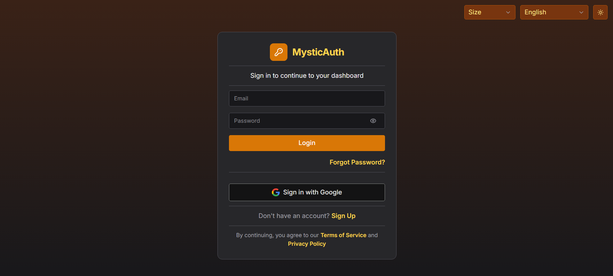
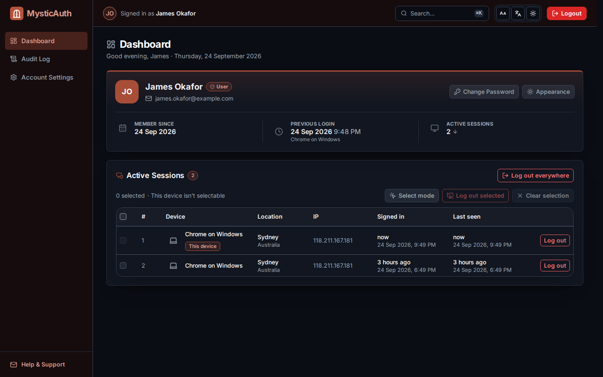
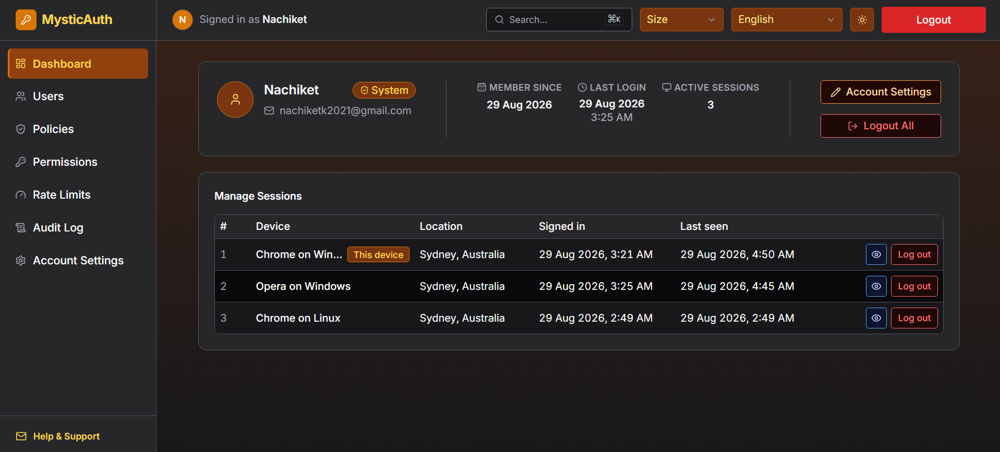
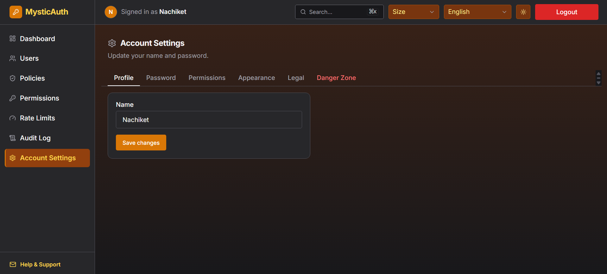
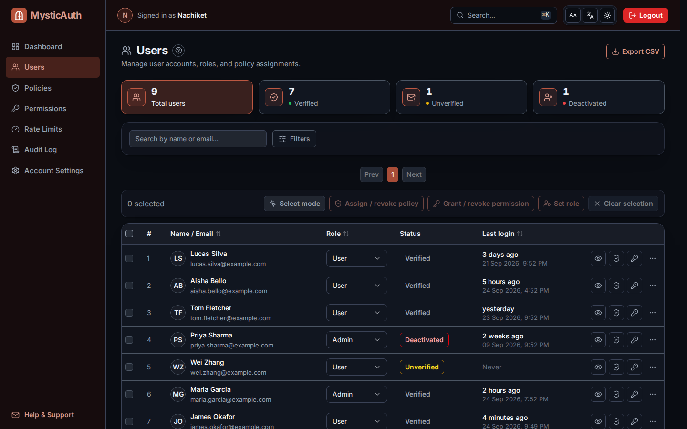
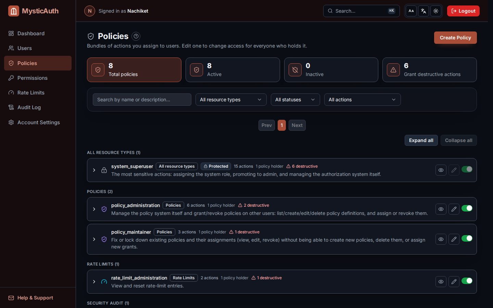
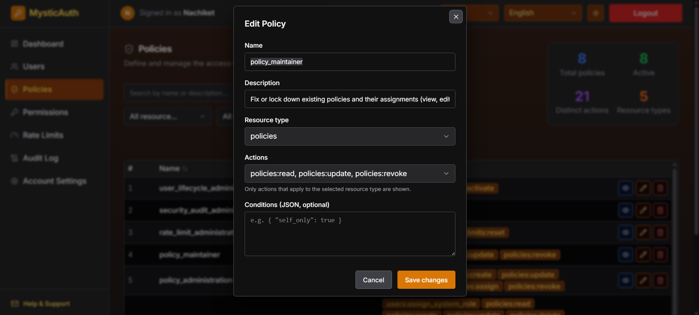
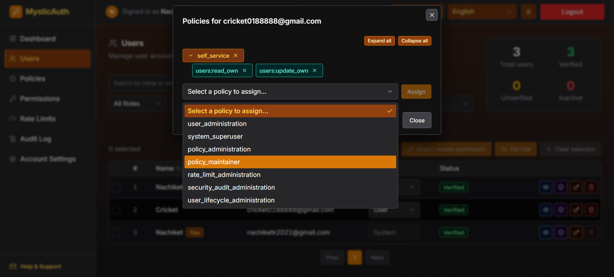
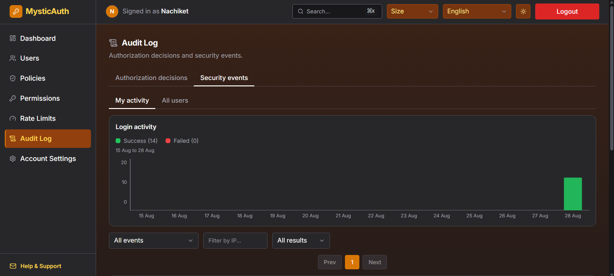
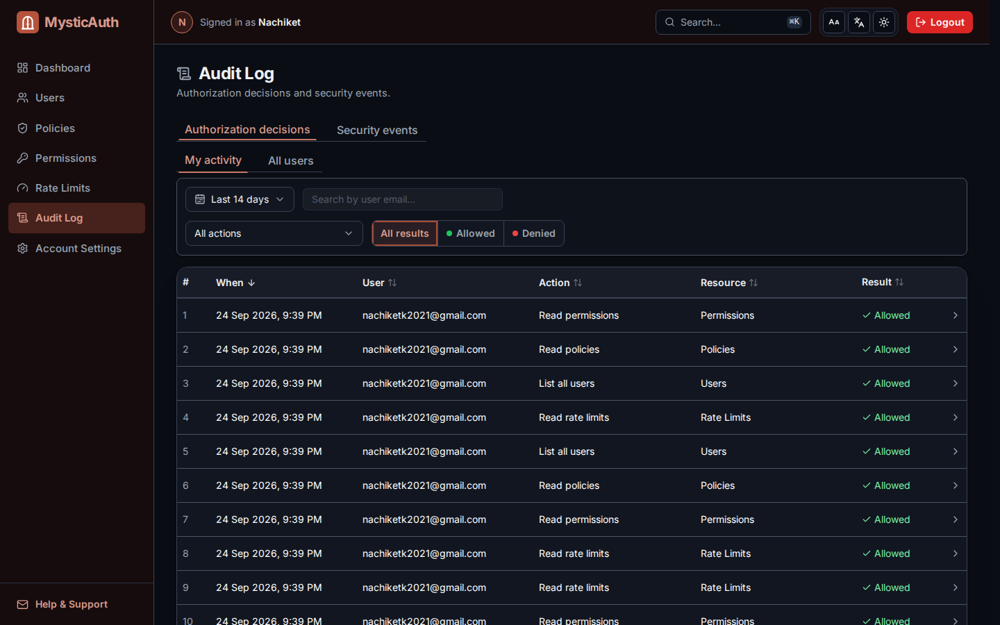

# MysticAuth


---

## Overview

A reusable full-stack identity and access management template with authentication, OAuth2/PKCE integration, fine-grained Policy-Based Access Control (PBAC), and self-hosted error monitoring, all enabled by default. Every access decision is made by an assigned, active `Policy`. A user's `role` column is display and grouping metadata only, and is never consulted when deciding what someone can do. Supports email and password login, Google OAuth2 with PKCE, fully async operations, and JWT authentication delivered as httpOnly cookies.

The product name shown in the UI and emails is configurable via the `APP_NAME` / `VITE_APP_NAME` environment variables, not hardcoded.

See [`docs/mystic_auth/README.md`](docs/mystic_auth/README.md) for the full documentation set: architecture, authentication, authorization, database, API reference, background workers, security, testing, Docker, CI/CD, and deployment. See [`docs/mystic_auth/template-usage/overview.md`](docs/mystic_auth/template-usage/overview.md) for how to clone and customize this repo as a starting point for your own project.

---

### Why this exists

This started as the same authentication and authorization foundation getting
rebuilt for startup take-home assignments that needed auth, OAuth2, and roles.
It grew from a planned small reusable module into a fuller auth template with
refresh rotation, rate limiting, background email delivery, and a real test
suite. See [Project Story](docs/mystic_auth/project-story/README.md) for the
full history.

---

## Screenshots

The screenshots below follow the path a user or administrator would normally
take through the app: sign in, review their own dashboard and account, then
move into system administration, policy management, and audit review.

### 1. Sign In



---

### 2. Standard User Dashboard (limited sidebar)



---

### 3. System Superuser Dashboard (full sidebar)



---

### 4. Account Settings



---

### 5. User Management



---

### 6. Policy Management



---

### 7. Edit Policy



---

### 8. Assign Policies



---

### 9. Security Events



---

### 10. Audit Logs



---

## Stack

- **Backend:** FastAPI (fully async), SQLAlchemy 2.0 (async, `asyncpg`), Alembic migrations
- **Authentication:** Email + Password (Argon2 hashing, JWT access & refresh tokens), Google OAuth2 with PKCE
- **Authorization:** Policy-Based Access Control (PBAC). See
  [PBAC Architecture](docs/mystic_auth/authorization/architecture.md)
- **Frontend:** TypeScript, React 19 + Vite, Chakra UI v3
- **State Management:** Zustand (client/session state) + TanStack Query (server state/caching)
- **Database:** PostgreSQL (async)
- **Caching & Tasks:** Redis + Taskiq for async email delivery, caching, rate limiting, and token state
- **Error Monitoring:** Self-hosted Bugsink, enabled by default with the stack
- **Deployment:** Docker with dev, self-hosted local-prod through Cloudflare Tunnel, and prod on your own server through Caddy

---

## Authentication & Authorization

- **Authentication** answers *who is calling*. It supports email/password and
  Google OAuth2 with PKCE. JWT access and refresh tokens are delivered as
  httpOnly, secure, `SameSite=Strict` cookies. See
  [Authentication Overview](docs/mystic_auth/authentication/overview.md) and
  [OAuth2 / PKCE](docs/mystic_auth/authentication/oauth2-pkce.md).
- **Authorization** answers *what the caller may do*. Protected routes call
  `require_authorization(action, resource_type)`, which evaluates the caller's
  active `Policy` rows with optional conditions such as time, network, and
  ownership. Routes do not use `role` for access decisions. See
  [PBAC Architecture](docs/mystic_auth/authorization/architecture.md). For
  role-like permission groups without per-resource conditions, use the same
  policies without conditions. See
  [RBAC Quickstart](docs/mystic_auth/authorization/rbac-quickstart.md).
- New accounts receive access through an explicit `self_service` policy
  assignment, not a default role.
- `role` (`user` / `admin` / `system`) remains on `users` as display and
  grouping metadata. The reserved `system` account is excluded from OAuth2
  login and generic admin routes, but no route grants access by comparing
  `role`.

---

## Installation

### 1. Create your own repository from this template

Click **[Use this template](https://github.com/Nachiket-2024/mystic-auth/generate)** on GitHub, or the green "Use this template" button at the top of the repo page. This creates your own repository with a copy of this codebase, no shared git history, and no fork relationship. Then clone *your* new repository:

```bash
git clone https://github.com/<your-username>/<your-repo>.git
cd <your-repo>
```

See [Using This Repository as a Template](docs/mystic_auth/template-usage/overview.md) for how to pull in future updates from this original template afterward.

### 2. Set up the environment if running locally (Skip if using Docker)

> Instructions below assume that you are at the root of the repository while running the commands.

Install backend dependencies:

```bash
pip install -r backend/requirements.txt
```

Install frontend dependencies:

```bash
npm install --prefix frontend
```

---

## Environment Variables

Choose the env template that matches the Compose file you are running:

| Mode | Copy | Compose file | Use case |
|---|---|---|---|
| Dev | `.env.example` | `docker-compose.yml` | Local development with hot reload |
| Local-prod | `.env.local-prod.example` | `docker-compose.local-prod.yml` | Self-hosting through Cloudflare Tunnel |
| Prod | `.env.prod.example` | `docker-compose.prod.yml` | Self-hosting on your own server |

For local development, copy `.env.example`:

```bash
cp .env.example .env
```

`SECRET_KEY`, `POSTGRES_*`, and the Bugsink secret key/admin login are all filled with `change_me_in_production`-style placeholders that pass validation and are enough for local infrastructure. Swap them for real values before deploying anywhere real (see [Security Decisions](docs/mystic_auth/security/decisions.md)). The containers can boot without real Google or SMTP values. The CLI-created system superuser can still sign in and view the dashboard because the script marks it verified. Regular users need one verification path: SMTP email delivery for password signup, or Google OAuth2 with your own `GOOGLE_CLIENT_ID`, `GOOGLE_CLIENT_SECRET`, and redirect URI.

`frontend/.env.example` also exists, but only matters if you run the frontend locally with `npm run dev` instead of Docker. Running the stack via Docker, the frontend reads the root `.env`'s `VITE_*` values directly, so `frontend/.env` can be skipped.

`.env.local-prod.example` is for self-hosting with Cloudflare Tunnel and no
server. `.env.prod.example` is for your own server with a public IP, where this
Compose stack owns TLS through Caddy. See
[Choosing the right env template](docs/mystic_auth/deployment/guide.md#choosing-the-right-env-template)
before switching modes.

---

## Run the App

> Instructions below assume that you are at the root of the repository while running the commands.

> Configure your Google Cloud project and enable the OAuth API before using Google login (see [OAuth2 / PKCE](docs/mystic_auth/authentication/oauth2-pkce.md) for the exact `GOOGLE_REDIRECT_URI` requirement). This is separate from the CLI-created system superuser path.

### Path 1. Docker (Recommended)

Use the helper for your shell:

```bash
# Git Bash, WSL, Linux, macOS
./scripts/docker/dev-up.sh
```

```powershell
# PowerShell
.\scripts\docker\dev-up.ps1
```

```bat
rem Command Prompt
scripts\docker\dev-up.cmd
```

The helper starts every service, restarts `backend`, `taskiq_worker`, and
`taskiq_scheduler` so their startup banners are fresh, waits for health checks, prints a
one-line-per-service status table, and tails fresh logs from `backend`,
`frontend`, `taskiq_worker`, and `taskiq_scheduler`.

The focused tail includes Uvicorn startup lines, Taskiq's "Listening started"
line, API calls, the frontend dev server, and async email task execution. It
does not replay old logs from earlier runs, and it keeps Postgres, Redis,
Bugsink, Alembic, and Bugsink health-check noise out of the default view.
Backend exceptions still go to Bugsink at
[http://localhost:8010](http://localhost:8010). See
[Docker Overview](docs/mystic_auth/docker/overview.md#day-to-day-dev-up-helpers)
for failure handling.

Want every service's full logs interleaved in one stream instead (e.g.
debugging Postgres/Bugsink/Taskiq startup itself)? Plain `docker compose up`
still does exactly that:

```bash
docker compose up
```

Once the services are running:

- **Backend:** [http://localhost:8000/docs](http://localhost:8000/docs), FastAPI API docs and endpoints
- **Frontend:** [http://localhost:5173](http://localhost:5173), React + Vite frontend
- **PostgreSQL:** `localhost:5433`, database ready for connections. Containers reach it at `postgres:5432` internally
- **Redis:** `localhost:6380`, cache, rate limiting, and Taskiq broker. Containers reach it at `redis:6379` internally
- **Taskiq worker:** Automatically listens for async tasks (email sending)
- **Taskiq scheduler:** Retries failed email sends with exponential backoff, by polling a Redis-backed schedule and re-enqueueing due retries onto the worker
- **Alembic migrations:** Run automatically on stack startup via the dedicated
  `alembic` service (`alembic upgrade head`). In production Compose, `backend`,
  `taskiq_worker`, and `taskiq_scheduler` wait for migrations before starting. See
  [Docker Overview](docs/mystic_auth/docker/overview.md)

See [Docker Overview](docs/mystic_auth/docker/overview.md) for the full service breakdown and [Deployment Guide](docs/mystic_auth/deployment/guide.md) for production Compose usage and host requirements.

---

**Self-hosted error monitoring (Bugsink) is part of the helper command above.**
`dev-up.sh`, `dev-up.ps1`, `dev-up.cmd`, and plain `docker compose up` start
it by default with the rest of the stack. The `bugsink-seed` service creates a
"MysticAuth" project and wires its DSN into `backend` and `frontend`, so no
manual project or DSN setup is needed. See
[Error Monitoring](docs/mystic_auth/error-monitoring/overview.md).

---

### Path 2. Running Locally

> Make sure PostgreSQL is running locally and the database exists.
> Redis can be run locally or via Docker.
> If you use this repo's Compose services for those dependencies, use the host
> ports from `.env.example`: Postgres on `localhost:5433` and Redis on
> `localhost:6380`.

#### 1. Run Alembic Migrations

```bash
alembic -c backend/alembic.ini upgrade head
```

#### 2. Start the FastAPI backend

```bash
uvicorn backend.app.main:app --reload
```

- **Backend:** [http://localhost:8000/docs](http://localhost:8000/docs)
- **PostgreSQL:** `localhost:5433` with this repo's Docker service, or your own
  local Postgres port when running it outside Docker
- **Redis:** `localhost:6380` with this repo's Docker service, or your own
  local Redis port when running it outside Docker

#### 3. Start the Taskiq Worker

```bash
PYTHONPATH=backend taskiq worker mystic_auth.taskiq_tasks.email_tasks:broker --reload
```

Also start the scheduler in a separate terminal, or backed-off email retries
will sit in Redis and never fire:

```bash
PYTHONPATH=backend taskiq scheduler mystic_auth.taskiq_tasks.email_tasks:scheduler
```

#### 4. Run the React frontend

```bash
npm run dev --prefix frontend
```

- **Frontend:** [http://localhost:5173](http://localhost:5173)

**Self-hosted error monitoring (Bugsink)** still runs via Docker in this local
path. This repo documents the containerized Bugsink setup only:

```bash
docker compose up -d bugsink bugsink-seed
```

`bugsink-seed` still creates the "MysticAuth" project automatically here, but it cannot wire the DSN into a backend running outside Docker. Check `bugsink-seed` logs with `docker compose logs bugsink-seed`, copy the printed DSN, and set `SENTRY_DSN` in `.env` using `http://<key>@localhost:8010/<id>` instead of the internal `bugsink:8000` form. See [Error Monitoring](docs/mystic_auth/error-monitoring/overview.md) for the full setup.

---

## First-Time Setup: Creating the System Superuser

After starting the app for the first time, create the reserved system account, a one-time step that seeds the account holding the `system_superuser` policy (see [PBAC Policy Examples](docs/mystic_auth/authorization/policy-examples.md)).

### Dev Docker

```bash
docker compose exec -it backend python -m mystic_auth.scripts.create_system_user
```

### Local-prod Docker

Use this when you started the self-hosted Cloudflare Tunnel stack:

```bash
docker compose -f docker-compose.local-prod.yml exec -it backend python -m mystic_auth.scripts.create_system_user
```

### Prod Docker

Run this on the server where `docker-compose.prod.yml` is running:

```bash
docker compose -f docker-compose.prod.yml exec -it backend python -m mystic_auth.scripts.create_system_user
```

### Local Backend Without Docker

```bash
PYTHONPATH=backend python -m mystic_auth.scripts.create_system_user
```

If you run the command from a non-interactive shell, remove `-it`.

You'll be asked for an email first. If it's new, you'll then be prompted for a name and password to create the account:

```
--- System Superuser Creation ---
Enter system user email: you@example.com
Enter system user name: Your Name
Enter system user password:

System user 'you@example.com' created successfully.
```

**If the email already belongs to an existing account**, the CLI can promote
that account instead of refusing. This covers the common case where you signed
up or logged in with Google before bootstrapping the system user. Password and
passwordless accounts follow different promotion flows. See
[System Superuser: Bootstrapping and Promotion](docs/mystic_auth/authentication/system-superuser.md).

Neither creation nor promotion is exposed through an API endpoint. This is CLI-only by design.

---

## Auth Flow

| Feature | Details |
|---|---|
| Signup | Creates an account, assigns the baseline `self_service` policy, and sends an email verification link |
| Email Verification | Uses a single-use Redis-backed token. Unverified users can request a fresh link after expiry |
| Login | Uses a timing-attack-resistant password check and returns JWT access and refresh tokens as httpOnly cookies |
| Google OAuth2 (PKCE) | Creates or logs in a user. Google's own email verification is trusted, so no separate verification step is needed |
| Token Refresh | Rotates the refresh token. Reuse of an already-rotated token revokes only that session's rotation chain, leaving every other device untouched |
| Logout | Ends the current session |
| Logout All | Ends every session for the account, across every device, instantly and in real time (see Manage Sessions) |
| Manage Sessions | View every active session (device/browser, IP, last used) and revoke another device in real time. Use Logout for the current device |
| Forgot Password | User requests a reset link via email (same generic response whether or not the email is registered) |
| Reset Password | User redeems the link, sets a new password (strength-validated, can't reuse the current password), and every other session is logged out |
| Change Password | User supplies the current password, gets fresh cookies for that device, and every other session is logged out |

See [Authentication Overview](docs/mystic_auth/authentication/overview.md) for the full mechanics of each flow.

---

## Security Features

- Policy-Based Access Control: every action is gated by an assigned policy, never by `role`
- JWT access and refresh tokens stored as httpOnly, secure, `SameSite=Strict` cookies
- Refresh token rotation with reuse detection, scoped to the compromised session's chain only, not the whole account
- Dual rate limiting (per-IP and per-account) plus a separate brute-force lockout on login
- Timing-attack-resistant login/signup/password-reset paths
- Email verification required before password-based login
- Password strength validation on signup, reset, and account settings, with same-password reuse prevention
- Security response headers (CSP, HSTS, X-Frame-Options, etc.) on every response
- Trusted-proxy-aware IP resolution (`TRUSTED_PROXY_IPS`) for rate limiting,
  lockout, and audit logging behind a reverse proxy
- `SECRET_KEY` minimum-length enforcement at startup
- Two independent audit logs: security/session events and PBAC decisions. See
  [Database Design](docs/mystic_auth/database/design.md#why-two-audit-tables-not-one)
- Per-session tracking for self-service viewing and revocation, kept in sync
  with the Redis-backed account and chain version counters that govern token
  validity
- Real-time cross-device session revocation with Server-Sent Events and Redis
  Pub/Sub. Logout-all, targeted Manage Sessions revoke, and password changes
  reach every open tab or device within milliseconds
- System user protected from deletion, role changes, and OAuth2 login via API: CLI-only creation
- Error monitoring for backend and frontend, enabled by default via self-hosted
  Bugsink. Error data can contain PII, so this keeps it inside your
  infrastructure. See [Error Monitoring](docs/mystic_auth/error-monitoring/overview.md)

See [Security Hardening](docs/mystic_auth/security/hardening.md) and [Security Decisions](docs/mystic_auth/security/decisions.md) for the full detail and rationale, and [Known Issues & Concerns](docs/mystic_auth/concerns/README.md) for what's tracked as still outstanding.

---

## Notes

- All credentials and secrets are loaded from `.env`
- **Alembic** is used for database migrations
- **Redis + Taskiq** are used for async email delivery, caching, and rate limiting
- OAuth2 setup requires Google Cloud credentials
- **Zustand** manages client-side session state. **TanStack Query** manages all server-state caching
- **Type Safety:** Full TypeScript support across the frontend (feature modules, store, `sdk.ts`)
- The system user can only be created via CLI: it is never exposed through any API endpoint
- **Bugsink** (self-hosted error monitoring) starts by default with the stack

---

## Documentation

Full documentation lives in [`docs/mystic_auth/`](docs/mystic_auth/README.md),
organized by feature and domain. If you're building on this template, put your
project docs in `docs/app/`, matching the `backend/app/` and `frontend/src/app/`
code split. See
[Using This Repository as a Template](docs/mystic_auth/template-usage/overview.md#the-app--mystic_auth-split)
and `scripts/upstream-sync/sync-upstream.sh`.

- [Architecture](docs/mystic_auth/README.md#architecture) (system overview, backend, frontend)
- [Authentication](docs/mystic_auth/README.md#authentication) and
  [OAuth2/PKCE](docs/mystic_auth/authentication/oauth2-pkce.md)
- [Authorization (PBAC)](docs/mystic_auth/README.md#authorization-pbac)
- [Database Design](docs/mystic_auth/database/design.md)
- [API Reference](docs/mystic_auth/api/reference.md)
- [Background Workers](docs/mystic_auth/background-workers/taskiq.md)
- [Security](docs/mystic_auth/README.md#security)
- [Error Monitoring](docs/mystic_auth/error-monitoring/overview.md)
- [Testing](docs/mystic_auth/testing/overview.md)
- [Docker](docs/mystic_auth/docker/overview.md)
- [CI/CD](docs/mystic_auth/cicd/overview.md)
- [Deployment](docs/mystic_auth/deployment/guide.md)
- [Known Issues & Concerns](docs/mystic_auth/concerns/README.md)

---

## Getting Help & Contributing

This is an open-source template, issues and pull requests are welcome:

- Check the [documentation](docs/mystic_auth/README.md) first, especially
  [Known Issues & Concerns](docs/mystic_auth/concerns/README.md) and
  [PBAC Troubleshooting](docs/mystic_auth/authorization/troubleshooting.md).
- Search [existing GitHub Issues](https://github.com/Nachiket-2024/mystic-auth/issues) before opening a new one.
- If you've found a bug, open a new Issue with clear reproduction steps.
- **Found a security vulnerability?** Don't open a public Issue. See
  [SECURITY.md](SECURITY.md) for private reporting.
- Fixes and improvements are welcome as Pull Requests.

---

## License

This project is licensed under the MIT License. See [LICENSE](LICENSE) for details.
