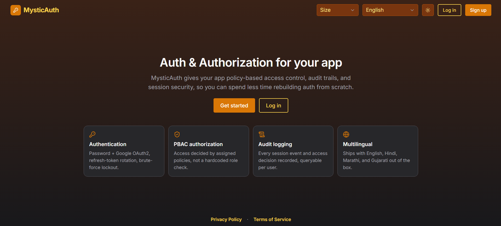
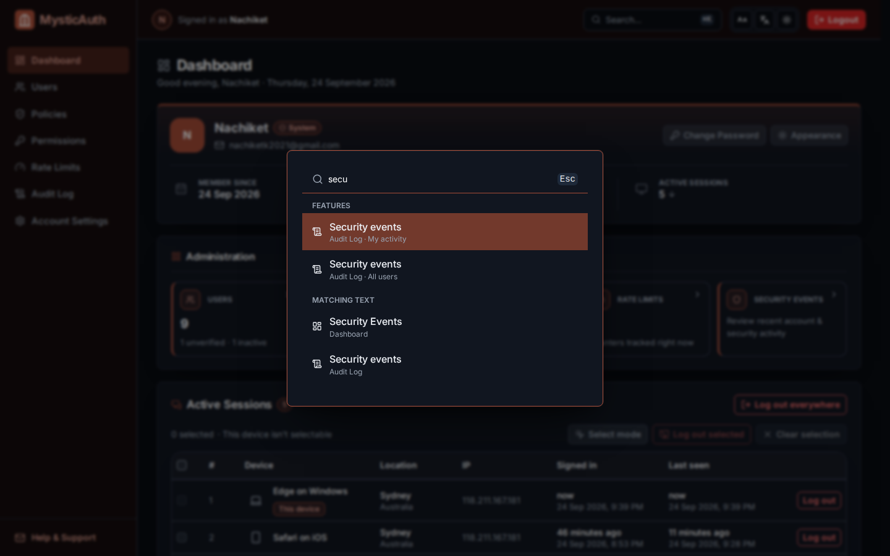
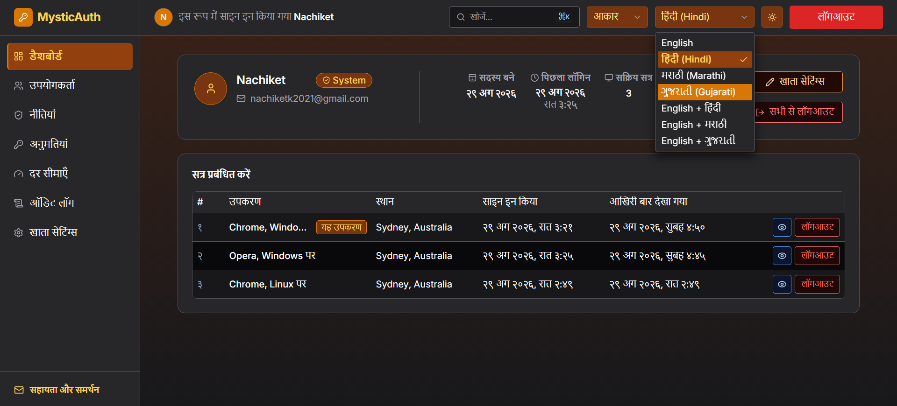
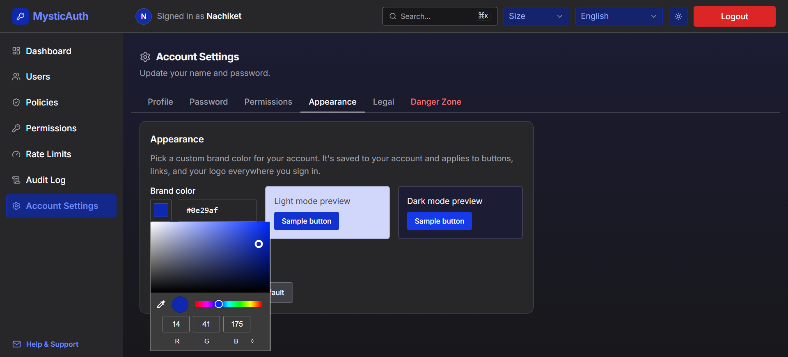
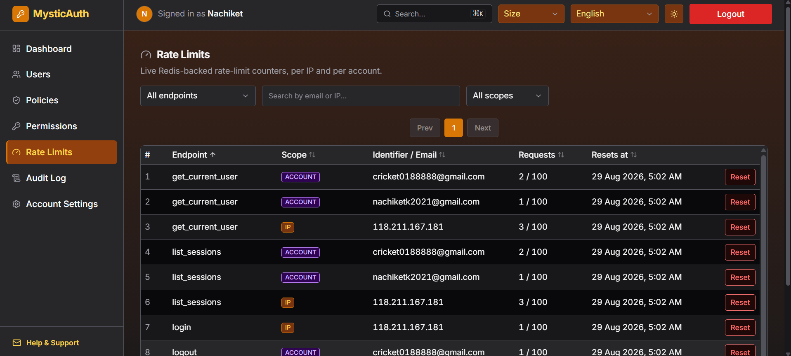

# MysticAuth


## Overview

A reusable full-stack identity and access management template with authentication, OAuth2/PKCE, fine-grained Policy-Based Access Control (PBAC), and self-hosted error monitoring, all enabled by default. Every access decision is made by an assigned, active `Policy`; a user's `role` is display metadata only and is never consulted when deciding what someone can do.

Most templates hardcode access to a `role` field (`if role == "admin"`), so every new permission means shipping a code change. Here, permissions live in `Policy` rows that admins assign and revoke at runtime, so access can change without a deploy.

Use this if you want Auth and PBAC you own and can modify, instead of wiring up an external IdP. Plain RBAC works too: an unconditioned policy, one per role, is already RBAC, no separate engine needed. See [RBAC Quickstart](docs/mystic_auth/authorization/rbac-quickstart.md).

**Full docs:** [`docs/mystic_auth/README.md`](docs/mystic_auth/README.md) (architecture, auth, PBAC, database, API reference, security, testing, Docker, CI/CD, deployment) · [`docs/mystic_auth/template-usage/overview.md`](docs/mystic_auth/template-usage/overview.md) (using this repo as a template for your own project)

---

### Why this exists

This started as the same authentication and authorization foundation getting rebuilt from scratch for take-home assignments that needed auth, OAuth2, and roles. It grew from a small reusable module into a full auth template with refresh-token rotation, rate limiting, background email delivery, and a real test suite. See [Project Story](docs/mystic_auth/project-story/README.md) for the full history.

---

## Screenshots

The screenshots below follow the path a user or administrator would normally take through the app: sign in, review their own dashboard, try the command palette, then move into system administration, account appearance settings, user and policy management, and audit review.

### 1. Landing Page


---

### 2. Sign In


---

### 3. Standard User Dashboard


---

### 4. Command Palette


---

### 5. System Superuser Dashboard


---

### 6. System Superuser Dashboard (Hindi)


---

### 7. Account Settings


---

### 8. Appearance


---

### 9. User Management


---

### 10. Policy Management


---

### 11. Edit Policy


---

### 12. Assign Policies


---

### 13. Rate Limits


---

### 14. Security Events


---

### 15. Audit Logs


---

## Stack

- **Backend:** FastAPI (async), SQLAlchemy 2.0 (`asyncpg`), Alembic
- **Auth:** Email + password (Argon2, JWT httpOnly cookies), Google OAuth2 with PKCE
- **Authorization:** Policy-Based Access Control. See [PBAC Architecture](docs/mystic_auth/authorization/architecture.md)
- **Frontend:** TypeScript, React 19 + Vite, Chakra UI v3, Zustand + TanStack Query
- **i18n:** English, Hindi, Marathi, Gujarati via `react-i18next`. See [Translations](docs/mystic_auth/translations/overview.md)
- **Data/Infra:** PostgreSQL, Redis (cache/rate-limit/token state), Procrastinate (Postgres-native task queue, no separate broker)
- **Error Monitoring:** Self-hosted Bugsink, on by default
- **Deployment:** Docker, with dev, self-hosted local-prod via Cloudflare Tunnel, and prod via Caddy on your own server

See [Auth Flow](docs/mystic_auth/authentication/overview.md) and [Security Hardening](docs/mystic_auth/security/hardening.md) for the full feature list.

---

## Key Features

- **Refresh-token rotation with reuse detection**: a replayed refresh token revokes the whole session chain, not just the one request
- **Real-time cross-device session revocation**: logging out or revoking a session pushes over SSE + Redis Pub/Sub, so other tabs/devices drop within seconds
- **Dual rate limiting**: per-IP and per-account limits enforced independently, so one leaking IP can't lock out every account behind it (or vice versa)
- **Offline session geolocation**: session location is resolved from a local IP database, no third-party geolocation API in the request path
- **Dual audit logs**: a system-wide audit trail and a per-user-facing one, so admins and end users each see the events relevant to them
- **Per-account appearance**: each account can set its own brand color, applied across the whole UI

---

## Quickstart (Docker)

Click **[Use this template](https://github.com/Nachiket-2024/mystic-auth/generate)** on GitHub to create your own repository (no shared history, no fork relationship), then clone *your* new repo:

```bash
git clone https://github.com/<your-username>/<your-repo>.git
cd <your-repo>
cp .env.example .env
./scripts/docker/dev-up.sh        # Git Bash / WSL / Linux / macOS
# .\scripts\docker\dev-up.ps1     # PowerShell
# scripts\docker\dev-up.cmd       # Command Prompt
```

Placeholder secrets in `.env.example` are enough to boot locally; swap them before deploying (see [Security Decisions](docs/mystic_auth/security/decisions.md)).

Once running:

- **Frontend:** http://localhost:5173
- **Backend / API docs:** http://localhost:8000/docs
- **Bugsink (error monitoring):** http://localhost:8010

Then create the reserved system account (one-time). Interactively:

```bash
docker compose exec -it backend python -m mystic_auth.scripts.create_system_user
```

Or non-interactively (recommended if you reset your local stack often) via `local-scripts/dev/create-system-user.{sh,ps1,bat}`: copy `system-user.env.example` next to the script, fill it in, and run it; it's gitignored so real credentials are never committed.

For running without Docker, local-prod/prod modes, and env var details, see [Docker Overview](docs/mystic_auth/docker/overview.md), [Deployment Guide](docs/mystic_auth/deployment/guide.md), and [System Superuser: Bootstrapping and Promotion](docs/mystic_auth/authentication/system-superuser.md).

---

## Using this as a template

See [Using This Repository as a Template](docs/mystic_auth/template-usage/overview.md) for pulling in future upstream updates, and the `app/` vs `mystic_auth/` code split so your own code never conflicts with a `sync-upstream.sh` run.

---

## Documentation

Full documentation lives in [`docs/mystic_auth/`](docs/mystic_auth/README.md):

- [Architecture](docs/mystic_auth/README.md#architecture)
- [Authentication](docs/mystic_auth/README.md#authentication) · [OAuth2/PKCE](docs/mystic_auth/authentication/oauth2-pkce.md)
- [Authorization (PBAC)](docs/mystic_auth/README.md#authorization-pbac)
- [Database Design](docs/mystic_auth/database/design.md)
- [API Reference](docs/mystic_auth/api/reference.md)
- [Background Workers](docs/mystic_auth/background-workers/procrastinate.md)
- [Security](docs/mystic_auth/README.md#security)
- [Testing](docs/mystic_auth/testing/overview.md)
- [CI/CD](docs/mystic_auth/cicd/overview.md)
- [Known Issues & Concerns](docs/mystic_auth/concerns/README.md)

---

## Getting Help & Contributing

Issues and pull requests are welcome. Check [Known Issues & Concerns](docs/mystic_auth/concerns/README.md) and [PBAC Troubleshooting](docs/mystic_auth/authorization/troubleshooting.md) first, then search [existing issues](https://github.com/Nachiket-2024/mystic-auth/issues) before opening a new one. **Found a security vulnerability?** Don't open a public issue. See [SECURITY.md](SECURITY.md) for private reporting.

---

## License

MIT. See [LICENSE](LICENSE).

---
