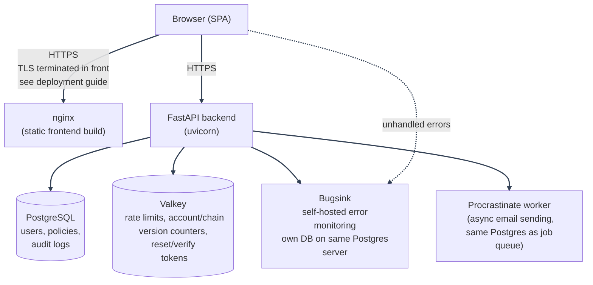
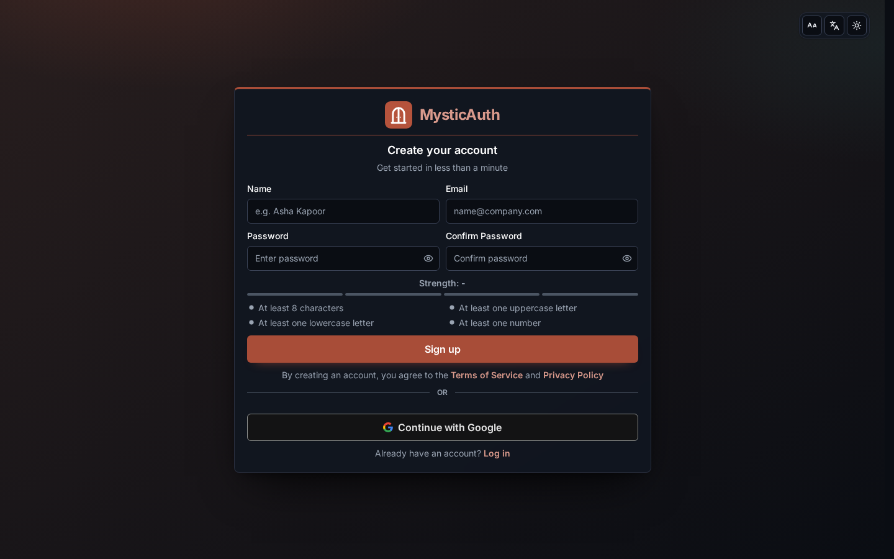
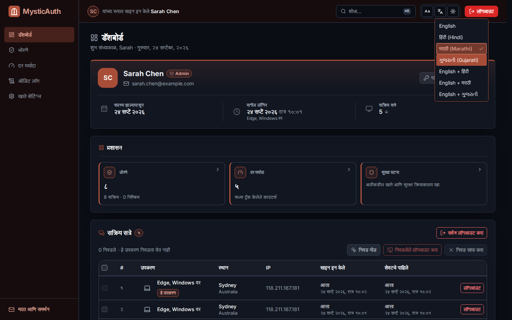
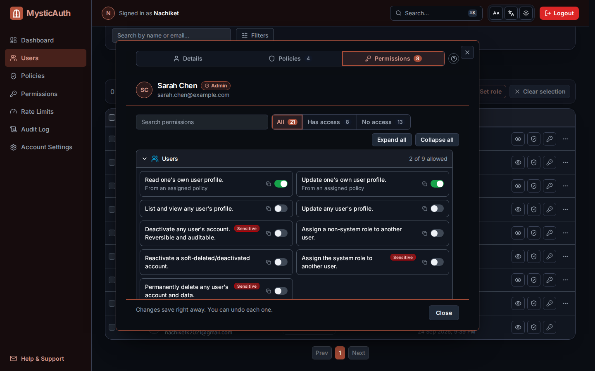
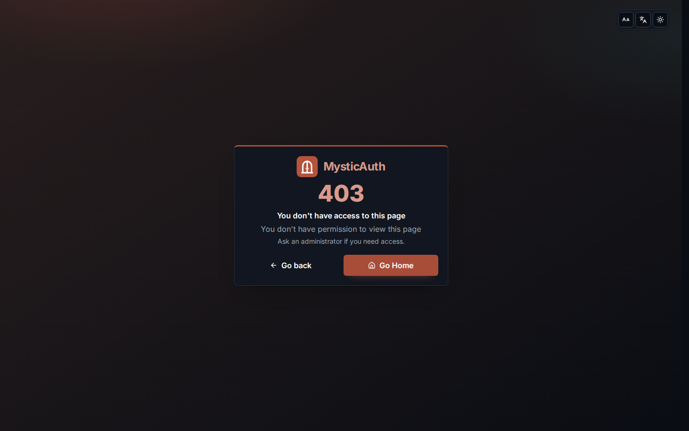

# MysticAuth

---

**📖 Documentation Site: [https://nachiket-2024.github.io/mystic-auth-docs/](https://nachiket-2024.github.io/mystic-auth-docs/)**


[](https://github.com/Nachiket-2024/mystic-auth/actions/workflows/ci.yml)


---

## Overview

MysticAuth is a full-stack authentication and authorization template for web applications that need owned user accounts, session management, auditability, and database-backed access control.

It provides two core subsystems:

1. **Authentication**: email/password signup, account verification, Google OAuth2 with PKCE, JWT access tokens, refresh-token rotation, session tracking, password reset, logout, logout-all, and account deletion.
2. **Authorization**: Policy-Based Access Control (PBAC) with database-backed policies, direct grants, condition evaluation, privilege-escalation guards, policy history, authorization audit logs, and frontend permission checks.

The `users.role` column is presentation metadata. Runtime authorization decisions are made from policies and direct permission grants, not from role string comparisons. Projects that only need role-shaped access can still model RBAC by assigning one unconditioned policy per role. See [RBAC Quickstart](https://nachiket-2024.github.io/mystic-auth-docs/docs/mystic_auth/authorization/rbac-quickstart).

---

Use this template when the application should own its account database and authorization model instead of delegating both concerns to an external identity provider. The implementation favors explicit server-side checks, httpOnly cookies, revocable refresh-token chains, durable audit records, and testable authorization policies.

---

### Why this exists

This started as a reusable authentication foundation for projects that needed account login, OAuth2, and access control. It grew into a template with refresh-token rotation, rate limiting, PBAC, background email delivery, audit logging, self-hosted error monitoring, production-shaped Docker deployments, and a broad automated test suite. See [Project Story](https://nachiket-2024.github.io/mystic-auth-docs/docs/mystic_auth/project-story) for the history.

---

## Architecture


```mermaid
%%{init: {"themeVariables": {"lineColor": "#334155"}} }%%
flowchart TD
    Browser["Browser (SPA)"]
    Browser -- "HTTPS\n TLS terminated in front\n see deployment guide" --> Nginx
    Browser -- HTTPS --> Backend
    Nginx["nginx\n (static frontend build)"]
    Backend["FastAPI backend\n (uvicorn)"]
    Backend --> Postgres[("PostgreSQL\n users, policies,\n audit logs")]
    Backend --> Valkey[("Valkey\n rate limits, account/chain\n version counters, reset/verify\n tokens")]
    Backend --> Bugsink["Bugsink\n self-hosted error monitoring\n own DB on same Postgres server"]
    Browser -. "unhandled errors" .-> Bugsink
    Backend --> Procrastinate["Procrastinate worker\n (async email sending,\n same Postgres as job queue)"]
    linkStyle default stroke:#334155,stroke-width:2px
```

One backend image (`docker/mystic_auth/dockerfiles/backend.Dockerfile`) runs as three containers with different commands: `backend` (the API), `procrastinate_worker` (async email + the daily account-purge job), and `alembic` (migrations only, exits after running). PostgreSQL is the only system of record; Valkey holds nothing that needs to survive a restart. See [System Architecture](https://nachiket-2024.github.io/mystic-auth-docs/docs/mystic_auth/architecture/system-overview) for the full component breakdown, the PBAC authorization pipeline, and a request-lifecycle sequence diagram.

---

## Screenshots

The screenshots cover the public pages, authenticated user experience, account settings, session management, PBAC policy and permission management, audit logs, and denied-access behavior.


<details>
<summary><strong>See all 22 screenshots</strong> (landing page through audit logs)</summary>

---

### 1. Landing Page


---

### 2. Sign In


---

### 3. Sign Up


---

### 4. Standard User Dashboard


---

### 5. Command Palette


---

### 6. System Superuser Dashboard


---

### 7. Language Switcher
Seven modes: English, three regional languages, and three bilingual pairings that keep the app chrome in English while page content switches.


---

### 8. Account Settings: Profile


---

### 9. Account Settings: Permissions
Every effective permission a user holds, grouped by resource type, with which policy (or direct grant) is the source of each one.


---

### 10. Appearance


---

### 11. User Management


---

### 12. User Details Dialog
Role metadata, status, sign-in method, and recent access changes for one account.


---

### 13. Bulk Actions on Users


---

### 14. Assign / Revoke Policies
Per-user policy assignment from the users table, with immediate saving and undo.


---

### 15. Grant / Revoke Permissions
The Permissions tab shows every action grouped by resource and identifies policy-based and direct grants.


---

### 16. Policy Management


---

### 17. Policy Details / Edit Dialog


---

### 18. Permissions Catalog
Every known action, which policies grant it, how many users hold it directly, and which actions are destructive.


---

### 19. Rate Limits
Live Valkey-backed counters per IP address and account, resettable by a caller with the required permission.


---

### 20. Authorization Decisions
Every allow and deny decision the PBAC engine makes, across every user, with the policy that granted or would have granted it.


---

### 21. Security Events
Sign-in activity and session security events, with a success/failure trend chart.


---

### 22. Not Authorized (403)
What a signed-in user without the required permission sees when opening a protected route directly.


</details>

---

## Stack

- **Backend:** FastAPI, SQLAlchemy 2.0 async ORM with `asyncpg`, Alembic migrations, Pydantic settings and schemas.
- **Authentication:** Argon2 password hashing, JWT access tokens, rotating refresh tokens, httpOnly cookies, Google OAuth2 with PKCE, server-side session revocation, password reset, account verification, and account lifecycle controls.
- **Authorization:** Policy-Based Access Control with policy rows, direct user grants, typed condition handlers, policy history, privilege-escalation guards, and allow/deny audit records. See [PBAC Architecture](https://nachiket-2024.github.io/mystic-auth-docs/docs/mystic_auth/authorization/architecture).
- **Frontend:** TypeScript, React 19 + Vite, Tailwind CSS v4 + shadcn/ui Radix primitives, Zustand + TanStack Query
- **i18n:** English, Hindi, Marathi, and Gujarati via `react-i18next`. See [Translations](https://nachiket-2024.github.io/mystic-auth-docs/docs/mystic_auth/translations/overview).
- **Data/Infra:** PostgreSQL for durable state, Valkey for derived state and token/rate-limit counters, Procrastinate for PostgreSQL-backed background jobs.
- **Error Monitoring:** Self-hosted Bugsink using the Sentry SDK protocol for backend and frontend exception reporting.
- **Backups:** Scheduled `pg_dump` sidecar in local-prod and prod, plus a restore drill that dumps, restores into a scratch database, and smoke-checks the result, run in CI on every push. See [Known Issues](https://nachiket-2024.github.io/mystic-auth-docs/docs/mystic_auth/concerns) for remaining backup gaps.
- **Deployment:** Docker dev mode, local-prod tunnel mode through Cloudflare/ngrok/Tailscale, and server-hosted prod mode behind Caddy-managed TLS.
- **Browser E2E:** Playwright tests cover the app and MysticAuth UI split under `tests/frontend/app/e2e/` and `tests/frontend/mystic_auth/e2e/`, including authentication, dashboards, account settings, permission-protected pages, responsive layouts, no-email stubbed flows, a WCAG 2.1 AA accessibility scan (`@axe-core/playwright`) across every major page, and an opt-in live-deployment smoke test that makes real requests against an already-running deployment. See [Browser E2E Tests](https://nachiket-2024.github.io/mystic-auth-docs/docs/mystic_auth/testing/browser-e2e)

### Verification matrix

The maintained local audit commands cover four Playwright projects: Chromium
desktop and mobile, Firefox desktop, and WebKit desktop. Backend security
coverage includes authorization escalation, condition-scope widening, context
spoofing, malformed and oversized condition payloads, batch abuse, tampering,
and concurrency. Generated coverage and browser artifacts are ignored by both
Git and Docker.

```bash
pytest --no-cov -q tests/backend/mystic_auth/security
pytest --no-cov -q tests/backend/mystic_auth/integration/authorization
npm run test --prefix frontend -- --run
npm run test:browser --prefix frontend -- --project=chromium-desktop
npm run test:browser --prefix frontend -- --project=chromium-mobile
npm run test:browser --prefix frontend -- --project=firefox-desktop
npm run test:browser --prefix frontend -- --project=webkit-desktop
python scripts/mystic_auth/load-test/load_test.py --base-url http://localhost:8000 --scenario health --requests 500 --concurrency 50 --workers 4
```

---

The HTTP load script is a release check, not a fixed CI threshold. Choose
request counts and concurrency for the deployment being measured.

See [Auth Flow](https://nachiket-2024.github.io/mystic-auth-docs/docs/mystic_auth/authentication/overview) and [Security Hardening](https://nachiket-2024.github.io/mystic-auth-docs/docs/mystic_auth/security/hardening) for the full feature list.

---

## Key Features

- **Refresh-token rotation with reuse detection**: each refresh consumes one refresh-token JTI and issues a replacement. Reuse of an already-consumed refresh token revokes the affected session chain.
- **Real-time cross-device session revocation**: logout, logout-all, targeted session revocation, and permission changes publish Valkey Pub/Sub events that reach open browsers through Server-Sent Events.
- **Dual rate limiting**: per-IP and per-account counters are enforced independently, with separate brute-force lockout for login.
- **Offline session geolocation**: session location is resolved from a local MaxMind database when configured, avoiding per-request calls to a third-party geolocation API.
- **Dual audit logs**: security events and authorization decisions are stored separately so user-facing history and authorization analysis remain distinct.
- **Per-account appearance**: each account can set its own brand color, applied across the whole UI.

---

## Quickstart (Docker)

This section assumes Docker is installed. The dev Compose stack starts the backend, frontend, PostgreSQL, Valkey, Procrastinate worker, Alembic migration runner, and Bugsink.

**Setting up with an AI coding agent (Claude Code, Codex, or similar)?**

Skip the steps below. After cloning your new repo, hand your agent [`agent-prompts/mystic_auth/new-project-setup.md`](agent-prompts/mystic_auth/new-project-setup.md) directly (e.g. "read this file and follow it"). It runs the same `quickstart.sh` script, asks you for your app name/brand color instead of guessing, and never puts real secrets in its own context. See [Agent Prompts](agent-prompts/mystic_auth/README.md) for how and why.

---

1. On GitHub, click **[Use this template](https://github.com/Nachiket-2024/mystic-auth/generate)**. This creates a brand new repository under your own account that starts as a copy of this one, with no shared commit history and no "fork" relationship back to this repo. It's the standard way to start a new project from a template on GitHub.
2. Clone *your* new repository and run the quickstart script:

   ```bash
   git clone https://github.com/<your-username>/<your-repo>.git
   cd <your-repo>
   ./scripts/mystic_auth/env-tools/quickstart/quickstart.sh                  # Git Bash / WSL / Linux / macOS
   # .\scripts\mystic_auth\env-tools\quickstart\quickstart.ps1     # PowerShell
   # scripts\mystic_auth\env-tools\quickstart\quickstart.cmd       # Command Prompt
   ```

---

   This is the whole setup in one command: it generates every `env/mystic_auth/.env*` file (plus `frontend/.env`) from its `.example` if `env/mystic_auth/.env` doesn't exist yet (distinct random secret per password field, one app name/brand color prompt applied everywhere), brings the dev stack up and waits for it to be healthy, offers to create the system superuser right there, then tails logs. On the first run, Docker may need to pull the PostgreSQL, Valkey, and Bugsink images and build the local backend/worker/frontend images, so startup can take several minutes and depends on Docker Hub and Docker Desktop network speed. Later starts reuse those images and named volumes and are normally much faster. Safe to re-run any time. Prefer to see and run each step yourself? See [Using This Repository as a Template: Quickstart](https://nachiket-2024.github.io/mystic-auth-docs/docs/mystic_auth/template-usage/overview#quickstart) for the same steps run individually (`setup-env`, `dev-up`, `create_system_user`), and for what each remaining field (Google OAuth, SMTP, a real domain, tunnel tokens) means.

3. Once it's up, open:

   - **Frontend:** http://localhost:5173
   - **Backend / API docs:** http://localhost:8000/docs
   - **Bugsink (error monitoring):** http://localhost:8010

For running without Docker, the local-prod and prod modes, keeping secrets rotated (`scripts/mystic_auth/env-tools/check-env/`, `scripts/mystic_auth/env-tools/rotate-secrets/`), and a full list of environment variables, see [Docker Overview](https://nachiket-2024.github.io/mystic-auth-docs/docs/mystic_auth/docker/overview), [Deployment Guide](https://nachiket-2024.github.io/mystic-auth-docs/docs/mystic_auth/deployment/guide), and [System Superuser: Bootstrapping and Promotion](https://nachiket-2024.github.io/mystic-auth-docs/docs/mystic_auth/authentication/system-superuser).

---

## Using this as a template

See [Using This Repository as a Template](https://nachiket-2024.github.io/mystic-auth-docs/docs/mystic_auth/template-usage/overview) for pulling in future upstream updates, and the `app/` vs `mystic_auth/` code split so your own code never conflicts with a `sync-upstream.sh` run.

Prefer to hand setup or syncing to an AI coding agent instead of following the docs by hand? [`agent-prompts/`](agent-prompts/mystic_auth/README.md) has ready-to-paste starting prompts for both.

---

## Documentation

Documentation site: **[nachiket-2024.github.io/mystic-auth-docs](https://nachiket-2024.github.io/mystic-auth-docs/)**

---

## Getting Help & Contributing

Issues and pull requests are welcome. See [CONTRIBUTING.md](CONTRIBUTING.md) for local setup, code style, and what CI checks before you open a PR. Check [Known Issues & Concerns](https://nachiket-2024.github.io/mystic-auth-docs/docs/mystic_auth/concerns) and [PBAC Troubleshooting](https://nachiket-2024.github.io/mystic-auth-docs/docs/mystic_auth/authorization/troubleshooting) first, then search [existing issues](https://github.com/Nachiket-2024/mystic-auth/issues) before opening a new one. **Found a security vulnerability?** Don't open a public issue. See [SECURITY.md](SECURITY.md) for private reporting.

---

## License

MIT. See [LICENSE](LICENSE).

---
