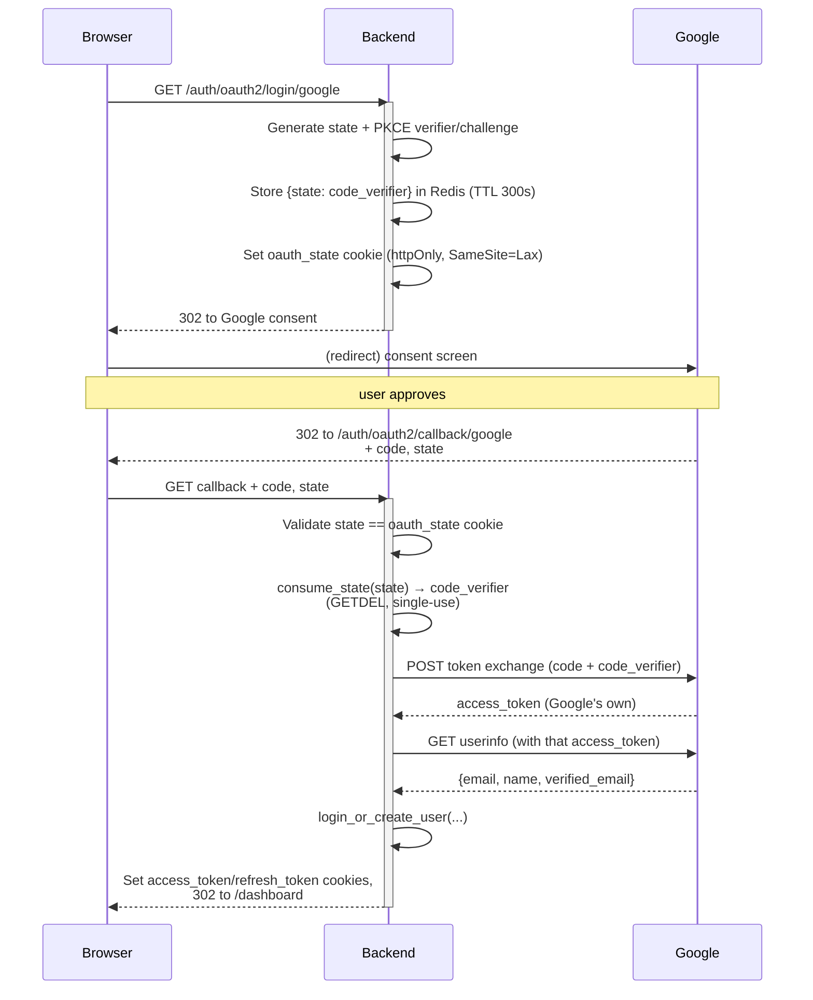

# OAuth2 / PKCE (Google Login)

## Purpose

Lets a user authenticate with their Google account instead of (or in addition to) a password, while defending against authorization-code interception (PKCE), CSRF/session fixation (`state`), and a specific pre-registration account-hijacking scenario unique to mixing password and OAuth2 signup on the same email.

## Components

| File | Role |
|---|---|
| `backend/mystic_auth/auth/oauth2/oauth2_login_handler.py` | Route-facing orchestration: builds the Google redirect, validates the callback, issues the app's own JWTs |
| `backend/mystic_auth/auth/oauth2/oauth2_service.py` | State/PKCE generation and storage, Google token exchange, userinfo fetch, user creation/login |
| `backend/mystic_auth/api/auth_routes/auth_routes.py` | `GET /auth/oauth2/login/google`, `GET /auth/oauth2/callback/google` |
| `frontend/src/mystic_auth/auth/oauth2/` | `OAuth2LoginButton`/`OAuth2LoginButtonComponent` — a plain link/redirect to the backend's initiate endpoint, no client-side OAuth SDK involved |

## Data / request flow

## PKCE mechanics

1. **Initiate** (`generate_and_store_state`): generates a random `code_verifier` (`secrets.token_urlsafe(64)`), derives `code_challenge = base64url(SHA256(code_verifier))` (no padding — RFC 7636 S256), and sends only the `code_challenge` to Google in the authorization URL (`code_challenge_method=S256`). The `code_verifier` itself is stored server-side in Redis, keyed by the `state` value — it never touches the browser.
2. **Callback** (`exchange_code_for_tokens`): the stored `code_verifier` is sent to Google's token endpoint alongside the authorization `code`. Google rejects the exchange if the verifier doesn't hash to the challenge it was given at the start — proving the same party that initiated the flow is the one completing it, even if the authorization `code` itself were intercepted in transit.

PKCE is applied here even though this is a confidential client (it has a `client_secret`) — OAuth 2.1 requires PKCE for every client type, and it defends against a different threat (code interception) than `client_secret`/`state` cover.

## CSRF protection (`state`)

A random `state = secrets.token_urlsafe(32)` is generated alongside the PKCE pair, stored in Redis (same TTL, same key as the `code_verifier` — `oauth_state:{state}`), and also set as an `oauth_state` httpOnly cookie (`SameSite=Lax` — must survive Google's top-level cross-site redirect back to the callback, which a `Strict` cookie would be dropped from). The callback requires the query-param `state`, the cookie value, and the Redis-stored entry to all agree, then atomically consumes the Redis entry (`GETDEL`) so the same `state` can never be redeemed twice — closing both a CSRF-via-forged-callback vector and a replay vector.

## Backend implementation details

- **Redirect URI is server-side fixed** (`settings.GOOGLE_REDIRECT_URI`), never influenced by the client — rules out an open-redirect-via-OAuth attack.
- **`verified_email` is load-bearing**: a callback where Google's own `verified_email` is falsy (or missing) is rejected outright — this is the only proof of email ownership the flow trusts. See `oauth2_login_handler.py`'s callback handler.
- **First-time login** creates a user with `role=UserRole.user` (display-only), `is_verified=True`, `hashed_password=None`, and assigns the `self_service` policy — mirroring `signup_service.py`'s policy assignment exactly (role never grants access; see [PBAC Architecture](../authorization/architecture.md)).
- **Pre-registration hijack guard**: if an email was already registered via password signup but never verified, and the real owner later authenticates via Google with that address, the existing account's `hashed_password` is cleared at that moment — closing the window where an attacker's pre-chosen password would otherwise remain valid on an account Google has now confirmed belongs to someone else. An already-verified account's password is left untouched. See `oauth2_service.py::login_or_create_user`'s docstring for the full walkthrough.
- **System account is blocked from OAuth2 login entirely** — `role == UserRole.system` short-circuits before any user creation/update logic, forcing the reserved system account through password login only (`scripts/create_system_user.py`).
- **`access_type`/`prompt` are intentionally omitted** from the Google authorization URL — this app never stores or uses Google's own refresh token, so there's no reason to force an offline-access grant or a full re-consent prompt on every login.
- Every step (missing code, provider error, state/cookie mismatch, expired state, failed token exchange, missing/unverified email, rejected `login_or_create_user`) redirects back to `{FRONTEND_BASE_URL}/login` rather than surfacing an API error — the frontend has no OAuth-specific error UI; a failed OAuth2 attempt looks identical to landing on the login page fresh.

## Frontend integration

`OAuth2LoginButtonComponent` is a plain anchor/redirect to `GET {BACKEND_BASE_URL}/auth/oauth2/login/google` — no `@react-oauth/google` or similar client SDK is used; the entire flow is server-driven redirects. On success, the backend redirects to `{FRONTEND_BASE_URL}/dashboard` with the session cookies already set, so the frontend's normal `GET /auth/me` bootstrap (via `useAuthSession`) picks up the new session exactly as it would after a password login.

## Configuration requirements

| Setting | Purpose |
|---|---|
| `GOOGLE_CLIENT_ID` / `GOOGLE_CLIENT_SECRET` | Google Cloud OAuth2 credentials |
| `GOOGLE_REDIRECT_URI` | Must exactly match a redirect URI registered in the Google Cloud Console for this client |
| `FRONTEND_BASE_URL` | Where every outcome (success or failure) redirects back to |
| `BACKEND_BASE_URL` | Used by the frontend to construct the initiate-login URL |

## Security considerations

See [Security Decisions: OAuth2 CSRF and account-hijacking protections](../security/decisions.md#oauth2-csrf-and-account-hijacking-protections) for the consolidated rationale, and [Security Hardening](../security/hardening.md) for the rate limits applied to both OAuth2 routes.

## Edge cases / error handling

- User cancels the Google consent screen (`error=access_denied`) → redirect to login, no state/Redis touched.
- `state` present but not in Redis (expired or already consumed) → redirect to login, logged as `warning`.
- Token exchange succeeds but userinfo fetch fails, or vice versa → redirect to login; each external call is independently wrapped in `try/except` and logs its own failure.
- `login_or_create_user` returns `None` (system-account block, deactivated account, unexpected error) → a `OAUTH2_LOGIN_SUCCESS` security-audit event is still written, but with `success=False`, so a blocked takeover attempt is reviewable rather than invisible.

## Testing coverage

`tests/backend/mystic_auth/unit/` covers `oauth2_login_handler`/`oauth2_service` with the Google HTTP calls mocked; `tests/backend/mystic_auth/integration/test_oauth_integration.py` exercises the initiate → callback flow against a real Redis instance. See [Testing Overview](../testing/overview.md).

## Troubleshooting

- **"redirect_uri_mismatch" from Google**: `GOOGLE_REDIRECT_URI` must be byte-for-byte identical to a URI registered in the Google Cloud Console (including scheme and trailing slash).
- **Callback always redirects to `/login` with no visible error**: check `docker compose logs backend` — every rejection path logs a `warning`/`error` with the specific reason (state mismatch, unverified email, exchange failure, etc.), since none of it is surfaced to the browser by design.
- **A returning Google user is asked to "set a password"**: expected if their account has never had one — `hashed_password` is `None` for OAuth2-only accounts. Use `PUT /users/me` with a `password` field to set one.
