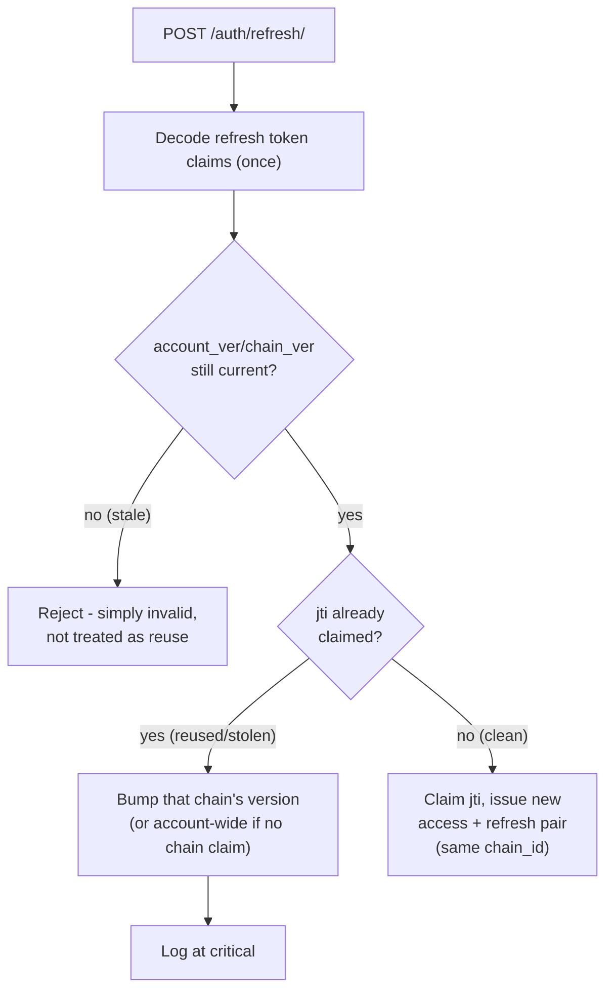

# Authentication Flows

Covers signup, email verification, login, refresh, logout, password reset, Google OAuth2, and the JWT/cookie mechanics underneath all of them. For *authorization* (what an authenticated caller is allowed to do), see [../authorization/architecture.md](../authorization/architecture.md).

## Tokens and cookies

Every session is a pair of JWTs, delivered as httpOnly cookies: never readable by frontend JavaScript, never stored in `localStorage`/Zustand (see `frontend/src/mystic_auth/store/authStore.ts`, which holds only the profile/permissions `GET /auth/me` returns, not tokens).

| Cookie | Path | Attributes | Purpose |
|---|---|---|---|
| `access_token` | `/` | `httponly`, `secure`, `samesite=Strict` | Sent on every request; verified by `get_current_user` on each one (see below). |
| `refresh_token` | `/auth` (scoped; never sent to non-auth routes) | `httponly`, `secure`, `samesite=Strict` | Only used to mint a new token pair via `POST /auth/refresh/`. |

Expiry is configured via `ACCESS_TOKEN_EXPIRE_MINUTES`/`REFRESH_TOKEN_EXPIRE_MINUTES` (`.env.example`) and encoded in each JWT's own `exp` claim. The cookie's `max_age` is a separate, independent browser-side hint, not the source of truth; a request with an expired-but-not-yet-cookie-cleared token is still rejected by signature/`exp` verification (`jwt_service.verify_token`).

**Claims**: `email`, `type` (`"access"` or `"refresh"`; a refresh token can never be used where an access token is expected, and vice versa), `jti` (unique ID, used for refresh-token revocation; see below), `exp`. Signed with `HS256` using `SECRET_KEY` (`.env`, required, no default). Deliberately no `role` claim: role is display-only metadata, resolved fresh from the database on every request (alongside PBAC permissions) rather than trusted from a token that could go stale, see [Authorization Model](../authorization/architecture.md).

---

## Signup

`POST /auth/signup` -> `signup_service.SignupService.signup`:

1. Check for an existing account with that email.
2. Hash the password (Argon2, via `password_service.hash_password`) **unconditionally**, even on the duplicate-email path, since hashing is the expensive step: skipping it only when the email is free would let a timing attack distinguish "registered" from "not registered" even though the HTTP response is identical either way.
3. Create the user row: `role=UserRole.user` (display-only, matches [Security Decisions](../security/decisions.md#role-is-never-used-to-decide-access)), `is_verified=False`, `is_active=True`.
4. Assign the `self_service` policy: this, not the role, is what gives the new account access to its own profile (`users:read_own`/`users:update_own`).
5. Queue a verification email asynchronously through `taskiq_tasks/email_tasks.py`.

The signup endpoint always returns the same generic response regardless of whether the email was already taken, for the same enumeration-resistance reason as step 2.

---

## Email verification

`POST /auth/verify-account` with a `token`:

1. The token is a scoped JWT (`role="verify"` internally, distinct from a login token) issued at signup, plus a Redis key (`verify:{token}`) that makes it single-use.
2. Redemption atomically `GETDEL`s the Redis key, so a token can't be replayed even if the JWT signature itself would still verify within its expiry window.
3. Sets `is_verified=True`.

If the verification link expires or has already been used, the frontend lets the user request a fresh link with `POST /auth/verify-account/request`. The request accepts an email address and always returns the same generic success response. The backend only sends a new email when the account exists and is still unverified, which avoids account enumeration and avoids spamming already-verified users.

---

## Login

`POST /auth/login`:

1. **Dual rate limiting**: per-IP and per-account sliding-window limits (`rate_limiter_service.py`), plus a separate brute-force lockout (`login_protection_service.py`) using `MAX_FAILED_LOGIN_ATTEMPTS` per email, `MAX_FAILED_LOGIN_ATTEMPTS_PER_IP` per IP (`.env.example`).
2. **Timing-attack-resistant password check**: `login_service.py` always runs the Argon2 comparison (against the real `hashed_password` if the account exists and has one, or a fixed `DUMMY_HASH` otherwise) *before* checking whether the account exists, is verified, or is active. This means "wrong password," "no such account," and "account exists but never set a password (OAuth2-only)" all take the same amount of time to reject.
3. The Argon2 comparison's *result* isn't checked first, though: `login_service.py` rejects in this order: account not found, not verified, not active, and only then a wrong password. This preserves constant-time hashing (step 2) while still surfacing "verify your email" instead of a generic "wrong password" to a legitimate user who mistyped their password on an unverified account.
4. On success: issue a fresh access+refresh token pair, set both cookies, log `LOGIN_SUCCESS` (or `LOGIN_FAILURE`/`ACCOUNT_LOCKED`) to the security audit log.

---

## Refresh token rotation

`POST /auth/refresh/` -> `refresh_token_service.refresh_tokens`:

1. Decode the refresh token's claims once (not the two-or-three separate decodes an earlier version did).
2. **Version check first**: if the token's embedded `account_ver`/`chain_ver` has already fallen behind Redis's current value (an explicit revoke already happened - logout, logout-all, password change, a targeted Manage Sessions revoke), it's rejected outright as stale. This runs *before* the reuse check below, so a session that was simply, intentionally ended never gets treated as suspected theft.
3. **Reuse detection**: refresh tokens are still single-use, enforced by an atomic per-`jti` claim (`claim_jti_for_rotation`), independent of the version check above. If a token whose `jti` is *already* claimed is presented again, that's either a stale retry, a race, or a stolen token being used in parallel with its legitimate owner. The response bumps that token's own `chain_ver` (`revoke_chain_for_user`) - or, for a pre-chain token with no lineage to scope to, `account_ver` account-wide - and the incident is logged at `critical`. See [Session Management](session-management.md#rotation-chains-and-reuse-detection) for why this stays scoped to the compromised chain instead of nuking every session on the account.
4. On a clean (non-reused, current-version) token: claim the old `jti`, issue a new access+refresh pair carrying the same `chain_id` forward.

Token validity is version-based, governed by Redis (`account_ver`/`chain_ver` counters, not a registry of live tokens), not the database: `refresh_tokens()` does not re-check `is_active`/account existence itself. The `user_sessions` table mirrors the current `jti`/`chain_id` only for display and targeted revoke in the Manage Sessions card. See [Session Management](session-management.md) for the full source-of-truth breakdown.

---

## Logout / logout-all

- `POST /auth/logout` bumps that one session's `chain_ver` (ending just this device) and clears both cookies (matching `path=/auth` for the refresh cookie).
- `POST /auth/logout/all` bumps `account_ver` - one `INCR`, every device, every session, immediately. Same mechanism the reuse-detection path (above, for an unknown-chain token) and account soft-delete/purge (see database design doc) reuse.
- **Both are idempotent about an already-dead refresh token.** Neither endpoint treats "the presented refresh token is already revoked/expired/malformed" as an error, since the caller's goal (no valid session left in this browser) is already true either way, so both still clear cookies and report success. This matters concretely right after a self/admin password change (below), which revokes every session for the account (bumps `account_ver`), including the one the current browser is still holding: clicking Logout immediately afterward presents that now-stale token, and it must still log the browser out cleanly rather than surfacing an "invalid or already revoked" error while leaving stale cookies (and an apparently-still-logged-in UI) behind. `logout/all` specifically decodes the token's claims without checking revocation first (`jwt_service.decode_payload`, not `verify_token`) so it can still resolve the owning email and revoke whatever sessions remain elsewhere, but it still enforces the token's `type` claim, so a wrong-type token (e.g. an access token mistakenly presented here) is never treated as resolving a real session to revoke.

---

## Password reset

`POST /auth/password-reset/request` -> `POST /auth/password-reset/confirm`:

1. Request: issues a scoped, Redis-backed single-use token (same `GETDEL` pattern as email verification), emailed to the address. **Always** the same generic response whether or not the email is registered.
2. Confirm: atomically redeems the token, validates the new password's strength (same rule signup enforces; see `password_service.validate_password_strength`), rejects if it matches the current password, and, critically, **bumps `account_ver`**, so a password reset actually ends every other session rather than just changing the password while old sessions stay valid.
3. A recoverable failure (e.g. weak password) restores the Redis token entry, capped at its *original* remaining TTL: it doesn't get a fresh full-length window, closing a window-extension loophole.

**Self/admin password changes revoke sessions the same way.** `PUT /users/me` (self) and `PUT /users/{email}` (admin) both back onto the same `UserUpdate` schema and, when the update includes a new password, both now call `refresh_token_service.revoke_all_tokens_for_user` (bumps `account_ver`) after the change succeeds, matching password-reset-confirm's behavior exactly, for the same reason: a password change may be happening precisely because the account is compromised, so an attacker's existing session shouldn't outlive it. An ordinary profile update with no password field does not trigger this.

**Self-service password changes also require the current password.** `PUT /users/me` requires a matching `current_password` whenever the request sets a new `password`: proof of the old credential, not just a valid session, since a hijacked `access_token` cookie alone would otherwise be enough to lock the real owner out. Skipped for an OAuth-only account (`hashed_password is None`) setting a password for the first time, and not required on the admin route (`PUT /users/{email}` authenticates via the admin's own `users:update_any` permission, not the target's old password). See [Security Decisions](../security/decisions.md#self-service-password-change-requires-the-current-password).

---

## Google OAuth2

`GET /auth/oauth2/login/google` -> Google consent screen -> `GET /auth/oauth2/callback/google`. See [OAuth2 / PKCE](oauth2-pkce.md) for the full request/response walkthrough and the exact PKCE code-challenge mechanics.

1. **CSRF protection**: a random `state` value (`secrets.token_urlsafe(32)`) is generated, stored in Redis, and set as a cookie. The callback validates the query-param `state` against both the Redis entry and the cookie, then atomically consumes it (`GETDEL`), so a callback can't be replayed or forged from a different browser session.
2. **PKCE** (S256) is layered on top of `state`, exceeding typical OAuth2 CSRF protection for a template of this kind.
3. **Redirect URI**: hardcoded server-side (`settings.GOOGLE_REDIRECT_URI`), never influenced by the client, ruling out an open-redirect-via-OAuth attack.
4. **`email_verified` is checked explicitly**: an OAuth2 login where Google itself hasn't verified the email is rejected. This is the only email-ownership proof the flow trusts.
5. **First-time login** (`oauth2_service.OAuth2Service.login_or_create_user`): creates a new user with `role=UserRole.user` (same default as password signup; see [Account Lifecycle](../database/design.md#account-lifecycle)), `is_verified=True` (Google already verified it), `hashed_password=None`, and assigns `self_service`, mirroring `signup_service.py`'s policy assignment exactly.
6. **Account-hijacking guard**: if an email was already registered via password signup but never verified, and someone later "logs in" via Google with that same address, the pre-existing account's `hashed_password` is **cleared** on the spot. Rationale: an attacker could have pre-registered a victim's email with a password *they* chose, hoping the victim later verifies it (e.g. by using "forgot password") without realizing an attacker-known password already works. Clearing it the moment Google's own verification (a stronger proof of ownership than clicking an email link) confirms the real owner closes that window. An *already-verified* account's password is left untouched; this guard only fires for the specific pre-registration-hijack scenario.
7. The reserved system account (`role=UserRole.system`) is blocked from OAuth2 login entirely; it must always go through the password login originally set by `scripts/create_system_user.py`.
8. Setting a password on an OAuth2-only account afterward: `PUT /users/me` with a `password` field. See [../database/design.md](../database/design.md#users) for why this needed its own fix (the field name intentionally doesn't match a real column, and must be hashed + renamed before reaching the CRUD layer).

---

## Current-session lookups (`GET /auth/me`)

Every call re-verifies the JWT *and* re-queries the database for the user row. This is deliberate, not just "how it happened to be written": it's what makes `is_active=False` (deactivation, soft delete) take effect on the *very next request*, rather than only once the access token's own `exp` is reached. See [Security Decisions](../security/decisions.md#why-current-user-lookups-re-query-the-database-every-time).

Server-side revocation (logout-all, password change, account deactivation, refresh-token reuse detection) is effective immediately: the very next request from an affected session gets `401`. Noticing that client-side is a separate concern. `useCurrentUserQuery` (`frontend/src/mystic_auth/auth/current_user/useCurrentUserQuery.ts`) is mounted once, at the app root, for the app's whole lifetime, so it does not re-run just because the user navigates between pages inside the SPA, and each page's own data query independently caches for the same 30s `staleTime`. Without a background poll, a tab that already had every page's data cached could sit showing "signed in" for a while after being revoked elsewhere, since nothing it does would happen to issue a fresh request that could actually surface the resulting `401`. `refetchInterval`/`refetchIntervalInBackground` on that query is what actually notices a revocation on its own, independent of user interaction or window focus.
