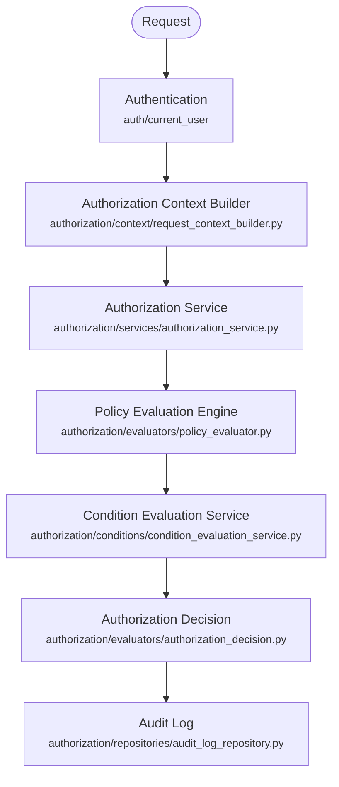

# Architecture Overview

## Request flow



Every real (non-hypothetical) authorization decision in the app goes through this exact pipeline, once. Nothing above the Authorization Service reads a user's role, a permission-role mapping, or does its own access comparison — routes only ever declare *what action on what resource type* they need.

## Component responsibilities

### Authentication
`auth/current_user/current_user_dependency.py`'s `get_current_user` verifies the `access_token` cookie and returns `{name, email, role}`. Authentication answers *who is calling*; it never answers *what they're allowed to do*. `role` here is metadata only — see [Adding New Permissions](adding-permissions.md) for why role never grants access.

### Authorization Context Builder
`authorization/context/request_context_builder.py`'s `build_authorization_context(request)` produces the one `context` dict every real authorization check evaluates conditions against:

```python
{
    "ip_address": "203.0.113.7",       # resolved via auth/security/client_ip.py
    "current_time": "2026-07-13T12:00:00+00:00",  # this server's own clock
    "security_context": {},             # reserved for a future trust-signal layer
}
```

**Rule: never trust client-supplied values by default.** `ip_address` is resolved by `auth/security/client_ip.py::get_client_ip` — the literal TCP peer (`request.client.host`) unless the peer itself is listed in `TRUSTED_PROXY_IPS` (`.env`, empty/untrusted by default), in which case the left-most `X-Forwarded-For` entry is trusted instead. `current_time` always comes from this backend's own clock, never anything in the request body or headers. The one deliberate exception is the authorization-check *inspection* endpoint (`POST /authorization/users/{email}/authorization-check`), which accepts a caller-supplied `context` on purpose — it's a "what would happen if" simulation tool for admins, not a real access decision, so there's nothing to spoof.

### Authorization Service
`authorization/services/authorization_service.py`. The single entry point every route/service calls:

- `authorize(user_email, action, resource_type, db, resource=None, context=None) -> bool` — the common case. Thin wrapper over `authorize_with_decision`.
- `authorize_with_decision(...) -> AuthorizationDecision` — computes the decision and writes an audit log entry. `authorize()` is just `.allowed` off of this.
- `authorize_detailed(...) -> AuthorizationDecision` — same computation, **no audit log write**. Used by the admin inspection endpoint and by `authorize_with_decision` internally, so a hypothetical "what if" query never pollutes the real audit trail.
- `authorize_batch(user_email, checks, db, context=None) -> list[AuthorizationDecision]` — fetches the user's policies **once** and evaluates every check against that same list, logging each decision individually. Used by `POST /authorization/batch-check`.
- `require(...)` — same as `authorize()`, but raises `HTTPException(403)` instead of returning `False`. This is what `dependencies/authorization_dependency.py`'s `require_authorization(action, resource_type)` factory calls — the dependency every protected route depends on.
- `assert_authorized_to_grant(caller_email, actions, resource_type, db)` — the privilege-escalation guard: before a policy create/update/assign can hand out one of this app's own sensitive actions (`Permission`'s vocabulary — see [Adding New Permissions](adding-permissions.md)), the caller must already hold it themselves.

### Policy Evaluation Engine
`authorization/evaluators/policy_evaluator.py`'s `PolicyEvaluationEngine`. Pure and DB-free: given a user's already-fetched policies plus `(action, resource_type, resource, context)`, it:

1. Filters to policies whose `resource_type` matches (or is `"*"`).
2. Filters to policies whose `actions` list contains the requested action.
3. For each matching candidate, delegates the whole `conditions` block to the Condition Evaluation Service.
4. Builds an `AuthorizationDecision` — `allowed` is `True` iff at least one candidate's conditions passed.

The engine has **zero condition-specific logic**. It doesn't know what `"time"` or `"self_only"` mean — see [Adding New Condition Handlers](adding-condition-handlers.md) for why that separation is deliberate.

### Condition Evaluation Service
`authorization/conditions/condition_evaluation_service.py`. Dispatches each key in a policy's `conditions` dict to its registered handler (`authorization/conditions/condition_registry.py`) and ANDs the results. An unrecognized condition key **fails safe (denies)** rather than being silently ignored — a policy can never grant access via a condition the engine doesn't understand.

### Authorization Decision
`authorization/evaluators/authorization_decision.py`'s `AuthorizationDecision` — the explainable result object:

| Field | Meaning |
|---|---|
| `allowed` | The final decision. |
| `evaluated_policies` | Every policy's name the engine was given, regardless of match. |
| `matched_policies` | Matched action+resource_type **and** conditions passed — what actually granted access. |
| `rejected_policies` | Matched action+resource_type but conditions failed. |
| `failed_conditions` | `{policy_name: [condition_key, ...]}` for every rejected policy. |
| `denial_reason` | `None` if allowed; else `"no_assigned_policies"`, `"no_matching_policy"`, or `"condition_failed"`. |
| `evaluation_timestamp` | ISO 8601 UTC, this server's clock. |

### Audit Log
`authorization/repositories/audit_log_repository.py` + the `authorization_audit_log` table. Every `authorize()`/`authorize_with_decision()`/`authorize_batch()` call writes one row — `allowed`, `candidate_policy_names`, `granting_policy_names`, `failed_conditions`, and the `context` it was evaluated against. Append-only; no update/delete API exists for it. Query via `GET /authorization/audit-log` (requires `policies:read`), `GET /authorization/audit-log/users/{email}` (requires `policies:read`), or `GET /authorization/audit-log/me` (any authenticated caller, their own entries only).

## Integration points

- **Every protected route** depends on `Depends(require_authorization(action, resource_type))` — see `authorization/dependencies/authorization_dependency.py`. This is the only supported way to gate a route; it builds context and calls `AuthorizationService.require` for you.
- **Policy mutations** (`create`/`update`/`delete`/`assign_policy_to_user`/`remove_policy_from_user` in `authorization/repositories/policy_repository.py`) each: (a) stage a `policy_history` row in the same transaction (see [Writing and Testing Policies](writing-testing-policies.md)), and (b) invalidate the Redis policy cache (see [Troubleshooting](troubleshooting.md#redis-cache-management)).
- **The Batch Authorization API** (`POST /authorization/batch-check`) reuses the exact same `PolicyEvaluationEngine`/`ConditionEvaluationService` calls as a single `authorize()` — it only changes how many times policies are *fetched* (once per batch, not once per check), never how a decision is computed.

## Full route list

| Method | Path | Permission required |
|---|---|---|
| POST | `/authorization/policies` | `policies:create` |
| GET | `/authorization/policies` | `policies:read` |
| GET | `/authorization/policies/{name}` | `policies:read` |
| PUT | `/authorization/policies/{name}` | `policies:update` |
| DELETE | `/authorization/policies/{name}` | `policies:delete` |
| GET | `/authorization/policies/{name}/history` | `policies:read` |
| GET | `/authorization/policies/{name}/history/compare` | `policies:read` |
| POST | `/authorization/policies/{name}/history/{id}/rollback` | `policies:update` |
| POST | `/authorization/users/{email}/policies` | `policies:assign` |
| DELETE | `/authorization/users/{email}/policies/{name}` | `policies:revoke` |
| GET | `/authorization/users/{email}/policies` | `policies:read` |
| GET | `/authorization/users/me/policies` | any authenticated user (self-service) |
| POST | `/authorization/users/{email}/authorization-check` | `policies:read` |
| POST | `/authorization/batch-check` | `users:read_own` (checks the caller's own authorization) |
| GET | `/authorization/audit-log` | `policies:read` |
| GET | `/authorization/audit-log/me` | any authenticated user |
| GET | `/authorization/audit-log/users/{email}` | `policies:read` |
