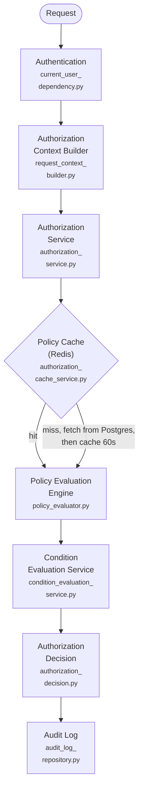
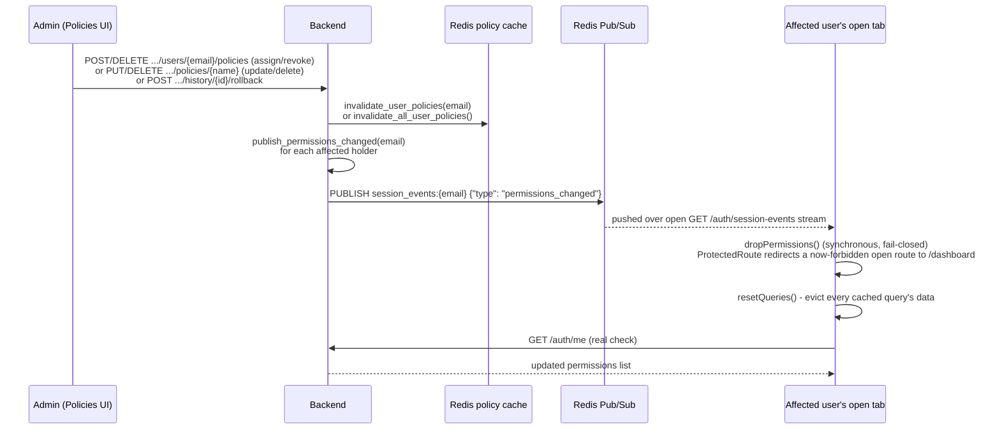

# Architecture Overview

## Request flow


```mermaid
flowchart TD
    Request(["Request"])
    Auth["Authentication<br/><small>current_user_<br/>dependency.py</small>"]
    Ctx["Authorization<br/>Context Builder<br/><small>request_context_<br/>builder.py</small>"]
    Svc["Authorization<br/>Service<br/><small>authorization_<br/>service.py</small>"]
    Cache{"Policy Cache<br/>(Redis)<br/><small>authorization_<br/>cache_service.py</small>"}
    Eng["Policy Evaluation<br/>Engine<br/><small>policy_evaluator.py</small>"]
    Cond["Condition<br/>Evaluation Service<br/><small>condition_evaluation_<br/>service.py</small>"]
    Dec["Authorization<br/>Decision<br/><small>authorization_<br/>decision.py</small>"]
    Log["Audit Log<br/><small>audit_log_<br/>repository.py</small>"]

    Request --> Auth --> Ctx --> Svc --> Cache
    Cache -- "hit" --> Eng
    Cache -- "miss, fetch from Postgres,<br/>then cache 60s" --> Eng
    Eng --> Cond --> Dec --> Log
```

Every real (non-hypothetical) authorization decision in the app goes through this exact pipeline, once. Nothing above the Authorization Service reads a user's role, a permission-role mapping, or does its own access comparison: routes only ever declare *what action on what resource type* they need. Before evaluation, the Authorization Service fetches the caller's active policies through a Redis cache-aside layer (`authorization/repositories/policy_assignment_repository.py`), not straight from Postgres on every call. See [Troubleshooting: Redis cache management](troubleshooting.md#redis-cache-management) for TTL and invalidation rules.

---

## Component responsibilities

### Authentication
`auth/current_user/current_user_dependency.py`'s `get_current_user` verifies the `access_token` cookie and returns `{name, email, role}`. Authentication answers *who is calling*; it never answers *what they're allowed to do*. `role` here is metadata only: see [Adding New Permissions](adding-permissions.md) for why role never grants access.

### Authorization Context Builder
`authorization/context/request_context_builder.py`'s `build_authorization_context(request)` produces the one `context` dict every real authorization check evaluates conditions against:

```python
{
    "ip_address": "203.0.113.7",       # resolved via auth/security/client_ip.py
    "current_time": "2026-07-13T12:00:00+00:00",  # this server's own clock
    "security_context": {},             # reserved for a future trust-signal layer
}
```

**Rule: never trust client-supplied values by default.** `ip_address` is resolved by `auth/security/client_ip.py::get_client_ip`: the literal TCP peer (`request.client.host`) unless the peer itself is listed in `TRUSTED_PROXY_IPS` (`.env`, empty/untrusted by default), in which case the left-most `X-Forwarded-For` entry is trusted instead. `current_time` always comes from this backend's own clock, never anything in the request body or headers. The one deliberate exception is the authorization-check *inspection* endpoint (`POST /authorization/users/{email}/authorization-check`), which accepts a caller-supplied `context` on purpose: it's a "what would happen if" simulation tool for admins, not a real access decision, so there's nothing to spoof.

### Authorization Service
`authorization/services/authorization_service.py`. The single entry point every route/service calls:

- `authorize(user_email, action, resource_type, db, resource=None, context=None) -> bool`: the common case. Thin wrapper over `authorize_with_decision`.
- `authorize_with_decision(...) -> AuthorizationDecision`: computes the decision and writes an audit log entry. `authorize()` is just `.allowed` off of this.
- `authorize_detailed(...) -> AuthorizationDecision`: same computation, **no audit log write**. Used by the admin inspection endpoint and by `authorize_with_decision` internally, so a hypothetical "what if" query never pollutes the real audit trail.
- `authorize_batch(user_email, checks, db, context=None) -> list[AuthorizationDecision]`: fetches the user's policies **once** and evaluates every check against that same list, logging each decision individually. Used by `POST /authorization/batch-check`.
- `require(...)`: same as `authorize()`, but raises `HTTPException(403)` instead of returning `False`. This is what `dependencies/authorization_dependency.py`'s `require_authorization(action, resource_type)` factory calls: the dependency every protected route depends on.
- `assert_authorized_to_grant(caller_email, actions, resource_type, db)`: the privilege-escalation guard: before a policy create/update/assign can hand out one of this app's own sensitive actions (`Permission`'s vocabulary: see [Adding New Permissions](adding-permissions.md)), the caller must already hold it themselves. The implementation is `authorization/services/authorization_grant_guard.py::assert_authorized_to_grant`, a standalone function rather than a method on this class, imported locally inside it to avoid a circular import (`authorization_grant_guard` itself calls back into `AuthorizationService.authorize` to check what the caller holds); `AuthorizationService` re-exposes it as a static method so existing `authorization_service.assert_authorized_to_grant(...)` call sites don't change. Applied symmetrically, not just on the grant side: `update_policy` and `delete_policy` (`policy_crud_routes.py`) call it with the policy's *current* actions/resource_type before touching it at all, and `remove_policy_from_user` (revoke, `policy_assignment_routes.py`) calls it the same way before removing an assignment. Without the symmetric half, bare `policies:delete`/`update`/`revoke` (without holding what the policy actually grants) could strip, narrow, or repurpose an equally- or more-privileged peer's access, including revoking `system_superuser` off someone else, with no escalation check at all.

### Policy Evaluation Engine
`authorization/evaluators/policy_evaluator.py`'s `PolicyEvaluationEngine`. Pure and DB-free: given a user's already-fetched policies plus `(action, resource_type, resource, context)`, it:

1. Filters to policies whose `resource_type` matches (or is `"*"`).
2. Filters to policies whose `actions` list contains the requested action.
3. For each matching candidate, delegates the whole `conditions` block to the Condition Evaluation Service.
4. Builds an `AuthorizationDecision`: `allowed` is `True` iff at least one candidate's conditions passed.

The engine has **zero condition-specific logic**. It doesn't know what `"time"` or `"self_only"` mean: see [Adding New Condition Handlers](adding-condition-handlers.md) for why that separation is deliberate.

### Condition Evaluation Service
`authorization/conditions/condition_evaluation_service.py`. Dispatches each key in a policy's `conditions` dict to its registered handler (`authorization/conditions/condition_registry.py`) and ANDs the results. An unrecognized condition key **fails safe (denies)** rather than being silently ignored: a policy can never grant access via a condition the engine doesn't understand.

### Authorization Decision
`authorization/evaluators/authorization_decision.py`'s `AuthorizationDecision`: the explainable result object:

| Field | Meaning |
|---|---|
| `allowed` | The final decision. |
| `evaluated_policies` | Every policy's name the engine was given, regardless of match. |
| `matched_policies` | Matched action+resource_type **and** conditions passed: what actually granted access. |
| `rejected_policies` | Matched action+resource_type but conditions failed. |
| `failed_conditions` | `{policy_name: [condition_key, ...]}` for every rejected policy. |
| `denial_reason` | `None` if allowed; else `"no_assigned_policies"`, `"no_matching_policy"`, or `"condition_failed"`. |
| `evaluation_timestamp` | ISO 8601 UTC, this server's clock. |

### Audit Log
`authorization/repositories/audit_log_repository.py` + the `authorization_audit_log` table. Every `authorize()`/`authorize_with_decision()`/`authorize_batch()` call writes one row: `allowed`, `candidate_policy_names`, `granting_policy_names`, `failed_conditions`, and the `context` it was evaluated against. Append-only; no update/delete API exists for it. Query via `GET /authorization/audit-log` (requires `policies:read`), `GET /authorization/audit-log/users/{email}` (requires `policies:read`), or `GET /authorization/audit-log/me` (any authenticated caller, their own entries only).

For a single decision (`authorize()`/`authorize_with_decision()`), the row is not written inline: `_log_decision` queues it via `log_authorization_decision_task` (`procrastinate_tasks/audit_log_tasks.py`), and a Procrastinate worker performs the actual insert. `authorize()` itself only waits on the (small, cheap) enqueue, not on the audit row's write; the write is picked up over Postgres `LISTEN/NOTIFY`, typically landing in well under a second. This keeps every protected route's response latency independent of the audit-log commit, which the response never depended on in the first place, while still giving the write Postgres-backed durability (a worker crash retries the job rather than losing the entry, unlike an in-process fire-and-forget task). `authorize_batch()` still writes its rows inline, one bulk insert per batch, since a batch request is already amortizing the cost across up to 50 checks.

---

## Integration points

- **Every protected route** depends on `Depends(require_authorization(action, resource_type))`: see `authorization/dependencies/authorization_dependency.py`. This is the only supported way to gate a route; it builds context and calls `AuthorizationService.require` for you.
- **Policy mutations** (`create`/`update`/`delete`/`assign_policy_to_user`/`remove_policy_from_user` in `authorization/repositories/policy_repository.py`) each: (a) stage a `policy_history` row in the same transaction (see [Writing and Testing Policies](writing-testing-policies.md)), and (b) invalidate the Redis policy cache (see [Troubleshooting](troubleshooting.md#redis-cache-management)). `policy_repository.py` owns `Policy` CRUD itself; the user-policy assignment side (`assign_policy_to_user`, `remove_policy_from_user`, `get_active_policies_for_user`, `get_policies_for_user`, `count_assignments`) lives in the sibling `authorization/repositories/policy_assignment_repository.py` and is re-exposed on `policy_repository` as bound static methods, so `policy_repository` stays the one call surface even though the two concerns are file-split.
- **The Batch Authorization API** (`POST /authorization/batch-check`) reuses the exact same `PolicyEvaluationEngine`/`ConditionEvaluationService` calls as a single `authorize()`: it only changes how many times policies are *fetched* (once per batch, not once per check), never how a decision is computed.

---

## Real-time push

The Redis policy cache above (`authorization/caching/authorization_cache_service.py`) keeps the *server* correct immediately: the next request after a grant/revoke/update/delete always evaluates against the current policy set, cache or no cache. But a browser tab that already has a permission-gated page open (Policies, Rate Limit Dashboard, a `IfCan`-gated button) has no way to notice a change made from *another* tab or by an admin elsewhere, short of its own background poll (`useCurrentUserQuery`'s 2-minute `refetchInterval`) or a manual refresh.

This reuses the same per-account SSE channel documented in [Session Management: Real-time push](../authentication/session-management.md#real-time-push) (`GET /auth/session-events`, `session_events:{email}` Redis Pub/Sub) rather than adding a second stream: `user_session/session_events.publish_permissions_changed(email)` is called from every policy mutation that can change what an account is granted. Unlike the `revoked`/`created` events on the same channel, the frontend's `useSessionEventsStream.ts` handler *does* branch on `type: "permissions_changed"` specifically, because merely invalidating the current-user query left an exploitable gap: a page like Rate Limit Dashboard uses TanStack Query's `placeholderData: keepPreviousData` for smooth pagination, which kept re-rendering its last real cached data as a placeholder on every filter/page click while waiting for the (now-403'ing) request to resolve - repeatable indefinitely on an open tab, since nothing had evicted that cache. On `permissions_changed` the handler instead:

1. Synchronously zeroes out `permissions` in the Zustand `authStore` (`dropPermissions()`), *before* any network round-trip. `ProtectedRoute`/`IfCan`/the sidebar's nav filter all read permissions reactively from that store, so this alone fails every permission check closed immediately - no cached data, stale or fresh, can pass a check that's already failing.
2. Calls `queryClient.resetQueries()` (not `invalidateQueries`): drops every cached query's data outright, not just marks it stale, so nothing is left over to serve as a `keepPreviousData` placeholder either, and forces an immediate refetch of the real `GET /auth/me` to learn the account's actual new permission list (repopulating it if this was a grant, not a revoke).

`ProtectedRoute` (`authorization/ProtectedRoute.tsx`) also distinguishes *why* a given render is denied: a route that was already showing (`wasEverAllowed`, tracked via a ref) redirects straight to `/dashboard` - the live-revoke case, no detour through a "you don't have permission" page that would misdescribe what just happened - while a route that was never allowed in the first place (a direct navigation/deep link to something the caller never held) still redirects to `/not-authorized` as before.


```mermaid
sequenceDiagram
    participant Admin as Admin (Policies UI)
    participant API as Backend
    participant Cache as Redis policy cache
    participant PubSub as Redis Pub/Sub
    participant Tab as Affected user's open tab

    Admin->>API: POST/DELETE .../users/{email}/policies (assign/revoke)<br/>or PUT/DELETE .../policies/{name} (update/delete)<br/>or POST .../history/{id}/rollback
    API->>Cache: invalidate_user_policies(email)<br/>or invalidate_all_user_policies()
    API->>API: publish_permissions_changed(email)<br/>for each affected holder
    API->>PubSub: PUBLISH session_events:{email} {"type": "permissions_changed"}
    PubSub-->>Tab: pushed over open GET /auth/session-events stream
    Tab->>Tab: dropPermissions() (synchronous, fail-closed)<br/>ProtectedRoute redirects a now-forbidden open route to /dashboard
    Tab->>Tab: resetQueries() - evict every cached query's data
    Tab->>API: GET /auth/me (real check)
    API-->>Tab: updated permissions list
```

- **Assign/revoke** (`assign_policy_to_user`/`remove_policy_from_user`, `api/pbac_routes/policy_assignment_routes.py`) know the single affected `user_email` already, so each publishes to just that one channel after its own cache invalidation and audit log write.
- **Update/delete/rollback** (`policy_crud_routes.py`'s `update_policy`/`delete_policy`, `policy_history_routes.py`'s `rollback_policy`) can change what *every* current holder of that policy is granted, all at once. Each fetches the holder list first (`policy_repository.get_holder_emails`, since a definition change, a cascade-delete, or a restore don't otherwise leave a way to know who held it), then fans out `publish_permissions_changed` to every one of those emails via `asyncio.gather` after the mutation succeeds. `update_policy` only does this when the change could actually alter access (`actions`/`resource_type`/`is_active` in the patch). A pure description/conditions edit, or reactivating via `is_active=True`, doesn't change what any holder is granted, so it skips the fan-out. `delete_policy` and `rollback_policy` always fan out: a delete always removes every holder's access, and a rollback's restored snapshot always includes `actions`/`resource_type`/`is_active` (the full definition, not a partial patch).
- **The published event is deliberately minimal** (`{"type": "permissions_changed"}`), the same "something changed, go check now" contract as the session-revoked/session-created events on this channel: never an authoritative new permission set on its own. `dropPermissions()` is a fail-closed *assumption* ("holds nothing until proven otherwise"), not the real answer - the receiving tab's `GET /auth/me` is still what actually decides what it can do, and self-corrects the optimistic empty list a moment later.
- **Best-effort, like every publish on this channel**: a Redis hiccup here is logged and swallowed, never turning a successful policy mutation into a failed request. The 2-minute background poll on `useCurrentUserQuery` remains the fallback for a silently dropped SSE connection.

---

## Full route list

| Method | Path | Permission required |
|---|---|---|
| POST | `/authorization/policies` | `policies:create` |
| GET | `/authorization/policies` | `policies:read` |
| GET | `/authorization/policies/{name}` | `policies:read` |
| PUT | `/authorization/policies/{name}` | `policies:update` |
| DELETE | `/authorization/policies/{name}` | `policies:delete` |
| GET | `/authorization/policies/{name}/history` | `policies:read` |
| GET | `/authorization/policies/{name}/history/compare` | `policies:read` |
| POST | `/authorization/policies/{name}/history/{id}/rollback` | `policies:update` |
| POST | `/authorization/users/{email}/policies` | `policies:assign` |
| DELETE | `/authorization/users/{email}/policies/{name}` | `policies:revoke` |
| GET | `/authorization/users/{email}/policies` | `policies:read` |
| GET | `/authorization/users/me/policies` | any authenticated user (self-service) |
| POST | `/authorization/users/{email}/authorization-check` | `policies:read` |
| POST | `/authorization/batch-check` | `users:read_own` (checks the caller's own authorization) |
| GET | `/authorization/audit-log` | `policies:read` |
| GET | `/authorization/audit-log/me` | any authenticated user |
| GET | `/authorization/audit-log/users/{email}` | `policies:read` |

---

## Frontend Policy Management UI

The admin-facing policy screens live under `frontend/src/mystic_auth/policies/` and `frontend/src/mystic_auth/users/`, routed at `/policies` (gated by `policies:read`):

| File | Role |
|---|---|
| `policies/PoliciesPage.tsx` | List/search policies, activate/deactivate, delete; every action gated by `IfCan` against the matching permission (`policies:create`/`update`/`delete`) |
| `policies/PolicyFormDialog.tsx` | Create/edit form, including the raw `conditions` JSON block described in [Condition Schema Reference](condition-schema-reference.md) |
| `policies/PolicyDetailsDialog.tsx` | Read-only view of a policy's actions, resource type, and conditions |
| `policies/PolicyStatsCard.tsx` | Summary counts (active/inactive policies, total assignments) on the Policies page |
| `users/UserPoliciesDialog.tsx` | Assign/revoke policies for a specific user, calling `POST`/`DELETE /authorization/users/{email}/policies` |
| `api/policies_api.ts` | Typed client for every route in the table above |

The UI is a thin client over the routes above: it does not duplicate the grant-guard or condition logic. `assert_authorized_to_grant` (see "Authorization Service" above) still runs server-side on every create/update/assign, so the form does not need to (and does not) replicate that check.
