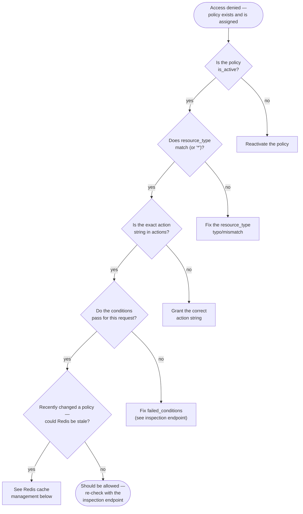

# Operational Troubleshooting Guide

## Common issues and solutions

### "Why was this user denied?" — use the audit log or the inspection endpoint

Every real `authorize()` call writes a row to `authorization_audit_log` with `allowed`, `candidate_policy_names`, `granting_policy_names`, and `failed_conditions`. Query it:

- `GET /authorization/audit-log/me` — your own history, no special permission needed.
- `GET /authorization/audit-log/users/{email}` — anyone's history (requires `policies:read`).

For a hypothetical "would this be allowed" question rather than a historical one, use `POST /authorization/users/{email}/authorization-check` — it runs the identical decision logic and returns `denial_reason` (`no_assigned_policies` / `no_matching_policy` / `condition_failed`) plus which policies were candidates vs. which actually granted it.

### A policy exists and is assigned, but access is still denied

Check, in order:

1. **Is the policy active?** `is_active=false` policies are filtered out before the evaluator ever sees them.
2. **Does `resource_type` actually match** (or is it `"*"`)? A typo here (`"user"` vs `"users"`) silently produces zero candidates.
3. **Is the exact action string present** in `actions`? `"users:update_own"` and `"users:update_any"` are different actions on purpose.
4. **Do the conditions actually pass for this specific request?** Use the inspection endpoint with the real `resource`/`context` you expect — `candidate_policies` non-empty but `authorized: false` means a policy matched but a condition rejected it; check `failed_conditions` (batch-check) or compare `candidate_policies` vs `granting_policies` (single-check inspection).
5. **Redis cache serving a stale policy list?** See [Redis cache management](#redis-cache-management) below.



### Invalid policy `conditions` rejected with 422

The response body lists every problem found (not just the first) — see the [Condition Schema Reference](condition-schema-reference.md) for each type's exact required shape. Common mistakes: `date_range` using `start_date`/`end_date` instead of `start`/`end`; `time.timezone` not being a real IANA name (`"EST"` isn't one — use `"America/New_York"`); `network.allowed_ips` containing a bare hostname instead of an IP/CIDR.

### A caller with `policies:create`/`update`/`assign` gets 403 "Cannot grant action ... you do not hold it yourself"

This is the privilege-escalation guard working as intended (see [Architecture](architecture.md#authorization-service)) — holding the ability to *manage* policies doesn't let you hand out actions you don't already have. The caller needs to already hold every sensitive action (from `Permission`'s vocabulary) that the policy grants — typically means they need `system_superuser` too, not just a `policies:*` action.

### 403 on baseline policy delete/rename, or 409 on revoking the last `system_superuser`

Also intentional (see [Writing and Testing Policies](writing-testing-policies.md#protected-baseline-policies)) — these guard against permanently locking the system out of its own authorization management.

## Logging and debugging

- All authorization-relevant logging goes through `backend/mystic_auth/logging/logging_config.py`'s `get_logger(__name__)` — structured, module-scoped loggers.
- `AuthorizationService._log_decision`'s own failures (a broken audit write) are caught and logged as a `warning`, never re-raised — an audit logging failure must never break the actual authorization decision it's describing. If you suspect audit entries are silently failing to write, check application logs for `"Failed to write authorization audit log entry"`.
- `AuthorizationCacheService` similarly logs (and swallows) every Redis failure with a specific prefix per operation (`"Authorization cache read failed"`, `"...write failed"`, `"...invalidation failed"`, `"...namespace flush failed"`) — grep for these to confirm whether a perceived staleness issue is actually a cache failure being silently absorbed.
- The backend container's own request logs (`docker compose logs backend`) show every HTTP request/response; for a specific authorization decision, correlate by timestamp against the audit log's `created_at`.

## Redis cache management

`authorization/caching/authorization_cache_service.py` is the **only** place authorization code talks to Redis. It caches exactly one thing: a user's active, assigned policy list (`authz:user_policies:{email}`, 60s TTL). It deliberately does **not** cache policy-lookup-by-name or final evaluation decisions — see the module's own docstring for the correctness reasons (a cached, session-detached `Policy` object fed into an update/delete would break SQLAlchemy's identity map; caching a final decision would risk serving a stale answer for genuinely time/context-sensitive conditions).

**Invalidation happens automatically:**
- Policy `update`/`delete` → flushes the *entire* `authz:user_policies:*` namespace (a policy's own definition change can affect every holder, and there's no cheap reverse index).
- Policy assign/revoke via the management API → invalidates just that one user's cache entry.

**If you suspect stale cached permissions:**

```bash
docker compose exec redis redis-cli KEYS "authz:user_policies:*"
docker compose exec redis redis-cli DEL "authz:user_policies:someone@example.com"
docker compose exec redis redis-cli FLUSHDB   # nuclear option — clears everything in this logical DB
```

**Fail-closed behavior:** every cache method catches all Redis errors and returns a cache-miss sentinel rather than raising. "Fail closed" here means *the cache is never trusted over the database* — any Redis error transparently falls through to the authoritative DB query, not "deny every authorization request when Redis is down." A fully unreachable Redis degrades performance (every check re-fetches from Postgres), never correctness or availability.

**Verifying it end-to-end** (useful after any change to the caching layer):

```bash
docker compose exec -w /repo backend python -c "
import asyncio
from backend.mystic_auth.authorization.caching.authorization_cache_service import authorization_cache_service
from backend.mystic_auth.authorization.models.policy_model import Policy

async def main():
    p = Policy(name='x', actions=['a'], resource_type='r', conditions=None, is_active=True)
    await authorization_cache_service.set_user_policies('test@example.com', [p])
    print(await authorization_cache_service.get_user_policies('test@example.com'))
    await authorization_cache_service.invalidate_user_policies('test@example.com')
    print(await authorization_cache_service.get_user_policies('test@example.com'))

asyncio.run(main())
"
```

## Database connection issues

### "Cannot connect to Postgres" from the host, but the container is healthy

The compose file publishes Postgres on host port `5433` (not the default `5432`) specifically to dodge the most common version of this: a native PostgreSQL install, or another Docker Compose project, already listening on `5432`. If you still hit this — e.g. something else is bound to `5433`, or `DATABASE_URL`/`localhost` port was changed — check what's actually listening:

```bash
# Windows: check what's actually listening
netstat -ano | findstr :5433
tasklist /FI "PID eq <pid-from-above>"
```

**Do not stop host services automatically** — this needs an explicit decision from whoever owns that machine (stop the conflicting service, or remap the Docker port again in `docker-compose.yml`). The safe workaround used throughout this project's own test suite: run everything **inside** the Docker network instead of from the host:

```bash
docker compose exec -w /repo backend python -m pytest tests/
```

(The `-w /repo` working directory requires the `backend` service's `docker-compose.yml` entry to mount the repo root, not just `./backend`, as an additional volume — see that file's `backend.volumes` for the `.:/repo` line and its comment.)

### Migrations won't apply / "relation already exists"

Verify you're pointed at the container you think you are, and that `DATABASE_URL` resolves to the right host (`postgres` inside the Docker network, `localhost` from the host — see any `tests/backend/conftest.py`'s environment-derivation logic for the exact substitution rule). To start completely fresh:

```bash
docker compose exec postgres psql -U ${POSTGRES_USER} -d ${POSTGRES_DB} -c "DROP SCHEMA public CASCADE; CREATE SCHEMA public;"
docker compose run --rm alembic
```

This reproduces the full migration chain from empty state and re-seeds the three baseline policies — verified as part of this project's own Docker/Test Environment Verification pass.

### `docker compose exec -it <service>` fails with "Cwd must be an absolute path" or "cannot attach stdin to a TTY"

Two unrelated shell gotchas, both encountered running this project's own test suite from Git Bash on Windows:

- **Path mangling**: Git Bash rewrites absolute-looking paths (`/repo`) to a Windows path (`C:/Program Files/Git/repo`) before they ever reach `docker compose exec`. Fix: prefix the command with `MSYS_NO_PATHCONV=1`.
- **No TTY available**: drop the `-it` flags for any `docker compose exec`/`docker compose run` invoked from a non-interactive shell — `-i`/`-t` require a real terminal, and any script/CI running these commands should omit them entirely (the command runs identically without them; only interactive convenience is lost).
