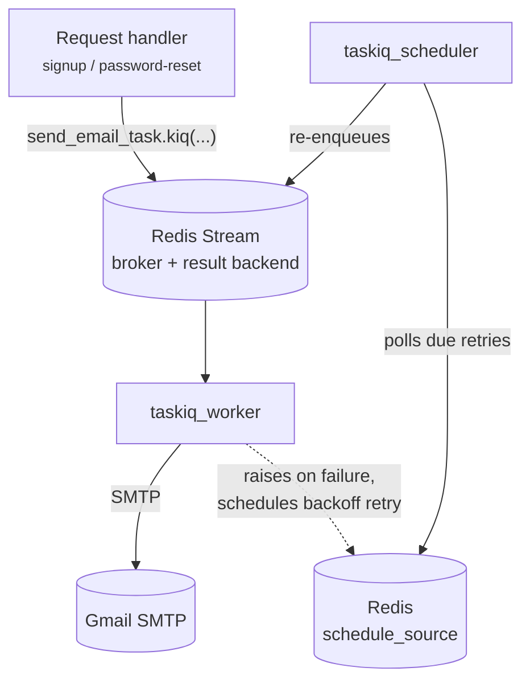

# Background Email Delivery

## Purpose

Offloads slow, failure-prone SMTP work from the request/response cycle, so signup, verification, and password-reset requests return without waiting on a mail server round trip.

---

## Architecture

Request handlers enqueue mail by calling
`backend/mystic_auth/taskiq_tasks/email_tasks.py::send_email_task.kiq(...)`.
Taskiq writes the job to Redis and the `taskiq_worker` service consumes it.

`backend/mystic_auth/taskiq_tasks/email_tasks.py` defines the default [Taskiq](https://taskiq-python.github.io/) broker:

```python
result_backend = RedisAsyncResultBackend(redis_url=settings.REDIS_URL)
schedule_source = ListRedisScheduleSource(settings.REDIS_URL)

broker: AsyncBroker = ResilientRedisStreamBroker(
    url=settings.REDIS_URL,
).with_result_backend(result_backend).with_middlewares(
    SmartRetryMiddleware(
        default_retry_count=3,
        default_delay=5,
        use_delay_exponent=True,
        max_delay_exponent=60,
        use_jitter=True,
        schedule_source=schedule_source,
    )
)

scheduler = TaskiqScheduler(broker=broker, sources=[schedule_source])

@broker.task(retry_on_error=True, max_retries=3)
async def send_email_task(to_email: str, subject: str, body: str, is_html: bool = True) -> bool:
    ...
```

Redis is the broker (a Redis Stream), the result backend, and the retry-schedule store, so the Docker path needs no separate message-queue infrastructure. The `taskiq_worker` container consumes the same broker, running from the identical `docker/backend.Dockerfile` image as the `backend` service, just with a different `command:` (`taskiq worker mystic_auth.taskiq_tasks.email_tasks:broker`, no `--reload` because the worker does not need file-watch). A second `taskiq_scheduler` container runs `taskiq scheduler mystic_auth.taskiq_tasks.email_tasks:scheduler` from the same image: it polls `schedule_source` for retries that are due and re-enqueues them onto `broker`. See [Backend Architecture](../architecture/backend.md) for why one image serves multiple roles (`backend`, `taskiq_worker`, `taskiq_scheduler`, `alembic`).



---

## Tasks

| Task | Enqueued from | Purpose |
|---|---|---|
| `send_email_task(to_email, subject, body, is_html=True)` | `auth/verify_account/account_verification_service.py`, `auth/password_logic/password_reset_service.py` | Sends email from the Taskiq worker via the configured SMTP sender (`aiosmtplib`) |

`send_email_task` itself doesn't talk to SMTP directly: it delegates to `emails/email_sender.py::email_sender` (an `EmailSender` protocol with one concrete `SMTPEmailSender` implementation). This is not a plugin system: swapping providers (e.g. SES, SendGrid, Postmark) means writing one new class and pointing `email_sender` at it, without touching the Taskiq task or its callers.

Both call sites build the HTML body via `emails/email_template_service.py::render_transactional_email` (a shared template with the app name/support address baked in from settings), then enqueue with `send_email_task.kiq(...)`:

```python
await send_email_task.kiq(
    to_email=user.email,
    subject="Verify your account",
    body=render_transactional_email(...),
)
```

`.kiq()` returns as soon as the task is enqueued in Redis, so the signup or password-reset request handler does not wait for SMTP delivery.

`send_email_task` logs `Sending email to {to_email}` right before handing off to `email_sender.send`, then `Email sent successfully to {to_email}` once it succeeds, both at INFO level, before returning `True`. It uses `logging_config.py::get_worker_logger()` rather than the usual `get_logger()`, so both lines are terminal-visible (`docker compose logs taskiq_worker`) instead of file-only. Background tasks have no HTTP access-log line marking when they start or finish, so these lifecycle logs make live sends visible while still writing to `logs/access.log`.

---

## Configuration

| Setting | Purpose |
|---|---|
| `REDIS_URL` | Broker + result backend connection |
| `FROM_EMAIL` | SMTP "From" address, also the account authenticating to the SMTP server |
| `GMAIL_APP_PASSWORD` | App password for the `FROM_EMAIL` account (Gmail requires a per-app password for SMTP with 2FA enabled) |
| `SUPPORT_EMAIL` | Optional; used as the email's `Reply-To`, falls back to `FROM_EMAIL` if unset |
| `SMTP_HOST` / `SMTP_PORT` | Optional; default to `smtp.gmail.com`/`587`. Override to point `SMTPEmailSender` at a different SMTP provider |
| `APP_NAME` | Required; product name used in the email template's branding |

---

## Failure handling and retries

The broker runs `taskiq.SmartRetryMiddleware`, and `send_email_task` is labeled `retry_on_error=True, max_retries=3`. On failure, `send_email_task` logs the full traceback and **raises** (rather than swallowing the exception): this is what lets the middleware see the failure and schedule a retry with exponential backoff (`default_delay=5`, `use_delay_exponent=True`, capped at `max_delay_exponent=60` seconds, with `use_jitter=True` so many simultaneously-failing emails don't all retry on the exact same tick), up to 3 attempts total. A transient SMTP failure (a momentary Gmail outage, a network blip) now gets retried automatically, with backoff, instead of hammering an already-struggling SMTP server or silently dropping the email.

A permanent failure (e.g. bad SMTP credentials) still exhausts all 3 attempts: each attempt logs its own traceback, and the middleware itself logs a final "Maximum retries count is reached" warning, so the failure is visible in logs even though nothing pages an operator automatically. No dead-letter queue or external alerting is configured: an operator watching logs would see it, but nothing pages anyone automatically. Left as a deployment-specific follow-up, since this template doesn't assume a specific alerting stack.

**Why a separate scheduler process**: `SmartRetryMiddleware`'s delay/backoff labels only take effect when given a `schedule_source` — without one, the "delay" is a no-op label and retries re-enqueue immediately, same as `SimpleRetryMiddleware`. The `schedule_source` (`ListRedisScheduleSource`, backed by Redis) is where the middleware writes each retry's due-time; nothing reads that store back out except a `TaskiqScheduler`. That's why a dedicated `taskiq_scheduler` container runs alongside `taskiq_worker`: the scheduler polls `schedule_source` and re-enqueues due retries onto the broker, while `taskiq_worker` keeps consuming the stream. Both processes point at the same Redis and share the same `broker`/`scheduler` objects defined in `email_tasks.py`.

---

## Redis stream recovery

`RedisStreamBroker.startup()` eagerly runs `XGROUP CREATE ... MKSTREAM` (atomically creating both the stream and the consumer group) and is `await`ed by Taskiq's own `Receiver.listen()` before the read loop starts. With 2 worker processes (`WorkerArgs.workers` default) both calling `startup()` independently, whichever process loses the `XGROUP CREATE` race gets a `BUSYGROUP` error, which the broker catches and logs at `debug` level.

That protects normal fresh-Redis startup, but it does not protect the worker if the stream or consumer group disappears after startup. A Redis `FLUSHDB`, cache reset, or test run sharing the live worker's Redis DB can delete the `taskiq` stream while workers are blocked in `XREADGROUP`, causing a `NOGROUP` response. `ResilientRedisStreamBroker` wraps the pinned `taskiq-redis` broker and handles that case by logging a warning, re-declaring the consumer group, and resuming listening.

It also handles a dropped Redis connection while blocked in `XREADGROUP` (for example, if Redis is restarted underneath the worker): it logs a warning, waits briefly, and re-enters the listener so the broker gets a fresh Redis connection instead of crashing the worker process. Other Redis errors still propagate.

Regression tests in `tests/backend/mystic_auth/unit/taskiq_tasks/test_email_tasks_unit.py` cover these mechanisms: `mkstream=True` + graceful `BUSYGROUP` handling for startup, re-declaration after a runtime `NOGROUP`, and reconnect after a runtime connection drop.

---

## Testing

`tests/backend/mystic_auth/unit/taskiq_tasks/test_email_tasks_unit.py` exercises `send_email_task` directly: the success path, the failure-raises-for-retry path, that the broker's retry middleware and the task's `retry_on_error`/`max_retries` labels are configured, and the fresh-Redis startup race guard above. The call sites (`account_verification_service.py`, `password_reset_service.py`) are separately tested with `send_email_task.kiq` mocked/patched. See [Testing Overview](../testing/overview.md).

---

## Troubleshooting

- **Worker not picking up tasks**: confirm `taskiq_worker` can reach `REDIS_URL`: same Redis instance the `backend` container uses. `./scripts/docker/dev-up.sh`, `.\scripts\docker\dev-up.ps1`, and `scripts\docker\dev-up.cmd` now include `taskiq_worker` and `taskiq_scheduler` in their live log tail; `docker compose logs taskiq_worker` still shows only the worker.
- **Retries never happen / a failed email is never retried**: confirm the `taskiq_scheduler` container is running (`docker compose ps taskiq_scheduler`). If it's down, `SmartRetryMiddleware` still writes each retry's due-time to `schedule_source` in Redis, but nothing polls it back out, so the retry silently never fires even though the first attempt's failure was logged.
- **Emails not arriving**: check `GMAIL_APP_PASSWORD` is a valid App Password (not the account password) and that "Less secure app access" / App Passwords are enabled on the sending Google account; check the dev-up log tail or `docker compose logs taskiq_worker` for the logged traceback (`send_email_task` logs every failure with `logger.error`).
