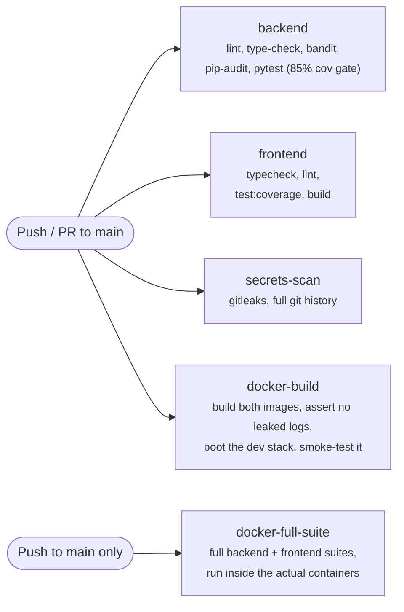

# CI/CD Overview

## Workflow

`.github/workflows/ci.yml`: triggers on every push and pull request targeting `main`. Declares top-level `permissions: contents: read`: none of the jobs below push commits, comment on PRs, or need any write access, so the default `GITHUB_TOKEN` is scoped down explicitly rather than left at whatever the repo/org default happens to be; a compromised action dependency in this workflow can't do more than read the checkout. Five independent jobs (no job depends on another); the first four run on every push/PR, the fifth only on a push to `main`:



### `backend`: Backend (unit + integration)

- Spins up Postgres 15 and Redis 7 as GitHub Actions **service containers** (not Docker Compose: a deliberate, lower-overhead equivalent for CI; Compose remains the source of truth for local development).
- All required settings (`SECRET_KEY`, `GOOGLE_CLIENT_ID`, `APP_NAME`, etc.: `core/settings.py` has no defaults for most of them) are provided as job-level env vars with clearly-fake CI-only values, since there's no checked-in `.env` for CI to read. `APP_NAME` in particular is set to `MysticAuth` here purely because `Settings` requires *some* value and refuses to start without one: it has no bearing on the actual product name. If you've cloned this repo as a template and renamed the app (see [Using This Repository as a Template: environment configuration](../template-usage/overview.md#environment-configuration)), there's no need to touch this CI value to match: it's a placeholder for test runs, not branding that needs to stay in sync with your `.env`.
- Installs both `backend/requirements.txt` and `backend/requirements-dev.txt` (ruff, mypy, bandit: static-analysis-only, never installed in the runtime image), then runs `pip-audit -r backend/requirements.txt` (dependency vulnerability scan) before proceeding.
- Runs `ruff check`, `mypy`, and `bandit -c pyproject.toml` (all three configured in `backend/pyproject.toml`): lint, type-check, and a Python-specific security scan, each as its own step so the specific failing tool is visible in the Actions UI.
- Runs `alembic upgrade head`, then `alembic check`: the latter fails if any SQLAlchemy model's columns/indexes have drifted from what the migrations actually create (e.g. a model field changed without a matching migration).
- Then `pytest tests/backend/app tests/backend/mystic_auth/unit` (the thin `app/` wrapper's own tests run alongside the `mystic_auth/` unit suite, as one coverage base), then `pytest tests/backend/mystic_auth/integration --cov-append`, then `pytest tests/backend/mystic_auth/security --cov-append --cov-fail-under=85`. The `--cov-append` flags accumulate coverage across all three steps, so the 85% gate on the final step checks *cumulative* unit+integration+security coverage (currently ~91%), not any one suite alone: `pytest.ini` deliberately does not bake `--cov-fail-under` into `addopts` itself, since that would also apply to (and false-fail) a developer running a single suite locally. See [Testing Overview](../testing/overview.md).
- Then runs `pytest tests/backend/mystic_auth/performance` as a **non-blocking** (`continue-on-error: true`) step: informational only, since its thresholds, while generous regression alarms rather than a strict SLA, can still be noisier on shared GitHub-hosted runners than locally.

### `frontend`: Frontend (typecheck + lint + test + build)

- Node version is pinned to an explicit patch (`22.22.0`), not a bare major (`22`): React Router 8 requires Node `>=22.22.0`, so an explicit patch guarantees the floor is met rather than trusting whichever latest-22.x a runner happens to resolve.
- `npm ci --legacy-peer-deps`, then `npm audit --audit-level=high` (dependency vulnerability scan, blocking), then `npm run typecheck`, `npm run lint`, `npm run test:coverage` (not plain `test`, since coverage must actually be collected for `vitest.config.ts`'s `coverage.thresholds` to be evaluated at all), `npm run build`, each as a separate step (so the specific failing stage is visible in the Actions UI).

### `secrets-scan`: Secrets scan (gitleaks)

- Checks out full git history (`fetch-depth: 0`, not just the latest commit) and runs [gitleaks](https://github.com/gitleaks/gitleaks) against it: catches a secret that was committed and later "removed" (but still sits in history), not just what's in the current working tree.

### `docker-build`: Docker image build verification

- Builds `docker/backend.Dockerfile` and `docker/frontend.Dockerfile --target production` to confirm both images still build cleanly.
- Runs the built backend image and asserts `/app/logs` exists but is **empty**: a regression guard for a real bug found during a pre-release image-contents audit (local access-log files, with real request data, were previously getting baked into the image via a `.dockerignore` gap: see [Security Decisions](../security/decisions.md#dockerignore-previously-let-local-files-leak-into-built-images)). The directory itself is expected to exist (the app creates it on import); this only checks that no host-side log content rode along inside it.
- Then boots the real dev stack (`docker compose up -d --build postgres redis alembic backend frontend`) and smoke-tests it: waits for the backend's `/health/ready` and the frontend's dev server to respond, then checks the actual response bodies (`{"status":"ok"}` from the backend, the app shell's root `<div>` from the frontend) before tearing everything down. This is a different class of check from everything else in this job: it confirms the *images and their compose wiring* actually boot and serve traffic (catches a bad env var passthrough, a broken healthcheck, a file the app needs at runtime that didn't make it into the image), a class of bug the `backend`/`frontend` jobs above can't see at all, since those run the same source code on a bare runner and never touch a built image. It does **not** re-run the test suite: that's `docker-full-suite`, below.
- `BUGSINK_SUPERUSER_EMAIL` is blanked in this job's own `.env` copy before booting: `bugsink`/`bugsink-seed` aren't part of this invocation, so without the override the backend's startup command would still wait its full ~10s for a DSN file that will never arrive, wasting part of an already-tight boot budget for no reason. CI-only; a real `docker compose up` (which does start Bugsink) keeps the default.
- If any step in this job fails, a final `docker compose logs --no-color` step (only runs on failure) prints every container's own logs, so the Actions UI shows *why* a container never became healthy instead of just a bare timeout. This is exactly what caught the real bug behind this job's own first two failed runs: not a timing issue at all, but the backend crashing at import time with a `PermissionError` on GitHub's native-Linux runners: see [Docker Overview: why `/app/logs` is a named volume](../docker/overview.md#why-applogs-is-a-named-volume-not-part-of-the-backendapp-bind-mount) for the full story and fix.
- **No push to a registry, no deploy step**: this repo has no deploy pipeline; that's an explicit scope boundary (a template repository shouldn't assume a specific cloud/hosting target), not an oversight.

### `docker-full-suite`: Full test suite via Docker (main only)

- Gated to `if: github.event_name == 'push' && github.ref == 'refs/heads/main'`: does **not** run on pull requests, only once something actually merges to `main`.
- Boots the backend stack (same `BUGSINK_SUPERUSER_EMAIL` override as `docker-build`, same reasoning), then runs the exact same three test tiers as the `backend` job above (unit -> integration -> security, same `--cov-fail-under=85` gate): but *inside the running backend container* via `docker compose exec --user root`, instead of on a bare GitHub Actions runner. `--user root` is required here: `pytest.ini`'s coverage output writes to `/repo` (the whole-repo bind mount), which native Linux won't let the container's non-root `app` user write into: see [Docker Overview: running a one-off command inside a container](../docker/overview.md#running-a-one-off-command-inside-a-container) for the full explanation (same underlying cause as `/app/logs` needing a named volume, just for coverage's output instead).
- Boots the frontend, then runs its full test suite inside that container the same way.
- Same on-failure `docker compose logs` step as `docker-build`.
- This is deliberately a repeat of tests already run natively above, not a different set of tests: the value is running them through the actual deployable image (real container filesystem, real installed dependencies, real compose networking) rather than a bare runner, catching container-specific drift the native jobs structurally cannot. It's gated to `main`-only rather than every PR because the code under test is identical either way, so doubling CI time on every single PR would mostly just re-prove what the native jobs already proved, for a real but narrow class of bug that surfaces at the point of merging, not the point of proposing a change.

---

## What's covered

- Backend unit/integration/security suites, against real Postgres/Redis, gated by an 85% cumulative-coverage threshold; performance tests run too, non-blocking.
- Backend lint (ruff), type-checking (mypy), and security scanning (bandit): all configured in `backend/pyproject.toml`.
- A model/migration drift check (`alembic check`): fails if a SQLAlchemy model's columns or indexes don't match what the checked-in migrations actually produce.
- Full frontend type-check, lint, test (with coverage thresholds enforced), and production build.
- Both Docker images still build, and (on every PR) the actual dev compose stack boots and serves traffic.
- On every push to `main`: the entire backend + frontend test suites, re-run a second time inside the real containers rather than a bare runner.
- Dependency vulnerability scanning on every push/PR: `pip-audit` (backend, blocking) and `npm audit --audit-level=high` (frontend, blocking). There is no scheduled/automated dependency-update bot in this repo; dependency bumps are a manual, deliberate action (see the header comment in `backend/requirements.txt`), not something that opens PRs on its own.
- Secret scanning across full git history (`gitleaks`), independent of the backend/frontend jobs.

---

## What's not covered (tracked, not silently missing)

See [Concerns](../concerns/README.md) for the full entries:

- No image push to a registry and no deployment stage: deploying is a manual, documented process (see [Deployment Guide](../deployment/guide.md)), not automated.

This is deliberately left as a documented gap rather than added: extending `ci.yml` with a deploy stage is a workflow change with its own blast radius (new required checks, new secrets, a specific hosting target to assume), and unnecessary cloud-specific tooling doesn't belong in a template repository with no assumed production target.

---

## Local equivalents

Everything CI runs can be run locally:

```bash
# Backend static analysis (from repo root; dev tools installed via requirements-dev.txt)
# ruff's import-sorting/per-file-ignore rules are path-relative to its own
# working directory, not to --config's location, so this one still needs a
# `cd`: kept a single self-contained line so it doesn't change your shell's
# directory afterward.
(cd backend && ruff check app mystic_auth alembic ../tests/backend)
mypy --config-file backend/pyproject.toml backend/app backend/mystic_auth
bandit -r backend/app backend/mystic_auth -c backend/pyproject.toml
alembic -c backend/alembic.ini check

# Backend tests (from repo root, against local or Dockerized Postgres/Redis)
python -m pytest tests/backend/app tests/backend/mystic_auth/unit tests/backend/mystic_auth/integration tests/backend/mystic_auth/security -q
python -m pytest tests/backend/mystic_auth/performance -q

# Frontend (from repo root)
npm run typecheck --prefix frontend && npm run lint --prefix frontend && npm run test:coverage --prefix frontend && npm run build --prefix frontend

# Secrets scan (from repo root; requires gitleaks installed, or run via Docker)
gitleaks detect --source . -v

# Docker image builds (from repo root)
docker build -f docker/backend.Dockerfile -t backend:local .
docker build --target production -f docker/frontend.Dockerfile -t frontend:local .

# Boot + smoke-test the dev stack, the same thing docker-build does on every PR
cp .env.example .env
sed -i 's/^BUGSINK_SUPERUSER_EMAIL=.*/BUGSINK_SUPERUSER_EMAIL=/' .env   # skip the wasted Bugsink-DSN wait: bugsink isn't started below
docker compose up -d --build postgres redis alembic backend frontend
curl -sf http://localhost:8000/health/ready   # wait/retry until it returns {"status":"ok"}
curl -sf http://localhost:5173                # wait/retry until it responds
docker compose down -v && rm .env

# Full suite through the actual containers, the same thing docker-full-suite
# does on every push to main
cp .env.example .env
sed -i 's/^BUGSINK_SUPERUSER_EMAIL=.*/BUGSINK_SUPERUSER_EMAIL=/' .env
docker compose up -d --build postgres redis alembic backend
# --user root: needed on native Linux, or pytest-cov's coverage output
# (written to /repo, the whole-repo bind mount) crashes with a permission
# error: see docs/mystic_auth/docker/overview.md's "running a one-off
# command inside a container" section
docker compose exec -T --user root backend bash -c "
  cd /repo &&
  python -m pytest tests/backend/app tests/backend/mystic_auth/unit -q &&
  python -m pytest tests/backend/mystic_auth/integration -q --cov-append &&
  python -m pytest tests/backend/mystic_auth/security -q --cov-append --cov-fail-under=85
"
docker compose up -d --build frontend
docker compose exec -T frontend sh -c "npm run test -- --run"
docker compose down -v && rm .env
```
