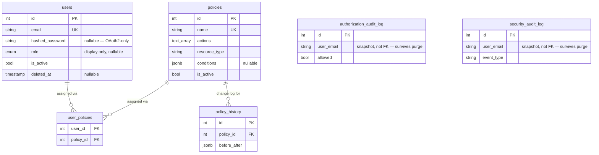

# Database Design

PostgreSQL, accessed via async SQLAlchemy (`backend/mystic_auth/database/`). Schema managed entirely through Alembic migrations (`backend/alembic/versions/`) — no `create_all()` in application startup.

`authorization_audit_log` and `security_audit_log` are drawn with no relationship lines above — deliberately: `user_email` is a snapshot string, not a foreign key to `users.id`, so the audit trail survives even after the user row is purged. See [Why two audit tables, not one](#why-two-audit-tables-not-one) and each table's own section below.

## Tables

### `users`

The single, unified identity table — password and OAuth2 (Google) accounts share it; there is no separate "oauth_accounts" table. See `backend/mystic_auth/user_table/user_model.py`.

| Column | Type | Notes |
|---|---|---|
| `id` | int, PK | |
| `name` | string | |
| `email` | string, **unique**, indexed | The DB-level unique constraint is what actually prevents a duplicate account under a signup/OAuth2-login race — see [Security Decisions](../security/decisions.md#the-signupoauth2-email-race). |
| `hashed_password` | string, nullable | Argon2 hash. **Null for OAuth2-only accounts** — there is no password to check, and `login_service.py` handles a null hash safely (compares against a dummy hash rather than short-circuiting, for timing-attack resistance — see [Authentication Flows](../authentication/overview.md#login)). |
| `role` | enum (`user`/`admin`/`system`), nullable | **Display/grouping metadata only — never consulted for an access decision.** See [Security Decisions](../security/decisions.md#role-is-never-used-to-decide-access). Nullable because the system must support a roleless account authorized purely through policies. |
| `is_verified` | bool | Email ownership confirmed (via the verification flow, or implicitly via Google's `verified_email`). |
| `is_active` | bool | **The single flag every auth check point gates on** (`login_service.py`, `oauth2_service.py`, `current_user_handler.py`). Also what soft delete reuses — see Account Lifecycle below. |
| `deleted_at` | timestamp, nullable | Soft-delete marker. `NULL` = never deleted. Set by soft delete, cleared by reactivation. |
| `created_at` / `updated_at` | timestamp | Server-side, automatic. |

### `policies`

The primary authorization unit — see [../authorization/architecture.md](../authorization/architecture.md) for how these are evaluated. `id`, `name` (unique), `description`, `actions` (`text[]`), `resource_type`, `conditions` (`jsonb`, nullable), `is_active`, `created_at`/`updated_at`, `created_by`.

### `user_policies`

Many-to-many join between `users` and `policies` — **the only thing that actually grants access**, never `users.role`. `user_id` and `policy_id` both `ON DELETE CASCADE`: a hard-deleted (purged) user's policy assignments disappear automatically with the row; a soft-deleted user's assignments are **not** touched (the row still exists) — see Account Lifecycle below.

### `policy_history`

Append-only change log for `policies` — every create/update/delete/rollback writes a row capturing the before/after state. See [../authorization/writing-testing-policies.md](../authorization/writing-testing-policies.md). Not a foreign-key target from anywhere; purely a forward-append audit trail.

### `authorization_audit_log`

One row per `authorize()`/`authorize_with_decision()`/`authorize_batch()` call — every real access decision, allow or deny. `user_email` is a **plain string column, not a foreign key** to `users.id` — deliberate: the audit trail must remain intact and queryable even after a user row is purged (hard-deleted). See [../authorization/architecture.md](../authorization/architecture.md#audit-log) for the full column list.

### `security_audit_log`

Separate audit vocabulary from the table above — login/logout/signup/OAuth2/password-reset/lockout/refresh-token-reuse events, plus the account lifecycle events (`account_deleted`/`account_purged`/`account_reactivated` — see below). Also `user_email` as a nullable **snapshot string**, not a foreign key, for the identical reason: this table must survive a purge. See `backend/mystic_auth/audit_log/audit_log_model.py`.

## Why two audit tables, not one

`authorization_audit_log` answers "was this specific action on this specific resource allowed, and by which policy" — a PBAC evaluation record. `security_audit_log` answers "what happened to this account" — a broader identity/session timeline (including things that have no policy evaluation at all, like a failed login attempt against a nonexistent email). They're queried by different audiences for different questions and were kept as two focused tables rather than one table with an ever-growing set of nullable, event-type-specific columns.

## Account lifecycle

Three operations, two permissions, deliberately separate:

| Operation | Endpoint | Permission | Reversible? |
|---|---|---|---|
| Soft delete (default) | `DELETE /users/{email}` | `users:delete_any` | Yes — via reactivate |
| Reactivate | `PATCH /users/{email}/reactivate` | `users:reactivate` | — |
| Purge (hard delete) | `DELETE /users/{email}/purge` | `users:purge` | **No** |

**Soft delete** (`user_lifecycle_crud.py::soft_delete`) sets `is_active=False` + `deleted_at=now()`. It deliberately reuses the *same* `is_active` flag every login/session check already gates on, rather than adding a second "is this user deleted" check to every one of those call sites. The row, its `user_policies` assignments, and all audit history are untouched — reactivation restores exactly the access the account had before, with nothing to re-grant. The route also explicitly calls `refresh_token_service.revoke_all_tokens_for_user()`, because `POST /auth/refresh/` itself never checks the database (see [Authentication Flows](../authentication/overview.md#refresh-token-rotation)) — without this, a still-valid refresh token could keep minting fresh (if practically useless, since `current_user_handler` re-checks `is_active` on every request) access tokens until it expired on its own.

**Purge** (`DELETE /users/{email}/purge`) permanently removes the row. `user_policies` rows cascade-delete automatically (`ON DELETE CASCADE`); `authorization_audit_log`/`security_audit_log` rows are untouched (string snapshot, not FK — see above), so the historical record of what the account did survives even though the account itself is gone. Gated by `users:purge`, a distinct and more sensitive permission from `users:delete_any` — granted only by the seeded `system_superuser` policy, never `user_administration`. An admin who can delete accounts day-to-day cannot irreversibly destroy one.

Both soft-delete and purge write a security audit event (`account_deleted`/`account_purged`) *before or as part of* the operation — for purge specifically, the audit write happens **before** the row is deleted, since the event itself is what makes the irreversible action reviewable afterward.

The system account (`role=UserRole.system`) is excluded from all three operations via the same target-account guard already used for its other admin-route protections (see `backend/mystic_auth/api/user_routes/user_routes.py`).

## Migrations

Every schema change is an Alembic migration under `backend/alembic/versions/`, applied via the dedicated one-shot `alembic` service (`alembic upgrade head`). In `docker-compose.prod.yml`, `backend`/`taskiq_worker` wait for it to complete before starting (`depends_on: ... condition: service_completed_successfully`); the dev `docker-compose.yml` runs the `alembic` service alongside the others without gating startup on it. Data-only migrations (e.g. granting a new permission to a seeded policy, backfilling a default role) follow the same process as schema migrations — see [../authorization/adding-permissions.md](../authorization/adding-permissions.md) for the exact pattern.
