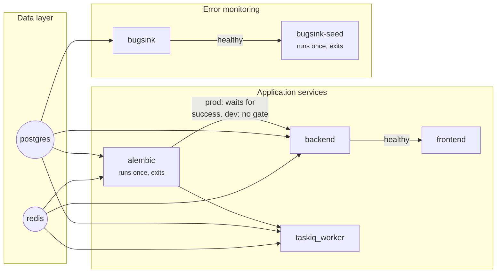

# Docker Overview

## Services

| Service | Image / build | Purpose |
|---|---|---|
| `postgres` | `postgres:15` | Primary database |
| `redis` | `redis:7` | Cache, rate limits, lockout counters, refresh-token jti registry, single-use tokens, taskiq broker |
| `backend` | `docker/backend.Dockerfile` | FastAPI app (uvicorn) |
| `frontend` | `docker/frontend.Dockerfile` (`dev` target locally, `production` target in prod) | React SPA — Vite dev server locally, nginx-served static build in prod |
| `taskiq_worker` | `docker/backend.Dockerfile` (same image as `backend`, different `command:`) | Consumes the email-sending task queue — see [Background Workers](../background-workers/taskiq.md) |
| `alembic` | `docker/backend.Dockerfile` (same image, one-shot) | Runs `alembic upgrade head` then exits; `backend`/`taskiq_worker` wait on its success in prod |
| `bugsink` | `bugsink/bugsink:2` (pulled, not built) | Self-hosted error monitoring, starts by default with `docker compose up`. See [Error Monitoring](../error-monitoring/overview.md) |
| `bugsink-seed` | `bugsink/bugsink:2` (same image, one-shot) | Runs once `bugsink` is healthy: creates its "MysticAuth" team/project (idempotent) and writes both DSN forms into the `bugsink_dsn` volume that `backend`/`frontend` read at their own startup — this is what makes error monitoring need zero manual project/DSN setup |

`backend`, `taskiq_worker`, and `alembic` all build from the **same** `docker/backend.Dockerfile` image with different `command:` overrides — keeps dependency versions and application code identical across all three roles by construction.

The `postgres` service also mounts `docker/postgres-init/` to `/docker-entrypoint-initdb.d/` — on a fresh volume only, it creates the separate `bugsink` database the service above uses, so it doesn't require a second Postgres container.

### Startup order

## Dockerfiles

- **`docker/backend.Dockerfile`** — two-stage build: a `builder` stage compiles native dependencies (`gcc`, `libpq-dev`) into an isolated venv; the runtime stage is `python:3.11-slim` with only `libpq5` (runtime client lib, not the dev headers), running as a non-root `app` user. Ships a `HEALTHCHECK` against `/health/ready` as a fallback for when the image runs outside Compose (Compose's own healthcheck, defined per-service, is what actually gates dependent-service startup).
- **`docker/frontend.Dockerfile`** — three stages: `dev` (default target — `node:20-bullseye`, Vite dev server with HMR, port 5173), `builder` (compiles the production bundle; takes `VITE_API_BASE_URL`/`VITE_APP_NAME`/`VITE_SENTRY_DSN`/`VITE_SENTRY_ENVIRONMENT` as build args, since this stage has no bind-mounted `frontend/.env` to read them from the way `dev` does — wired from the root `.env` via `docker-compose.prod.yml`'s `build.args`, see [Deployment Guide](../deployment/guide.md#required-production-environment-variables)), `production` (`nginx:1.27-alpine` serving the static build as a non-root `nginx` user, port 80, `HEALTHCHECK` via `wget`).
- **`docker/nginx.frontend.conf`** — SPA fallback to `index.html`, gzip, security headers (`X-Content-Type-Options`, `X-Frame-Options`, `Referrer-Policy`, CSP). No HSTS at this layer — by design, since TLS terminates in front of this container in a real deployment, not here (see [Security Hardening](../security/hardening.md#security-response-headers)).
- **`.dockerignore`** (repo root — the build context for both Dockerfiles above is `.`, not `backend/`/`frontend/` individually, so its patterns are written relative to the repo root) — excludes `backend/logs/` (real local request logs, previously leaking into the backend image — a real bug, not a hypothetical one, see [Security Decisions](../security/decisions.md#dockerignore-previously-let-local-files-leak-into-built-images)) and `**/`-recursive patterns for `__pycache__/`/`*.pyc`/`.pytest_cache/` (bare patterns without the `**/` prefix looked like they should already match at any depth but empirically didn't).

## Dev vs. production compose

| | `docker-compose.yml` (dev) | `docker-compose.prod.yml` |
|---|---|---|
| Frontend | Vite dev server, HMR, bind-mounted source | nginx serving the baked-in static build |
| Backend/worker | `--reload`, bind-mounted `./backend:/app` | No reload, code baked into the image |
| Restart policy | `restart: always` (postgres/redis only; backend/frontend/worker have none) | `unless-stopped` on every long-running service |
| Ports exposed | 5433 (postgres), 6380 (redis), 8000 (backend), 5173 (frontend) all published to host — non-default DB/cache host ports deliberately chosen to dodge the common local 5432/6379 collision; containers still reach each other at `postgres:5432`/`redis:6379` over the Docker network regardless | Only 8000 (backend) and 80 (frontend) published |
| `backend`/`taskiq_worker` startup gate | `postgres`/`redis` healthy | `postgres`/`redis` healthy **and** `alembic: service_completed_successfully` |

Both compose files assume a reverse proxy / TLS terminator sits in front of the stack in a real deployment — neither attempts to provision TLS itself. See [Deployment Guide](../deployment/guide.md).

## Healthchecks

| Service | Check | Notes |
|---|---|---|
| `postgres` | `pg_isready` | |
| `redis` | `redis-cli ping` | |
| `backend` | `GET /health/ready` via a Python one-liner (no curl in the slim image) | Confirms DB + Redis connectivity, not just process liveness |
| `frontend` (prod) | `wget` against `/` | |
| `frontend` (dev) | none | Acceptable for local dev — Vite's own dev server failure is immediately visible in the terminal |
| `taskiq_worker` | greps `/proc/*/cmdline` for `taskiq` | Overrides the inherited HTTP healthcheck from `backend.Dockerfile`, since the worker serves no HTTP and would otherwise always report unhealthy |
| `alembic` | none | One-shot; `service_completed_successfully` is the signal other services wait on, not a healthcheck |

## Validation results

Ran `docker compose up -d --build` (dev compose) from the repo root and verified the stack end-to-end (template-preparation pass):

- All five core services (`postgres`, `redis`, `backend`, `taskiq_worker`, `frontend`) reached a running state; `postgres`, `redis`, `backend`, `taskiq_worker` all reported `healthy` on their respective healthchecks (`frontend` dev has none, by design — see above).
- `alembic` ran the full migration chain successfully.
- `GET /health/ready` returned `{"status":"ok","checks":{"database":"ok","redis":"ok"}}`; `GET /` returned the `APP_NAME`-driven welcome message, confirming the env-driven app name reaches the running container.
- Frontend dev server responded `200` on `http://localhost:5173/`, and its `<title>` correctly resolved from `VITE_APP_NAME` via Vite's `%VITE_APP_NAME%` `index.html` substitution.
- `docker compose exec -w /repo backend python -m pytest tests/backend/mystic_auth/unit tests/backend/mystic_auth/integration tests/backend/mystic_auth/security` — all 522 tests passed.
- `npm run build` inside the `frontend` container succeeded (`tsc -b && vite build`), including after the promote-to-admin UI removal.
- Full auth surface exercised via real HTTP requests against the running stack (real Postgres + Redis, not mocks): signup, verification (token pulled from its real Redis key), login, `GET /auth/me` (PBAC-derived permissions, not role-derived), refresh rotation (`POST /auth/refresh/` — note the trailing slash), logout (subsequent `/auth/me` correctly 401s), password-reset request+confirm (login with the new password succeeded), the single bidirectional `PATCH /users/{email}/role` endpoint (moved a user `user` → `admin` → `user`), the now-removed `PATCH /users/{email}/promote-to-admin` correctly 404s, PBAC allow/deny (`GET /users/` 403 for a plain user, 200 for a system user), policy create/list/delete, and the PBAC audit log recording those decisions. Google OAuth2 was verified up to the redirect (`GET /auth/oauth2/login/google` returns a correct PKCE `code_challenge` + `state` against the real configured `client_id`) — completing the full round trip needs a live browser + Google consent, which wasn't exercised.
- `taskiq_worker` crash-looped for the first ~30 seconds against the fresh Redis Stream before self-stabilizing (`NOGROUP` error, auto-restarted by its own process-manager supervisor) — no task was lost. **Update from a later QA pass**: re-investigated by reading `taskiq-redis`'s actual source and reproducing against a genuinely fresh Redis container — the race does not reproduce with the currently pinned `taskiq-redis==1.2.3` (0 restarts observed). See [Background Workers: Taskiq](../background-workers/taskiq.md#startup-on-a-fresh-redis-instance) for the full investigation; the crash-loop described above likely reflected an older dependency version or a since-fixed detail of the worker command (the `--reload` flag mentioned in earlier notes has since been removed from the `taskiq_worker` command entirely).

`docker-compose.yml` no longer hardcodes `container_name`s or the default `5432`/`6379` host ports for `postgres`/`redis` (now `5433`/`6380`) — those are the two most common local collision points (a native Postgres/Redis install, or another Compose project using the same generic names) and this template should come up cleanly next to other local projects out of the box. Containers still reach each other at `postgres:5432`/`redis:6379` over the Docker network regardless of the host mapping.

### Error monitoring service — live verification

Bugsink starts by default with plain `docker compose up` now — the `--profile monitoring` flag used in this section's verification notes below predates that (it was opt-in at the time). No profile flag is needed today.

`docker compose --profile monitoring up -d bugsink` was verified against a fresh `postgres_data` volume: `docker/postgres-init/init-bugsink-db.sh` correctly created the separate `bugsink` database, Bugsink's own migrations ran clean against it, the configured superuser was created, the container reported `healthy` (`GET /health/ready` → `200`), and its login page responded (`GET /` → `302` redirect to login) at `http://localhost:8010`. Confirmed isolated from the app's own `mystic_auth` database — both live on the same `postgres` server/container, in separate databases.

Also verified live, end-to-end: a real HTTP request to a temporary route that raised an exception produced a genuine `500` response and the exact exception showed up as an Issue in Bugsink within seconds — confirming the whole chain (`main.py`'s `global_exception_handler` → `capture_exception` → `sentry-sdk` → network → Bugsink ingestion) actually works, not just that the pieces are individually configured. A malformed `SENTRY_DSN` was also confirmed *not* to crash the app (see [Security Decisions](../security/decisions.md#a-malformed-sentry_dsn-must-never-crash-the-app)).

**`bugsink-seed` auto-seeding — live verification.** Ran `docker compose --profile monitoring up bugsink-seed` against a healthy `bugsink`: it created the "MysticAuth" team/project via Bugsink's own Django ORM and wrote both DSN forms into the `bugsink_dsn` volume, printing the seeded project id/key to its own log. Re-ran it a second time — same project id and key came back (no duplicate team/project created), confirming `get_or_create` idempotency. Recreated `backend`/`frontend` afterward and confirmed (via `/proc/1/environ` inside each container, since `docker exec` itself only inherits the container's baseline `env_file` config, not what the entrypoint script exports into PID 1) that both processes picked up the seeded DSN with no manual restart. A real exception triggered against that DSN showed up as an Issue under the seeded project.

Needed one fix along the way: the image runs as a non-root user that can't write into a fresh named volume, so `bugsink-seed` runs with `user: root` (it's a short-lived one-shot container, not a long-running service). A second approach — having `backend/mystic_auth/core/settings.py` itself fall back to reading the seeded file whenever `SENTRY_DSN` came back empty — was tried and reverted: it broke `tests/backend/mystic_auth/unit/test_settings_unit.py::test_optional_fields_default_when_unset`, correctly catching a real design flaw (a leftover seeded file from a previous `--profile monitoring` run would silently re-enable monitoring even after a user explicitly cleared `SENTRY_DSN`, contradicting this doc's own "clear the var, it's off immediately" claim above). The one-off verification command below instead sources the seeded file only for that single command, leaving the app's own "empty `SENTRY_DSN` means off" rule untouched.

### Image content audit — files that shouldn't ship

A production-readiness review checked what actually ends up *inside* the built images, not just whether they build. Both of the following were found by building the image and listing its real contents (`docker run --rm <image> find ...`), not by inspecting the Dockerfiles/`.dockerignore` alone:

- **`backend/logs/`** (23MB of real local access-log data — request paths, timestamps, correlation IDs) was present in a freshly built backend image with no bind mount involved. Root cause and fix: [Security Decisions](../security/decisions.md#dockerignore-previously-let-local-files-leak-into-built-images).
- **`__pycache__/` directories** were present nested throughout `backend/app/**` and `backend/mystic_auth/**` despite `.dockerignore` listing `__pycache__/` — the bare pattern doesn't recurse the way it looks like it should; fixed with explicit `**/`-prefixed patterns. Re-verified after the fix: `find /app -iname "__pycache__"` on a fresh image returns nothing. (This predates the `mystic_auth/`+`app/` split — at the time, `backend/app/` was the whole codebase; see [Security Decisions](../security/decisions.md#dockerignore-previously-let-local-files-leak-into-built-images) for the original writeup.)
- The actual production frontend image (`nginx` stage, `docker/frontend.Dockerfile --target production`) was checked separately and found clean — it only ever receives `--from=builder /app/dist`, never the full source tree where these local-artifact leaks would apply.
- **`VITE_*` env vars were silently never reaching the production bundle** — found by building the `production` target with no build args (matching what `docker-compose.prod.yml` did before this was fixed) and inspecting the actual output: the browser tab title baked in as the literal string `%VITE_APP_NAME%` (Vite's own build log flagged this: `%VITE_APP_NAME% is not defined in env variables`), and the compiled `axiosInstance` chunk showed `apiBaseUrl: undefined` — meaning every API call from a production build would have gone out with no base URL at all. Root cause: the `builder` stage has no bind-mounted `frontend/.env` the way the `dev` target does, and `frontend/.env` itself is `.dockerignore`d from the build context, so Vite's env loading had nothing to read from. Fixed by adding `ARG`/`ENV` for the four `VITE_*` vars to `docker/frontend.Dockerfile`'s `builder` stage and wiring them as `build.args` in `docker-compose.prod.yml`, sourced from the root `.env` (see [Deployment Guide](../deployment/guide.md#required-production-environment-variables)). Re-verified after the fix: with real build args supplied, the title resolved correctly and `apiBaseUrl` was baked in as the real configured URL.

### QA & stability pass — live re-verification

A later pass re-ran the full live verification against the running stack (`docker compose up -d`) after fixing the four issues found by that pass's independent audit (see [Security Decisions](../security/decisions.md)): signup, duplicate-signup handling, pre-verification login rejection, account verification (single-use, and its JWT expiry now correctly matches its Redis TTL/emailed wording), login, refresh rotation, reuse detection (confirmed the whole session family is revoked, not just the reused token), logout, `logout/all`, password-reset request+confirm, the new self-service current-password requirement (rejected without it, accepted with the correct one), PBAC allow/deny, policy CRUD (create/read/update/history/delete), the authorization audit log, rate limiting/account lockout (429 after repeated failures), and OAuth2 PKCE initiation (correct `code_challenge`/`state`/`oauth_state` cookie). Both production Docker images (`docker/backend.Dockerfile`, `docker/frontend.Dockerfile --target production`) built and the frontend image was confirmed to actually serve (`200` from its nginx container). `pip-audit` and `npm audit --audit-level=high` both reported zero known vulnerabilities.
