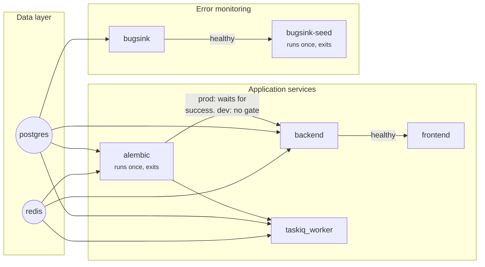

# Docker Overview

## Services

| Service | Image / build | Purpose |
|---|---|---|
| `postgres` | `postgres:15` | Primary database |
| `redis` | `redis:7` | Cache, rate limits, lockout counters, account/chain version counters, single-use refresh-token claims, Taskiq broker in Docker/self-hosted deployments |
| `backend` | `docker/backend.Dockerfile` | FastAPI app (uvicorn) |
| `frontend` | `docker/frontend.Dockerfile` (`dev` target locally, `production` target in prod) | React SPA: Vite dev server locally, nginx-served static build in prod |
| `taskiq_worker` | `docker/backend.Dockerfile` (same image as `backend`, different `command:`) | Consumes the email-sending task queue: see [Background Workers](../background-workers/taskiq.md) |
| `alembic` | `docker/backend.Dockerfile` (same image, one-shot) | Runs `alembic upgrade head` then exits. In prod, `backend` and `taskiq_worker` wait on its success |
| `bugsink` | `bugsink/bugsink:2` (pulled, not built) | Self-hosted error monitoring that starts by default with the stack. See [Error Monitoring](../error-monitoring/overview.md) |
| `bugsink-seed` | `bugsink/bugsink:2` (same image, one-shot) | Runs once `bugsink` is healthy. It creates the "MysticAuth" team/project idempotently and writes seeded DSNs into the `bugsink_dsn` volume. Locally, both backend and frontend DSN forms are written and read at startup. In prod, only the backend form is written because `frontend`'s `VITE_SENTRY_DSN` is baked in at image build time |

`backend`, `taskiq_worker`, and `alembic` all build from the same
`docker/backend.Dockerfile` image with different `command:` overrides. This
keeps dependency versions and application code identical across all three
roles.

The `postgres` service mounts `docker/postgres-init/` to
`/docker-entrypoint-initdb.d/`. On a fresh volume, it creates the separate
`bugsink` database, so Bugsink does not need a second Postgres container.

### Startup order


```mermaid
flowchart LR
    subgraph Data["Data layer"]
        postgres(("postgres"))
        redis(("redis"))
    end

    subgraph App["Application services"]
        alembic["alembic<br/><small>runs once, exits</small>"]
        backend["backend"]
        taskiq["taskiq_worker"]
        frontend["frontend"]
    end

    subgraph Monitoring["Error monitoring"]
        bugsink["bugsink"]
        bugsinkseed["bugsink-seed<br/><small>runs once, exits</small>"]
    end

    postgres --> alembic
    redis --> alembic
    alembic -->|"prod: waits for<br/>success. dev: no gate"| backend
    alembic --> taskiq
    postgres --> backend
    redis --> backend
    postgres --> taskiq
    redis --> taskiq
    backend -->|healthy| frontend
    postgres --> bugsink
    bugsink -->|healthy| bugsinkseed
```

---

## Dockerfiles

- **`docker/backend.Dockerfile`**: two-stage build: a `builder` stage compiles native dependencies (`gcc`, `libpq-dev`) into an isolated venv; the runtime stage is `python:3.14.6-slim` with only `libpq5` (runtime client lib, not the dev headers), running as a non-root `app` user. Ships a `HEALTHCHECK` against `/health/ready` as a fallback for when the image runs outside Compose (Compose's own healthcheck, defined per-service, is what actually gates dependent-service startup).
- **`docker/frontend.Dockerfile`**: three stages: `dev` (default target: `node:22.22.0-bullseye`, Vite dev server with HMR, port 5173, runs as root since the container needs to `npm install` against the bind-mounted `frontend/` and root avoids host/container UID mismatches on the bind mount: the `production` stage below is the one that runs as a non-root user), `builder` (compiles the production bundle; takes `VITE_API_BASE_URL`/`VITE_APP_NAME`/`VITE_SENTRY_DSN`/`VITE_SENTRY_ENVIRONMENT` as build args, since this stage has no bind-mounted `frontend/.env` to read them from the way `dev` does: wired from the root `.env` via `docker-compose.local-prod.yml`'s `build.args`, see [Deployment Guide](../deployment/guide.md#required-production-environment-variables)), `production` (`nginx:1.27-alpine` serving the static build as a non-root `nginx` user, port 80, `HEALTHCHECK` via `wget`).
- **`docker/nginx.frontend.conf`**: SPA fallback to `index.html`, gzip, security headers (`X-Content-Type-Options`, `X-Frame-Options`, `Referrer-Policy`, CSP). No HSTS at this layer: by design, since TLS terminates in front of this container in a real deployment, not here (see [Security Hardening](../security/hardening.md#security-response-headers)).
- **`.dockerignore`** (repo root: the build context for both Dockerfiles above is `.`, not `backend/`/`frontend/` individually, so its patterns are written relative to the repo root): excludes `backend/logs/` (real local request logs, previously leaking into the backend image: a real bug, not a hypothetical one, see [Security Decisions](../security/decisions.md#dockerignore-previously-let-local-files-leak-into-built-images)) and `**/`-recursive patterns for `__pycache__/`/`*.pyc`/`.pytest_cache/` (bare patterns without the `**/` prefix looked like they should already match at any depth but empirically didn't).

### Why `frontend` sets `pull_policy: build`

`frontend` is the only service in either compose file with both `image:`
(`mystic-auth-frontend:dev`/`:prod`) and `build:` set. Every other service
either only has `build:` (nothing to pull) or only has `image:` (postgres,
redis, bugsink, genuinely pulled from a registry). Without `pull_policy:
build`, Compose attempts a pull of `image:` first on every run, which
always fails (`pull access denied for mystic-auth-frontend, repository
does not exist`) since this tag is never published, before falling back to
building anyway. Harmless but noisy on every startup; `pull_policy: build`
skips straight to building.

---

## Dev vs. production compose

| | `docker-compose.yml` | `docker-compose.local-prod.yml` | `docker-compose.prod.yml` |
|---|---|---|---|
| Purpose | Local development | Production-style local or self-hosted run behind an external TLS layer | Internet-facing VPS-style deployment with Caddy-managed TLS |
| Frontend | Vite dev server, HMR, bind-mounted source | nginx serving the baked-in static build | nginx serving the baked-in static build, reached through Caddy |
| Backend/worker | `--reload`, bind-mounted `./backend:/app` | No reload, code baked into the image | No reload, code baked into the image |
| Restart policy | `restart: always` for Postgres/Redis only | `unless-stopped` on every long-running service | `unless-stopped` on every long-running service |
| Ports exposed | 5433 (Postgres), 6380 (Redis), 8000 (backend), 5173 (frontend), all on localhost-friendly dev ports | 8000 (backend) and 80 (frontend) published for a local reverse proxy or tunnel | Only 80/443 on Caddy. Postgres, Redis, backend, and frontend are internal-only |
| TLS | None | External terminator or tunnel | Caddy with automatic Let's Encrypt certificates |
| `backend`/`taskiq_worker` startup gate | Postgres and Redis healthy | Postgres and Redis healthy, plus `alembic: service_completed_successfully` | Postgres and Redis healthy, plus `alembic: service_completed_successfully` |

Use `docker-compose.local-prod.yml` when you want the production image/runtime shape but an external tool owns the public URL and TLS. Use `docker-compose.prod.yml` when the host itself should expose only Caddy on 80/443. See [Deployment Guide](../deployment/guide.md).

### Running a one-off command inside a container

**Shortcut: `scripts/docker/backend-exec.sh <command>` (Git Bash/WSL/Linux/macOS), `scripts\docker\backend-exec.ps1 <command>` (PowerShell), or `scripts\docker\backend-exec.cmd <command>` (Command Prompt)** run this whole section's recommended invocation for you -- both workarounds below baked in, both harmless no-ops on a platform that doesn't need them. Use these day to day; the raw command is spelled out below for when you need something the wrapper doesn't cover, or just want to understand what it's doing.

`docker compose exec -w /repo backend <command>` (used throughout this documentation to run tests against the whole repo: see [Testing Overview](../testing/overview.md)) runs `<command>` with its working directory set to `/repo` inside the container (the whole-repo bind mount: see `docker-compose.yml`'s `backend` service).

**On Windows, using Git Bash specifically:** this can fail with `OCI runtime exec failed: exec failed: Cwd must be an absolute path`, even though `/repo` clearly is one. Git Bash silently rewrites arguments that look like Unix paths into Windows paths before handing them to non-MSYS programs like `docker.exe`, which mangles `-w /repo` into something Docker no longer recognizes. Two ways around it, either works:

```bash
# Option 1: disable Git Bash's path rewriting for this one command
MSYS_NO_PATHCONV=1 docker compose exec -w /repo backend <command>

# Option 2: cd inside the container's own shell instead of using -w
docker compose exec backend bash -c "cd /repo && <command>"
```

This is specific to Git Bash's own path handling: PowerShell, Command Prompt, and native Linux/macOS terminals all run `-w /repo` as written, with nothing to work around.

**Running `pytest` specifically needs `--user root`, on native Linux.** `pytest.ini` writes coverage output (`.coverage`, `htmlcov/`) to the current working directory: `/repo`, the whole-repo bind mount: and that directory's actual ownership on disk is whatever owns the host's checkout, not the container's own non-root `app` user (same root cause as [why `/app/logs` is a named volume](#why-applogs-is-a-named-volume-not-part-of-the-backendapp-bind-mount), just for coverage's output files instead of the app's own log directory, and not something a single named-volume mount can carve out the way `/app/logs` could, since coverage's output isn't confined to one fixed path). Invisible on Docker Desktop for the same reason as always; a hard `PermissionError`/`INTERNALERROR` on native Linux otherwise:

```text
docker compose exec --user root -w /repo backend pytest tests/backend/
```

Running as root here is scoped to this one throwaway test invocation: it has no bearing on the actual application, which still runs as its normal non-root `app` user by default (`backend.Dockerfile`'s `USER app`) for every real request it serves. One minor side effect worth knowing on native Linux specifically: `.coverage`/`htmlcov/` end up root-owned on the host afterward, so a later `rm -rf htmlcov/` may need `sudo`. Docker Desktop (Windows/Mac) doesn't have this wrinkle either, for the same permissive-bind-mount reason as above.

---

## Healthchecks

| Service | Check | Notes |
|---|---|---|
| `postgres` | `pg_isready` | |
| `redis` | `redis-cli ping` | |
| `backend` | `GET /health/ready` via a Python one-liner (no curl in the slim image) | Confirms DB + Redis connectivity, not just process liveness. Budget is 10 retries / 30s start period (~130s total) rather than a tighter 5/10s (~60s): generous headroom for a genuinely cold first boot on modest or shared hardware. This is a secondary hardening, not the fix for the specific bug below: no healthcheck budget helps if the container is actually crash-looping. |
| `frontend` (prod) | `wget` against `/` | |
| `frontend` (dev) | none | Acceptable for local dev: Vite's own dev server failure is immediately visible in the terminal |
| `taskiq_worker` | greps `/proc/*/cmdline` for `taskiq` | Overrides the inherited HTTP healthcheck from `backend.Dockerfile`, since the worker serves no HTTP and would otherwise always report unhealthy |
| `bugsink` | `GET /health/ready` via a Python one-liner | Same reasoning as `backend`'s own check |
| `alembic` | none | One-shot; `service_completed_successfully` is the signal other services wait on, not a healthcheck |
| `bugsink-seed` | none | One-shot, same shape as `alembic`: creates the Bugsink project/DSN once, then exits 0 |

### Day-to-day: dev-up helpers

`docker compose up` (no `-d`) attaches to and interleaves *every* service's
full stdout/stderr into one stream: Postgres's own boot log, Alembic's
migration list, Bugsink's 100+ Django migrations, and (worst of it)
Bugsink's own healthcheck hitting `/health/ready` every 10 seconds,
forever, all mixed in with whatever you actually started the stack to look
at. None of that is useful once the stack is actually up.

Use the helper for your shell:

```bash
# Git Bash, WSL, Linux, macOS
./scripts/docker/dev-up.sh
```

```powershell
# PowerShell
.\scripts\docker\dev-up.ps1
```

```bat
rem Command Prompt
scripts\docker\dev-up.cmd
```

The helper script starts the stack detached, restarts `backend` and
`taskiq_worker` so their startup banners are fresh, waits for health checks,
prints one status line per service, and tails fresh logs from
`backend`/`frontend`/`taskiq_worker`. The tail includes startup banners, API
traffic, Vite output, and async email task execution.

The script records a timestamp before starting Compose and passes it to
`docker compose logs --since`, so old request or task activity is not replayed
as if it belonged to the current startup. If a service fails to come up, the
status table still prints and the script exits non-zero.

Because `backend`/`taskiq_worker` restart on every invocation, running the
helper a second time while it (or another copy of it) is already tailing
the same stack will restart both again because each invocation is independent.
In-flight requests or tasks may retry, and you should expect an extra boot
banner in that case.

It deliberately does **not** use `docker compose up --wait`, despite that
being the obvious built-in choice. `--wait` treats *any* exited container
as a failure to reach "running," with no exception for a one-shot job that
exited 0 on purpose. `alembic` and `bugsink-seed` (see the table above)
are exactly that. `--wait` reports this stack as failed on every single
successful start, because those two containers correctly finished and
exited. The dev-up helpers poll the long-running services' own status
text directly instead, entirely sidestepping that mismatch.

Plain `docker compose up` still has its place. Run it directly when you
want everything's full logs in one interleaved stream, e.g. actually
debugging Postgres/Bugsink/Alembic startup itself rather than the app.

### Why `/app/logs` is a named volume, not part of the `./backend:/app` bind mount

Dev's `backend` and `taskiq_worker` services bind-mount `./backend:/app` for
hot reload. `mystic_auth/logging/logging_config.py` writes to `/app/logs`.
Without a separate volume, that path would live inside the bind mount and be
owned by the host checkout owner, not the container's non-root `app` user.

Docker Desktop on Windows and macOS hides this because its bind mounts are more
permissive. Native Linux does not. A fresh clone has no `backend/logs/`
directory because it is gitignored, so the container's `app` user cannot create
it inside the host-owned bind mount. `os.makedirs()` then raises
`PermissionError` at import time before the app starts serving. This broke CI
the first time a job booted the dev Compose stack on a Linux runner.

The fix has two parts. `docker/backend.Dockerfile` creates `/app/logs` and
`chown`s it to the `app` user at build time. `docker-compose.yml` mounts a
Docker-managed volume, `backend_logs:/app/logs`, on top of that path for both
`backend` and `taskiq_worker`. Docker initializes a fresh named volume from the
image path, including ownership, so the app always writes to a directory owned
by the container user. The tradeoff is that `backend/logs/access.log` is no
longer directly readable from the host in dev. Use
`docker compose exec backend tail -f logs/access.log`, or
`docker compose logs backend` for WARNING and above.

---

## Validation history

Live verification notes live in their own doc so this page stays
reference-focused. See [Docker Validation History](validation-history.md).
