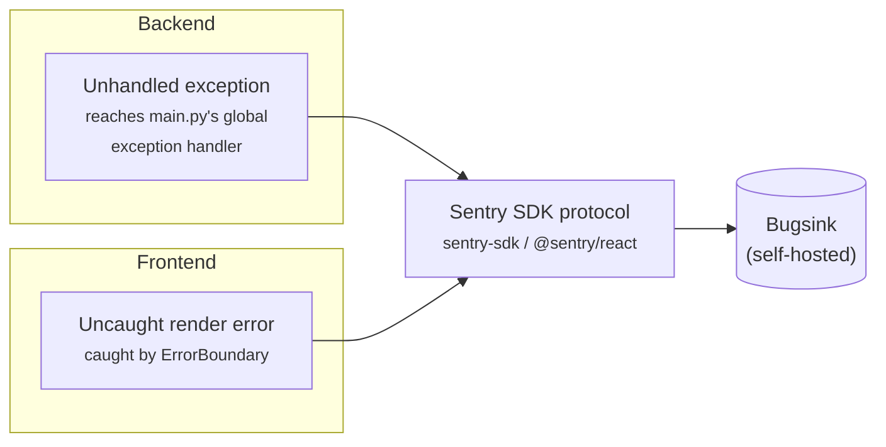

# Error Monitoring

Enabled by default via self-hosted Bugsink. This template ships the wiring to report unhandled backend exceptions and frontend render crashes to an error-tracking service — the Bugsink container starts automatically with `docker compose up` and the SDKs make zero calls only if you clear `SENTRY_DSN`/`VITE_SENTRY_DSN` yourself.

## Why Bugsink

Both the backend and frontend integrations speak the **Sentry SDK wire protocol** — the same protocol Sentry itself, [GlitchTip](https://glitchtip.com/), and [Bugsink](https://www.bugsink.com/) all implement. Nothing here is tied to Sentry-the-company specifically; only the SDK package names (`sentry-sdk`, `@sentry/react`) are.

This template documents **self-hosted Bugsink** as the default path, for reasons specific to what this template is:

- **This is an auth + PBAC template.** Error payloads (stack traces, request context) can carry emails and other PII. Self-hosting keeps that data on your own infrastructure instead of a third-party SaaS by default.
- **Lightweight.** Bugsink is a single Django app — no Redis, no Celery, no split frontend/backend containers. It reuses the same Postgres server this template already runs (a second database, not a second container — see `docker/postgres-init/init-bugsink-db.sh`).
- **No hard event cap that silently drops data.** Self-hosted, there's no monthly quota — you won't lose visibility into an incident right when a traffic spike would otherwise blow through a SaaS free tier's limit.
- **License**: Bugsink is [PolyForm Shield](https://polyformproject.org/licenses/shield/1.0.0/) — source-available, not OSI-approved open source. In plain terms: free to self-host and modify, with one restriction — you can't use it to build a *competing* error-tracking product. Using it to monitor errors in an unrelated app (this one) isn't a competing use, so this doesn't affect you or this template's own MIT license (Bugsink runs as a fully separate service you only talk to over HTTP — nothing from it is copied into or distributed with this repo).

Prefer Sentry's own hosted free tier instead? It works identically — see [Alternative: Sentry's hosted free tier](#alternative-sentrys-hosted-free-tier) below. Same SDK, same code, just a different DSN.

## Quickstart (self-hosted Bugsink)

No external account or sign-up is involved anywhere in this path — Bugsink is entirely self-hosted, and the only "credentials" are the superuser login you make up yourself in step 1. (Compare with [the Sentry-hosted alternative](#alternative-sentrys-hosted-free-tier) below, which does need a sentry.io account — that's the one path here that involves a third party.)

**`docker compose up` starts Bugsink by default** — see [Docker Overview: services](../docker/overview.md#services) for the full service breakdown. All you need to do is set the variables in step 1 below before your first `docker compose up`.

1. **Set the Bugsink-specific variables in `.env`** (see `.env.example`):

   ```bash
   BUGSINK_SECRET_KEY=<run: openssl rand -base64 50>
   BUGSINK_SUPERUSER_EMAIL=<your email>
   BUGSINK_SUPERUSER_PASSWORD=<a strong password>
   BUGSINK_BASE_URL=http://localhost:8010
   ```

   These configure the Bugsink *container* directly — they are unrelated to this app's own `Settings` class and never read by the backend/frontend themselves. `BUGSINK_BASE_URL` is what Bugsink uses to construct links back to itself (e.g. in any email it sends) — `http://localhost:8010` is only correct for local dev; update it to match wherever you're actually reaching Bugsink from (a LAN IP, a tunnel, a real hostname) if that's not `localhost`.

   **`BUGSINK_SECRET_KEY` specifically must be a real, long value.** Leave it as `.env.example`'s placeholder and the `bugsink` container crash-loops on startup (Django's own deploy check rejects short/low-entropy secret keys) — you'll see it endlessly restarting in `docker compose ps`/logs. This doesn't affect anything else: `backend`, `frontend`, and every other service start and work normally regardless, since nothing depends on `bugsink` being healthy. If you don't want error monitoring at all, either set a real key anyway (cheapest fix, `openssl rand -base64 50`) or run `docker compose stop bugsink bugsink-seed` to stop the restart loop.

2. **Start it** (part of the normal quickstart — no extra flag needed):

   ```bash
   docker compose up -d
   ```

   First boot runs Bugsink's own database migrations against the `bugsink` database (created automatically by `docker/postgres-init/init-bugsink-db.sh` — see that file's own comment if you're enabling this against an *already-initialized* `postgres_data` volume, since init scripts only run once, against a fresh volume) and creates the superuser from step 1.

3. **That's it — no manual project/DSN setup.** Once `bugsink` reports healthy, the one-shot `bugsink-seed` service (`docker-compose.yml`) runs automatically: it creates a "MysticAuth" team and project via Bugsink's Django ORM (idempotent — safe to run on every `up`), then computes both DSN forms itself and writes them to a small shared Docker volume that `backend`/`frontend` read from at their own startup:

   ```
   SENTRY_DSN=http://<key>@bugsink:8000/<id>        # backend: reaches Bugsink over the Docker network
   VITE_SENTRY_DSN=http://<key>@localhost:8010/<id> # frontend: reaches Bugsink from the browser, via its published host port
   ```

   (This two-host split — `bugsink:8000` internally vs. `localhost:8010` from the browser — used to be a manual, easy-to-miss trap when copy-pasting a single DSN Bugsink's UI showed you. `bugsink-seed` computes both forms directly from the project's id/key, so there's nothing to copy-paste or get wrong.) `backend`'s and `frontend`'s own `command:` in `docker-compose.yml` wait briefly (bounded at ~10s) for `bugsink-seed` to finish writing these before starting their real process, so a fresh `docker compose up -d` picks up monitoring with no restart needed. You can still log in at `http://localhost:8010` with the superuser credentials from step 1 to browse the "MysticAuth" project's Issues list directly.

4. **Verify it actually works** — don't just trust the config, trigger a real error and confirm it shows up in Bugsink's UI:

   ```bash
   docker compose exec backend sh -c '. /shared/bugsink-dsn/backend.env 2>/dev/null; python -c "
   import sentry_sdk
   from mystic_auth.error_monitoring.sentry_service import init_sentry, capture_exception
   import asyncio

   init_sentry()
   try:
       raise ValueError(\"manual verification error\")
   except ValueError as exc:
       asyncio.run(capture_exception(exc))
   sentry_sdk.flush(timeout=10)  # the SDK sends asynchronously — without an explicit
                                  # flush, this one-off script can exit before the
                                  # background transport thread gets to send anything
   "'
   ```

   (The leading `. /shared/bugsink-dsn/backend.env` sources the seeded `SENTRY_DSN` into this one-off shell — `docker compose exec` starts a fresh process using the container's baseline env, not whatever the running `backend` process's own entrypoint already exported into itself, so without this the DSN this command sees would be empty/stale even though the real app has the right one. Harmless no-op — `2>/dev/null` — if you've turned monitoring off by clearing `SENTRY_DSN`.)

   Open your project in Bugsink within a few seconds and confirm a `ValueError: manual verification error` Issue appeared. Delete it afterward from Bugsink's own UI (Issue → delete) — this is a one-time sanity check, not something to leave sitting in your issue list. (Deleting it via Django's ORM/shell directly, rather than Bugsink's own UI, can hit foreign-key errors from related tables it doesn't cascade through automatically — the UI's delete action handles this correctly, a raw ORM `.delete()` may not.)

To turn it off again: clear `SENTRY_DSN`/`VITE_SENTRY_DSN` (or just don't set them) — every capture call becomes a no-op immediately, no restart of Bugsink itself required. The `bugsink` container can keep running or be stopped independently (`docker compose stop bugsink bugsink-seed`), or removed from the stack entirely by deleting its service block from `docker-compose.yml`/`docker-compose.prod.yml` if you don't want it at all.

## Using Bugsink

Written for whoever's never touched Bugsink (or Sentry, or any error tracker like this) before — the concepts, not a pixel-perfect UI tour, since the UI itself is simple enough that "what am I even looking at" is the only real barrier.

- **Issues, not raw events.** Once error reporting is on, you don't watch a live feed — you open `http://localhost:8010` (or wherever `BUGSINK_BASE_URL` points) and check your project's **Issues** list when you actually want to know what's broken. An Issue is one *kind* of error, automatically deduplicated — the same exception happening 500 times shows up as one Issue with a count of 500, not 500 separate rows. That count, plus "first seen"/"last seen" timestamps, is usually enough on its own to tell a one-off blip from something actively breaking right now.
- **Opening an Issue** shows the exception type and message, the full stack trace (which file/line/function, down to the frame that actually raised it), and — for backend errors — the caller's email if `capture_exception` could resolve one from their session (see [User context](#user-context) below). There's no request-body/header dump beyond that; this integration deliberately doesn't send that (see [Security notes](#security-notes)).
- **Resolving an Issue** marks it as fixed — it moves out of your default "unresolved" view. If the exact same error happens again later, Bugsink reopens it automatically (a "regression") rather than silently starting a fresh, disconnected Issue — so resolving something is a real claim ("I fixed this"), not just archiving it.
- **Muting an Issue** is different from resolving: use it for something you've deliberately decided isn't worth fixing right now (a known third-party flake, noise from an edge case you're accepting) — it stays out of your unresolved view without claiming you fixed anything.
- **Projects and teams**: one Bugsink instance can hold multiple projects (e.g. if you later stand up another service pointed at the same Bugsink), each with its own DSN and its own Issues list, grouped under teams for who can see what. For a single-app setup like this template's default, one project is all you need.
- **You won't see anything until something actually breaks.** There's no seed data — a fresh project's Issues list is empty by design. If you want to confirm the pipe works before waiting for a real bug, use the verification command in step 4 above.

## What gets reported, and from where

| Layer | Trigger | Where |
|---|---|---|
| Backend | Any exception that reaches `main.py`'s global exception handler (i.e. anything not already turned into a normal HTTP error response by a route) | `backend/mystic_auth/error_monitoring/sentry_service.py::capture_exception` |
| Backend (manual) | Anything your own route/service code catches but still wants tracked | `capture_exception`, re-exported from `backend/app/sdk.py` |
| Frontend | An uncaught render error anywhere in the component tree | `frontend/src/mystic_auth/ui/ErrorBoundary.tsx` → `core/errorMonitoring.ts::reportError` |
| Frontend (manual) | Anything your own component/hook code catches but still wants tracked | `reportError`, re-exported from `frontend/src/app/sdk.ts` |
| Frontend (automatic) | Uncaught `window.onerror`/unhandled promise rejections | Sentry SDK's own default browser instrumentation, once initialized |

**Not reported automatically**: a normal `403`/`404`/validation error — those are expected API responses handled by the calling code (a toast, an inline `FormAlert`), not exceptions. Reporting every expected error response would drown out the events that actually indicate a bug.



## User context

The backend attaches the caller's email (read from their `access_token` cookie, best-effort — a missing/expired/invalid cookie just means no user context, never a failure to capture) so an error can be traced back to who hit it. Deliberately narrow: only an email is attached, not the SDK's broader automatic PII collection (request bodies, full cookie jars, etc.), which could otherwise capture credentials in transit — see `error_monitoring/sentry_service.py::init_sentry`'s own comment on `send_default_pii`.

## Security notes

- **Bugsink needs its own operational security**, same as Postgres/Redis already do in this stack — self-hosting only guarantees the *data* stays on your infrastructure, not that the service is automatically locked down. It has no host port exposed at all in `docker-compose.prod.yml` by default (unlike backend/frontend, which are meant to be internet-facing) — reaching it in production means an SSH tunnel, a VPN, or a reverse-proxy route you add deliberately, not something exposed by default.
- **Traces are 0% sampled** (`traces_sample_rate: 0` / `tracesSampleRate: 0`) — this integration is error capture only, not performance monitoring/tracing. No request-body/timing data is sent beyond what an actual captured exception includes.
- **`SECRET_KEY` vs. `BUGSINK_SECRET_KEY`**: these are two unrelated secrets for two unrelated purposes (this app's JWT signing key vs. Bugsink's own Django secret key) — never reuse one for the other.
- **A typo'd `SENTRY_DSN` can't take the app down.** `init_sentry()` runs at import time, before the app itself really exists — it deliberately catches any failure from `sentry_sdk.init()` (verified directly: a malformed DSN string does raise from the SDK) and logs a warning instead of letting it propagate, so a mistake in this one *optional* setting degrades to "monitoring is off" rather than "nothing works." See [Security Decisions](../security/decisions.md#a-malformed-sentry_dsn-must-never-crash-the-app).

## Alternative: Sentry's hosted free tier

Since the integration only depends on the Sentry SDK protocol, pointing it at Sentry's own hosted service instead of self-hosted Bugsink is purely a matter of using a different DSN — no code changes:

1. Create a free account at [sentry.io](https://sentry.io) and a project.
2. Copy that project's DSN into **both** `SENTRY_DSN` and `VITE_SENTRY_DSN` — identically this time. Sentry's hosted DSN is a real internet hostname (`https://<key>@o0.ingest.sentry.io/...`), reachable the same way from the backend container and the browser, so the self-hosted Bugsink split (step 4 above, `bugsink:8000` internally vs. `localhost:8010` from the browser) doesn't apply here.
3. You don't need the `bugsink` Docker service for this path — stop it (`docker compose stop bugsink bugsink-seed`) or remove its service block from `docker-compose.yml`/`docker-compose.prod.yml` if you'd rather not run it alongside a hosted DSN.

Trade-offs vs. self-hosted Bugsink: zero infrastructure to run/maintain, a more polished/mature UI — but error data (including any PII it contains) leaves your infrastructure, and the free tier caps at 5,000 events/month with events silently dropped past that (1 dashboard user).

## Alternative: GlitchTip

[GlitchTip](https://glitchtip.com/) is another real option if you outgrow Bugsink or prefer a fully OSI-approved-open-source (MIT) self-hosted alternative — same DSN-swap story, but heavier to run (needs Redis + Celery + a split frontend/backend on top of Postgres, vs. Bugsink's single container). Not documented step-by-step here since Bugsink already covers the "lightweight, self-hosted, license-compatible" niche this template optimizes for — but nothing in the integration code assumes Bugsink specifically.
