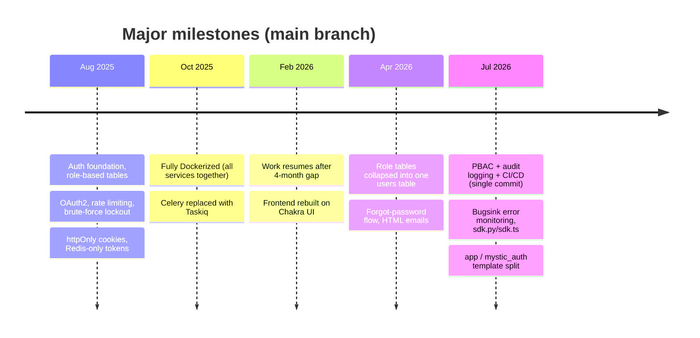

# Project Story

## Where this started

This project started because I got tired of rebuilding the same authentication and authorization pieces for different startup take-home assignments.

During 2025, while applying to startups, many take-home projects needed similar foundations with slightly different expectations — one needed email/password authentication, another needed OAuth2, another wanted RBAC. Each time, the actual product logic was slowed down because a large amount of time went into rebuilding the same authentication foundation.

The original idea was simple:

> Build auth + OAuth2 + a basic authorization layer once, then reuse it.

I assumed this would take a week or two. Almost a year later — on and off, between a master's programme and long gaps where I didn't touch it at all — it's still going, and it grew into a full template with PBAC, audit logging, CI/CD, and a real test suite instead of the small module I set out to build.

Authentication looks small from the outside — a login endpoint, a logout endpoint, maybe a token — but it quickly becomes its own engineering domain. The project expanded into understanding and implementing:

- refresh token rotation and reuse detection,
- session storage decisions,
- Redis-based session and token management,
- rate limiting,
- brute-force protection,
- cookie security,
- OAuth2 PKCE flows,
- background email delivery through asynchronous workers,
- database migrations,
- CI validation,
- frontend authorization handling.

What started as a shortcut for future projects became a project of its own.

---

## How it evolved

The commit history shows the real evolution, not a fully planned architecture from day one — 47 commits on `main`, from the first on 18 Aug 2025 to the most recent on 25 Jul 2026. There's a several-month gap between October 2025 and February 2026. Below, days committed back-to-back are grouped into one range; an isolated day stands on its own.



### Aug 18–23, 2025

The first version focused on authentication. It started with a bare FastAPI skeleton, then in quick succession: modular auth logic with role-based tables, OAuth2 plus rate limiting and brute-force protection, a refactor of the auth flow and role tables around standard security practices, and a logout-from-all-devices endpoint (both on the 21st), then role-based routes with `main.py`. The run closed with a move to generic, permission-injected routes and the first Alembic migration — and, the same day, the frontend's first commits: a bare TypeScript + React setup.

Rate limiting and brute-force protection showed up on day three, because security concerns became obvious while building the foundation — not because they were planned upfront.

### Aug 26–28, 2025

Tailwind CSS was tried and then replaced by plain CSS. The same day, modular slice/types/button/form files and `store.ts` were added. Auth route pages were wired into `App.tsx`, and all `axios` calls were centralized into a single API folder — the frontend's first pass at having a consistent shape.

The stretch that followed involved the biggest learning curve of the project so far.

### Aug 30 – Sep 2, 2025

Frontend imports were corrected and Tailwind re-added. Then HTTP-only cookies for tokens landed, and a basic OAuth2 flow started working end to end across frontend, backend, Redis, and Postgres — the first time all the moving pieces talked to each other. Auth code was modularized and a basic dashboard integrated into the frontend, and logout was reworked on both the frontend and backend, including component files for the logout/logout-all buttons.

### Sep 4–5, 2025

The token table was changed and cookie-setting modularized. The backend was fully commented, with the token CRUD corrected across its call sites (the single largest commit of this stretch, at ~2,000 changed lines). The OAuth2 service logic and the frontend's auth slice/API were updated to match.

### Sep 7, 2025

Single-device OAuth2 login and logout both worked end to end with the updated token logic.

### Sep 13–14, 2025

The logout-all handler was reworked — its own commit message notes "not done yet" — alongside a round of backend commenting. Then `TokenCRUD` and `UserCRUD` were both fully modularized.

### Sep 16, 2025

Logout logic was updated so `is_active` correctly flips to `false` on logout.

### Sep 18, 2025

The token table's field structure changed again — mostly a cleanup, with more lines removed than added as redundant fields were dropped.

### Sep 22–24, 2025

Token tables were removed entirely in favor of Redis-only token management (the last of these commits again flagged "not done yet" mid-migration). OAuth2 login was re-verified against the new logic, and logout/logout-all was confirmed working end to end. `UserCRUD` was updated alongside a new signup page, and the stretch closed with logging added across the backend.

This four-week stretch, from late August through late September, was where the project stopped being "just implementing features" and started being about the underlying security decisions. Questions like where tokens should live, how refresh-token reuse detection should work, and what logout-all should actually revoke became architectural decisions, not coding tasks.

### Oct 6, 2025

The app was fully Dockerized, with OAuth2 login and logout tested end to end inside containers. This was the first time backend, frontend, PostgreSQL, Redis, background workers, migrations, and environment configuration were all managed together as one system, instead of pieces run separately.

### Oct 10, 2025

Celery was replaced with Taskiq. Celery was considered first because it's widely used, but since the backend was built around async patterns, the worker model created friction. After comparing ARQ, Dramatiq, and Taskiq, Taskiq fit the async-first approach best. This was a large commit (61 files), and its own message admits it left "frontend issues" behind — the swap wasn't clean on the first pass, even though the actual requirement (reliably sending verification and password-reset emails) was simple.

### Oct 14, 2025

The frontend flickering issue from the Taskiq swap was resolved, with signup, login, logout, and logout-all all confirmed working again.

---

### Feb 21, 2026

Work resumed, after a roughly four-month gap, by fixing the OAuth2 login flow, which had drifted during the break.

### Feb 26–28, 2026

The UI was rebuilt on Chakra UI: the login page first, with Tailwind removed (the largest of the three commits, at ~2,000 changed lines), then signup, verify-account, and dashboard pages, and finally the dashboard updated to show real user details alongside a reworked signup page.

The frontend also moved toward feature-based organization, mirroring the backend: auth, dashboard, profile, policies, users administration, audit logging. Redux was still the frontend state management foundation at this point.

---

### Apr 12, 2026

Earlier role-based tables were collapsed into a single `users` table with a role enum — the authorization data model's first big simplification.

### Apr 14, 2026

Forgot-password frontend support and stronger backend password-reset validation landed first (the larger of the two commits, at ~2,400 changed lines), followed the same day by HTML email templates, a reset cooldown, and a fix for loading-state flashes in the UI.

---

## Architecture evolution

The architecture wasn't designed perfectly from the beginning. Early on, I explored different structures, including more traditional MVC-style approaches and layouts copied from examples found online.

As the project grew, a problem became obvious: authentication flows aren't isolated files. A single feature could involve API routes, schemas, services, handlers, database models, frontend pages, API clients, state management, and tests. When these pieces were spread across unrelated folders, debugging got harder, because understanding one flow meant jumping across many locations.

So instead of organizing only by technical type —

```text
controllers/
services/
models/
schemas/
```

— I moved toward grouping related behavior together, by feature instead of by layer.

Here's the structure right before the PBAC and Claude Code sprint — the last commit of the manual, ChatGPT-assisted era, on 14 Apr 2026 (the entry directly above):

```text
backend/
  app/
    api/
      auth_routes/
      user_routes/

    auth/
      current_user/
      login/
      logout/
      logout_all/
      oauth2/
      password_logic/
      password_reset_confirm/
      password_reset_request/
      refresh_token_logic/
      security/
      signup/
      token_logic/
      verify_account/

    core/
    database/
    logging/
    redis/
    scripts/
    taskiq_tasks/
    user_crud/
    user_table/

frontend/
  src/
    api/

    auth/
      current_user/
      login/
      logout/
      logout_all/
      oauth2/
      password_reset_confirm/
      password_reset_request/
      signup/
      verify_account/

    core/
    dashboard/
    store/
```

Grouping code around business flows, instead of forcing every feature across separate technical layers, made changes easier — everything needed for a feature lived close together. Changing login behavior meant working mostly inside the authentication area, not hunting across unrelated controller, service, and model folders.

This wasn't chosen because it's the only "correct" architecture. It was chosen because, for this project's size and workflow, it made the system easier to understand, debug, and extend. That decision mattered even more later, when the PBAC and Claude Code sprint below brought the biggest change yet.

---

### Jul 14, 2026

After a 3-month gap, the biggest change happened in a single commit: 364 files touched (+27,663/-8,184 lines), moving the project from a role-based authorization system to Policy-Based Access Control (PBAC). Instead of access being decided by a role column, authorization decisions are now based on assigned policies, allowed actions, resources, and optional conditions — roles became descriptive metadata rather than the source of truth for permissions. PBAC wasn't part of the original design; it was added once role-based access started showing its limits.

That same commit also added audit logging, security hardening, improved headers and middleware, stronger cookie/security handling, CI/CD pipelines, extensive backend and frontend testing, and complete documentation. The project moved from "a reusable auth module" into a complete authentication and authorization foundation in one pass, not incrementally. Frontend state management was redesigned too, in the same commit: Redux was replaced with Zustand for client state and TanStack Query for server state.

### Jul 18, 2026

Documentation was updated and a round of audit findings fixed, tightening up loose ends from the previous entry's big commit.

### Jul 20, 2026

`main` picked up Bugsink self-hosted error monitoring, an `sdk.py`/`sdk.ts` extension-surface pattern, a reorganization of `frontend/src/` (moving `components/`, `hooks/`, and `users_admin/` into feature folders like `auth/`, `authorization/`, `layout/`, `ui/`, and `users/`), and logout/rate-limiter fixes.

### Jul 25, 2026

Calling this "a template" only went so far while the template's own code and a real project's code would have lived in the same undifferentiated `backend/app/` and `frontend/src/` trees — there was no boundary marking which files were "the template" (safe to pull upstream updates into) versus "your project" (never touched by an update).

Both backend and frontend were split in two. `backend/mystic_auth/` and `frontend/src/mystic_auth/` hold the template's own internals going forward. A thin `backend/app/` / `frontend/src/app/` shell — entry point, routing, and a `sdk.py`/`sdk.ts` + `app_sdk.py`/`app_sdk.ts` re-export surface — is where project-specific code is meant to live and grow (see [Using This Repository as a Template](../template-usage.md) for the full mechanics). The test suite (`tests/backend/`, `tests/frontend/`) was restructured to mirror the same split — `mystic_auth/` for template-internals coverage, `app/` for the shell itself.

The docs got the same split, in the same pass: everything that used to live directly under `docs/` moved into `docs/mystic_auth/` (upstream's own reference documentation), and a new, empty-by-default `docs/app/` was added for a downstream project's own docs — the same "don't edit this, do edit that" boundary, just applied to documentation instead of code. A `scripts/sync-upstream.sh` script was also added, wrapping the whole fetch/review/merge dance from [Staying in sync with upstream template updates](../template-usage.md#staying-in-sync-with-upstream-template-updates) into one on-demand command.

---

## The tools that built it

The project was worked on across several months, with gaps in between — my master's programme started during this period, and there were stretches where I wasn't actively working on it.

### Aug 18, 2025 – Apr 14, 2026

Most of the early foundation — everything up through the single-`users`-table refactor and the forgot-password/email work — was built with ChatGPT-assisted coding, not by hand from a blank file. The loop looked like this:

- describe the problem to ChatGPT and get back an approach or a chunk of code,
- copy-paste that into VSCode,
- run the application and check whether it actually worked,
- when it didn't — or when the generated code didn't fit how the rest of the codebase was shaped — manually edit it: fix variable names, wire it into existing files, correct what ChatGPT got wrong or didn't know about the rest of the project,
- paste errors and results back into the conversation, and repeat.

So "manual" here means hand-editing and integrating ChatGPT's output, not writing everything from scratch. No tool read the codebase or applied changes directly; every change passed through me first. This was slower than an agentic workflow, but it meant every system decision was actually understood, since nothing landed without being read and adjusted first.

Working through ChatGPT's suggestions and then adjusting them to fit the real codebase is how I learned most of the underlying technologies during this period: Redis-based session management and token lifecycle design, Docker and multi-container setups, TypeScript, OAuth2/PKCE flows, background workers and Taskiq, security practices, frontend architecture decisions, and Redux-based state management.

Some concepts, like PBAC, weren't part of this original architecture at all — they came later, once the authorization redesign made the limits of role-based access obvious.

---

### Jul 14–25, 2026

Two days before the first commit of this stretch, I bought a Claude Code Pro plan to try it out. This wasn't one continuous stretch of work — it landed as four separate commits across eleven days (14th, 18th, 20th, 25th) — but all of them used the same tool, replacing the ChatGPT-and-VSCode loop from every earlier phase of the project.

The foundation and architecture already existed by this point, from the manual era. Claude Code's main advantage was cutting implementation friction: describe the desired change, review what it generated, correct decisions where needed, run tests, refine the result — much faster than copy-pasting between a chat window and an editor. The architecture decisions, trade-offs, and overall direction still came from the understanding I'd built over the earlier development; the tool changed how fast a change went from idea to working code, not what the system was supposed to do.

Across the four days: the 14th was the big one — PBAC, audit logging, security hardening, the Redux-to-Zustand/TanStack-Query migration, CI/CD pipelines, documentation, and 650+ tests, all in a single commit, because the existing feature-based architecture meant most of it could be added as new domains rather than a rewrite. Over that stretch, I hit the 5-hour usage window 2–3 times and used roughly 65% of my weekly quota. The 18th cleaned up documentation and a round of audit findings. The 20th added Bugsink error monitoring, an `sdk.py`/`sdk.ts` extension pattern, and a frontend folder reorganization. The 25th did the `app`/`mystic_auth` split described above, under "How it evolved" — separating the template's own code from project-specific code for the first time.

---

## Why it is a template now

Somewhere during the infrastructure and security work, this stopped being just a personal shortcut. The problems solved here — authentication, sessions, permissions, security controls, audit trails, email workflows, testing — come up in almost every application with users.

The point of this template isn't just saving development time. It's a starting point with documented architectural decisions, tested authentication flows, reusable authorization patterns, and security considerations already handled — so a new project can start from a stronger baseline and focus on the actual product being built, instead of rebuilding the same foundation again.

See [Using This Repository as a Template](../template-usage.md) for how to adapt it.
