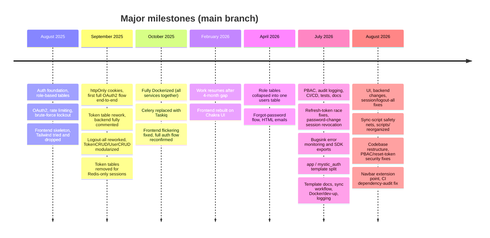

# Project Story

## Where this started

This project started because I got tired of rebuilding the same authentication and authorization pieces for different startup take-home assignments.

During 2025, while applying to startups, many take-home projects needed similar foundations with slightly different expectations: one needed email/password authentication, another needed OAuth2, another wanted RBAC. Each time, the actual product logic was slowed down because much time went into rebuilding the same authentication foundation.

The original idea was simple:

> Build auth + OAuth2 + a basic authorization layer once, then reuse it.

I assumed this would take a week or two. Almost a year later, after working on it on and off between a master's programme and long gaps where I didn't touch it at all, it's still going. It grew into a full template with PBAC, audit logging, CI/CD, and a real test suite instead of the small module I set out to build.

Authentication looks small from the outside: a login endpoint, a logout endpoint, maybe a token. It quickly becomes its own engineering domain. The project expanded into understanding and implementing:

- refresh token rotation and reuse detection,
- session storage decisions,
- Redis-based session and token management,
- rate limiting,
- brute-force protection,
- cookie security,
- OAuth2 PKCE flows,
- background email delivery through asynchronous workers,
- database migrations,
- CI validation,
- frontend authorization handling.

What started as a shortcut for future projects became a project of its own.

---

## How it evolved

The commit history shows the real evolution, not a fully planned architecture from day one. The first on 18 August, 2025 to the most recent on 8 August, 2026. There's a 4-month gap between October 2025 and February 2026. Below, days committed back-to-back are grouped into one range while an isolated day stands on its own.


```mermaid
timeline
    title Major milestones (main branch)
    August 2025: Auth foundation, role-based tables
            : OAuth2, rate limiting, brute-force lockout
            : Frontend skeleton, Tailwind tried and dropped
    September 2025: httpOnly cookies, first full OAuth2 flow end-to-end
            : Token table rework, backend fully commented
            : Logout-all reworked, TokenCRUD/UserCRUD modularized
            : Token tables removed for Redis-only sessions
    October 2025: Fully Dockerized (all services together)
            : Celery replaced with Taskiq
            : Frontend flickering fixed, full auth flow reconfirmed
    February 2026: Work resumes after 4-month gap
            : Frontend rebuilt on Chakra UI
    April 2026: Role tables collapsed into one users table
            : Forgot-password flow, HTML emails
    July 2026: PBAC, audit logging, CI/CD, tests, docs
            : Refresh-token race fixes, password-change session revocation
            : Bugsink error monitoring and SDK exports
            : app / mystic_auth template split
            : Template docs, sync workflow, Docker/dev-up, logging
    August 2026: UI, backend changes, session/logout-all fixes
            : Sync-script safety nets, scripts/ reorganized
            : Codebase restructure, PBAC/reset-token security fixes
            : Navbar extension point, CI dependency-audit fix
```

### 18 August, 2025 - 23 August, 2025

The first version focused on authentication. It started with a bare FastAPI skeleton, then in quick succession: modular auth logic with role-based tables, OAuth2 plus rate limiting and brute-force protection, a refactor of the auth flow and role tables around standard security practices, and a logout-from-all-devices endpoint (both on 21 August, 2025).

Then role-based routes landed with `main.py`, and the run closed with a move to generic, permission-injected routes plus the first Alembic migration. That same day, the frontend's first commits appeared: a bare TypeScript + React setup.

Rate limiting and brute-force protection showed up on day three because security concerns became obvious while building the foundation, not because they were planned upfront.

### 26 August, 2025 - 28 August, 2025

Tailwind CSS was tried and then replaced by plain CSS. Modular slice/types/button/form files and `store.ts` were added. Auth route pages were wired into `App.tsx`, and all `axios` calls were centralized into a single API folder: the frontend's first consistent shape.

### 30 August, 2025 - 2 September, 2025

Frontend imports were corrected and Tailwind re-added. Then HTTP-only cookies for tokens landed, and a basic OAuth2 flow started working end-to-end across frontend, backend, Redis, and Postgres: the first time all the moving pieces talked to each other. Auth code was modularized and a basic dashboard integrated into the frontend, and logout was reworked on both the frontend and backend, including component files for the logout/logout-all buttons.

### 4 September, 2025 - 5 September, 2025

The token table was changed and cookie-setting modularized. The backend was fully commented, with the token CRUD corrected across its call sites (the largest commit in this range, at ~2,000 changed lines). The OAuth2 service logic and the frontend's auth slice/API were updated to match.

### 7 September, 2025

Single-device OAuth2 login and logout both worked end-to-end with the updated token logic.

### 13 September, 2025 - 14 September, 2025

The logout-all handler was reworked alongside a round of backend commenting; its own commit message notes that the work was still in progress. Then `TokenCRUD` and `UserCRUD` were both fully modularized.

### 16 September, 2025

Logout logic was updated so `is_active` correctly flips to `false` on logout.

### 18 September, 2025

The token table's field structure changed again: mostly a cleanup, with more lines removed than added as redundant fields were dropped.

### 22 September, 2025 - 24 September, 2025

Token tables were removed entirely in favor of Redis-only token management (the last of these commits again flagged the migration as still in progress). OAuth2 login was re-verified against the new logic, and logout/logout-all was confirmed working end-to-end. `UserCRUD` was updated alongside a new signup page, and backend logging was added across the backend.

This four-week range, from late August through late September, was where the project stopped being "just implementing features" and started being about the underlying security decisions. Questions like where tokens should live, how refresh-token reuse detection should work, and what logout-all should actually revoke became architectural decisions, not coding tasks.

### 6 October, 2025

The app was fully Dockerized, with OAuth2 login and logout tested end-to-end inside containers. This was the first time backend, frontend, PostgreSQL, Redis, background workers, migrations, and environment configuration were all managed together as one system, instead of pieces run separately.

### 10 October, 2025

Celery was replaced with Taskiq. Celery was considered first because it's widely used, but since the backend was built around async patterns, the worker model created friction. After comparing ARQ, Dramatiq, and Taskiq, Taskiq fit the async-first approach best (ARQ was close, but Taskiq's FastAPI integration was cleaner). This was a large commit (61 files), and its own message admits it left "frontend issues" behind: the swap needed follow-up work, even though the actual requirement (reliably sending verification and password-reset emails) was simple.

### 14 October, 2025

The frontend flickering issue and the Taskiq swap was resolved, with signup, login, logout, and logout-all all confirmed working again.

---

### 21 February, 2026

Work resumed after the 4-month gap by fixing the OAuth2 login flow, which hadn't been fully solid before the break.

### 26 February, 2026 - 28 February, 2026

The UI was rebuilt on Chakra UI: the login page first, with Tailwind removed (the largest of the three commits, at ~2,000 changed lines), then signup, verify-account, and dashboard pages. The dashboard was updated to show real user details alongside a reworked signup page.

The frontend also moved toward feature-based organization, mirroring the backend: auth, dashboard, and profile. Redux was still the frontend state management foundation at this point.

---

### 12 April, 2026

Earlier role-based tables were collapsed into a single `users` table with a role enum: the authorization data model's first big simplification.

### 14 April, 2026

Forgot-password frontend support and stronger backend password-reset validation landed first (the larger of the two commits, at ~2,400 changed lines), followed the same day by HTML email templates, a reset cooldown, and a fix for loading-state flashes in the UI.

---

## Architecture evolution

The architecture wasn't designed perfectly from the beginning. Early on, I explored different structures, including more traditional MVC-style approaches and layouts copied from examples found online.

As the project grew, a problem became obvious: authentication flows aren't isolated files. A single feature could involve API routes, schemas, services, handlers, database models, frontend pages, API clients, state management, and tests. When these pieces were spread across unrelated folders, debugging got harder, because understanding one flow meant jumping across many locations.

So instead of organizing only by technical type:

```text
controllers/
services/
models/
schemas/
```

I moved toward grouping related behavior together, by feature instead of by layer.

This was the structure right before the PBAC and Claude Code sprint, in the last commit of the manual, ChatGPT-assisted era on 14 April, 2026:

```text
backend/
  app/
    api/
      auth_routes/
      user_routes/

    auth/
      current_user/
      login/
      logout/
      logout_all/
      oauth2/
      password_logic/
      password_reset_confirm/
      password_reset_request/
      refresh_token_logic/
      security/
      signup/
      token_logic/
      verify_account/

    core/
    database/
    logging/
    redis/
    scripts/
    taskiq_tasks/
    user_crud/
    user_table/

frontend/
  src/
    api/

    auth/
      current_user/
      login/
      logout/
      logout_all/
      oauth2/
      password_reset_confirm/
      password_reset_request/
      signup/
      verify_account/

    core/
    dashboard/
    store/
```

Grouping code around business flows, instead of forcing every feature across separate technical layers, made changes easier: everything needed for a feature lived close together. Changing login behavior meant working mostly inside the authentication area, not hunting across unrelated controller, service, and model folders.

This wasn't chosen because it's the only "correct" architecture. It was chosen because, for this project's size and workflow, it made the system easier to understand, debug, and extend. That decision mattered even more later, when the PBAC and Claude Code sprint below brought the biggest change yet.

---

### 14 July, 2026

After a 3-month gap, the biggest change happened in a single commit: 364 files touched (+27,663/-8,184 lines), moving the project from a role-based authorization system to Policy-Based Access Control (PBAC). Instead of access being decided by a role column, authorization decisions are now based on assigned policies, allowed actions, resources, and optional conditions. Roles became descriptive metadata rather than the source of truth for permissions. PBAC wasn't part of the original design; it was added once role-based access started showing its limits.

That same commit also added audit logging, security hardening, improved headers and middleware, stronger cookie/security handling, CI/CD pipelines, extensive backend and frontend testing, and broad documentation. The project moved from "a reusable auth module" into a broader authentication and authorization foundation in one large change, not incrementally. Frontend state management was redesigned too, in the same commit: Redux was replaced with Zustand for client state and TanStack Query for server state.

### 18 July, 2026

A couple of real session/token bugs (a roleless OAuth2 account getting logged out on refresh, a race condition in refresh-token rotation, an expired-token cleanup that never ran), a password-change flow that now asks for your current password and logs out other sessions, and a handful of smaller admin/config fixes were done. CI also got a real coverage gate and dependency scanning for the first time. This is roughly where `template-usage.md` and this file were first written, and the known-issues doc got trimmed down to what was still actually true.

### 20 July, 2026

Running the template against my other projects surfaced a couple of small logout and rate-limiter bugs, fixed here. That's the kind of thing real usage catches that reading the code alone wouldn't. Alongside that, self-hosted error monitoring landed via Bugsink, so real errors get logged somewhere instead of just showing up in server logs. The `sdk.py`/`sdk.ts` files were introduced too, a single file on each side that re-exports the pieces meant to be built on, so future code doesn't have to reach into the template's internals directly. The frontend also got reorganized into proper feature folders.

### 25 July, 2026 - 29 July, 2026

This range turned the repo from "reusable codebase" into a real template which mainly happened because of running the template against real downstream projects. The code was split into upstream-owned internals (`backend/mystic_auth/`, `frontend/src/mystic_auth/`) and thin project-owned shells (`backend/app/`, `frontend/src/app/`), with `sdk.py`/`sdk.ts` and `app_sdk.py`/`app_sdk.ts` as the extension surface. Docs and tests were split the same way, `scripts/upstream-sync/sync-upstream.sh` was added for future template updates, and the template-usage docs grew the ownership model, sync workflow, worked example, RBAC quickstart, and shared sidebar/CORS/nav extension points.

Caught an `sdk.ts` import bypass, an event-loop-blocking token signature, logout and rate-limiter bugs, a Bugsink Gunicorn timeout issue, a deployed OAuth redirect gotcha, and the stale `react-router-dom` package with an unpatched advisory, fixed by moving to `react-router` v8 and making npm audit blocking again. Docker and day-to-day operations were tightened too: `scripts/dev-up.sh` became the quieter default startup path, frontend Compose builds got `pull_policy: build`, `watch_for_late_dsn()` catches Bugsink's DSN after slow cold boots, backend logging became dev-readable and deployment-structured, and stale docs/comments/config were cleaned up. A resend verification email flow was added for users who tried to verify their account after the verification link had expired, the background email worker got terminal-visible logging, and a PowerShell dev-up bug got fixed so the startup logs it always promised actually showed up.

### 2 August, 2026 - 5 August, 2026

The template changed across UI, backend behavior, Docker, CI, tests, and documentation. The UI changed across account settings, dashboards, user management, policies, audit logs, shared tables, filters, pagination, and screenshots. Backend work expanded session management, audit data, user stats, token/session handling, typing, logging, and tests, and the codebase was split into smaller feature-shaped files where modules had grown too large. Active Sessions and Last Login now update immediately after login and logout-all via real-time session events, "me"-scoped query caches are cleared correctly so data can't leak between accounts in the same browser tab, and password changes keep the current device's session while revoking every other one. Docker and deployment coverage expanded with `docker-compose.local-prod.yml`, `docker-compose.prod.yml`, and `docker/Caddyfile`, alongside strict auth cookies, access-log rotation, and Compose validation.

Running a real upstream sync with Claude Code against another one of my projects surfaced four real gaps in `sync-upstream.sh`: a binary file mid-patch could make `git apply --3way` silently drop the rest of the diff while still looking like a normal result, nothing caught two migrations landing on the same alembic head, comment-only rewording upstream kept forcing the same conflict every sync, and Windows/Git Bash friction was still a manual workaround instead of just working. All four got fixed, `scripts/` was reorganized into `upstream-sync/`, `docker/`, and `db/` subfolders, and docs across the repo were updated to match.

### 7 August, 2026 - 9 August, 2026

A 202-file restructure renamed and relocated files across frontend and backend to match the feature-based layout, tests included, and split `user_management_routes.py` into lifecycle, query, and update route files. Assigning the system role now requires an explicit `users:assign_system_role` check instead of the broader `users:assign_role` permission alone, and password reset confirmation now uses a reset-scoped token check instead of the generic JWT verifier, which had accepted any validly-signed token for the target account.

The next day, `AppLayout` got an `extraNavbarContent` prop so downstream apps can add their own top-bar content the same way `extraNavItems` already lets them extend the sidebar, without touching `mystic_auth/` directly. A CI run around the same time also caught a high-severity `nanoid` advisory pulled in transitively through `vite`/`postcss`, resolved with `npm audit fix`. Toast notifications were also found overlapping the navbar's logout button, fixed by giving the toaster a top offset that clears the sticky navbar.

---

## The tools that built it

Two very different workflows built this project: a manual ChatGPT + VSCode loop for most of it, then an agentic coding loop with Claude Code from July 2026 on and Codex joining from the commit of 28 July, 2026 (Yeah, I hit my Claude Code weekly limit). The workflow details and diagram live in [The Tools That Built It](tools.md).

---

## Why it is a template now

Somewhere during the infrastructure and security work, this stopped being just a personal shortcut. The problems solved here, authentication, sessions, permissions, security controls, audit trails, email workflows, and testing, come up in almost every application with users.

The point of this template isn't just saving development time. It's a starting point with documented architectural decisions, tested authentication flows, reusable authorization patterns, and security considerations already handled, so a new project can start from a stronger baseline and focus on the actual product being built.

See [Using This Repository as a Template](../template-usage/overview.md) for how to adapt it.
