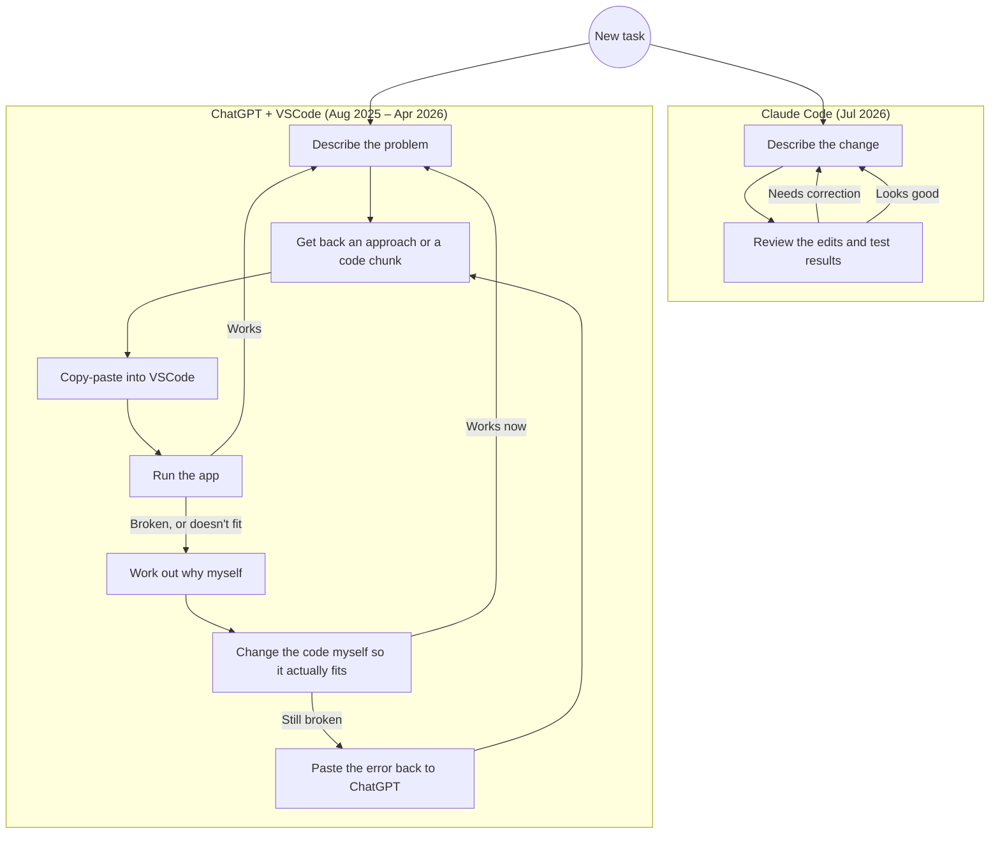

# The Tools That Built It

Companion to the [Project Story](README.md) — that page covers *what* happened and *when*; this one covers *how* the work actually got done, which changed partway through.

The project was worked on across several months, with gaps in between — my master's programme started during this period, and there were stretches where I wasn't actively working on it. Two different workflows built it, and they looked pretty different day to day:

## Aug 18, 2025 – Apr 14, 2026

Most of the early foundation — everything up through the single-`users`-table refactor and the forgot-password/email work — came out of the ChatGPT + VSCode loop above. "Manual" here means hand-editing and integrating ChatGPT's output, not writing everything from scratch — no tool read the codebase or applied changes directly, every change passed through me first. Slower than the Claude Code loop, but it meant every system decision was actually understood before it landed.

Working through ChatGPT's suggestions and adjusting them to fit the real codebase is how I learned most of the underlying technologies during this period: Redis-based session management, Docker and multi-container setups, TypeScript, OAuth2/PKCE flows, background workers, security practices, and Redux-based state management. Some concepts, like PBAC, weren't part of this original architecture at all — they came later, once role-based access started showing its limits.

---

## Jul 14–27, 2026

Two days before this stretch started, I bought a Claude Code Pro plan to try it out — the Claude Code loop above, replacing the ChatGPT + VSCode loop for the rest of the project. The first commit with it, on the 14th, was the big one: PBAC, audit logging, security hardening, the Redux-to-Zustand/TanStack-Query migration, CI/CD pipelines, documentation, and 650+ tests, all in one sitting, because the existing feature-based architecture meant most of it could be added as new domains rather than a rewrite. I hit the 5-hour usage window 2–3 times and used roughly 65% of my weekly quota just on that one commit.

Everything after that kept using the same tool, in smaller passes rather than one big sprint — each one is described in the [Project Story](README.md#how-it-evolved). The foundation and architecture already existed by this point, so Claude Code's main advantage was cutting implementation friction, not changing direction — the decisions and trade-offs still came from the understanding built over the earlier phase.
