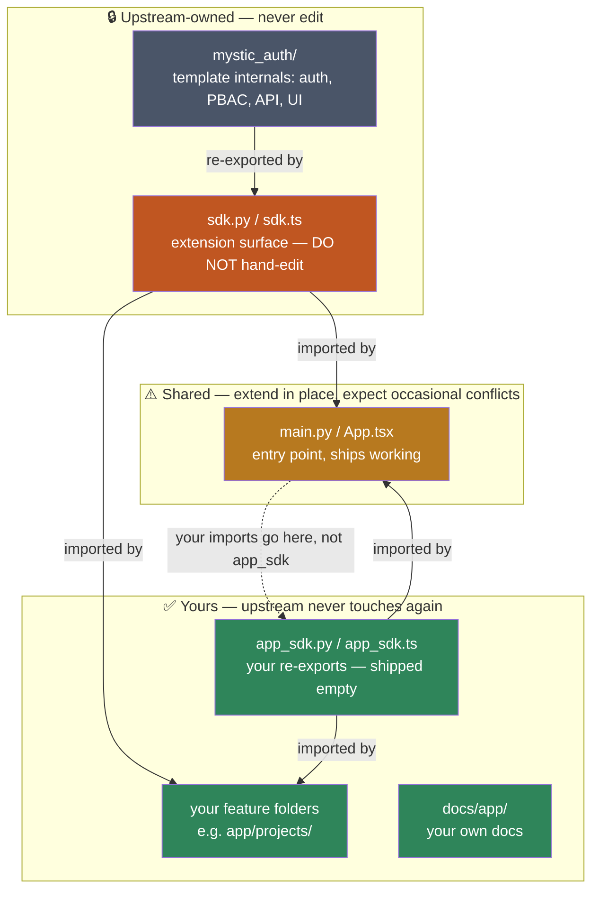

# Using This Repository as a Template

You've created your own repository from this template (via GitHub's **Use this template** button) to build your own product's authentication and authorization layer on top of it. This doc is a fast overview — what you get, how to run it, and where to make it yours. For how any specific piece actually works, see the rest of [`docs/`](README.md).

## What this template provides

- **Authentication**: email+password with Argon2 hashing, email verification, rate limiting + brute-force lockout, Google OAuth2 (PKCE), JWT access+refresh tokens as httpOnly cookies, refresh-token rotation with reuse detection, logout/logout-all, forgot/reset password. See [Authentication Overview](authentication/overview.md).
- **Authorization**: Policy-Based Access Control (PBAC), not RBAC. Every protected route is gated by an assigned `Policy` — not by a user's `role`. Policies are data (rows in Postgres), so a new access rule is a new policy, not a new deploy. See [PBAC Architecture](authorization/architecture.md).
- **Audit logging**: two append-only tables — security/session events, and every PBAC allow/deny decision. See [Database Design](database/design.md#why-two-audit-tables-not-one).
- **Frontend**: React 19 + TypeScript, Vite, Chakra UI v3, Zustand, TanStack Query. See [Frontend Architecture](architecture/frontend.md).
- **Infrastructure**: Docker Compose (dev + prod), PostgreSQL, Redis, Taskiq for async email, Alembic migrations, GitHub Actions CI.
- **Error monitoring**: self-hosted Bugsink, on by default with `docker compose up`. See [Error Monitoring](error-monitoring/overview.md).

## Quickstart

1. Click **[Use this template](https://github.com/Nachiket-2024/mystic-auth/generate)**, then clone *your* new repo.
2. `cp .env.example .env` — prefilled with working (fake) values, so this just works for local dev as-is. Only two things need real values before those specific features work: `GOOGLE_CLIENT_ID`/`GOOGLE_CLIENT_SECRET` ([OAuth setup](#oauth-setup-google)) and `FROM_EMAIL`/`GMAIL_APP_PASSWORD` ([Email setup](#email-setup)). Everything else runs fine without them.
3. `docker compose up` — brings up backend, frontend, Postgres, Redis, Taskiq, and Bugsink, migrations included.

Once it's up:

- **Backend docs**: [http://localhost:8000/docs](http://localhost:8000/docs)
- **Frontend**: [http://localhost:5173](http://localhost:5173)
- **Bugsink** (error monitoring): [http://localhost:8010](http://localhost:8010)
- **Taskiq** (background worker, e.g. sending emails): no UI or port — it just runs. See [Background Workers: Taskiq](background-workers/taskiq.md) if you want to watch its logs (`docker compose logs -f taskiq_worker`) or add your own tasks.
- Postgres/Redis are reachable on `localhost:5433`/`localhost:6380` (non-default host ports, to avoid clashing with anything else you have running locally).

Then create the reserved system superuser (one-time, CLI-only):

```bash
docker compose exec -it backend python -m mystic_auth.scripts.create_system_user
```

See root [`README.md`](../../README.md#-first-time-setup--creating-the-system-superuser) for the prompts.

## Environment configuration

Every setting is documented inline in [`.env.example`](../../.env.example) — treat that file as the source of truth, not this doc. `frontend/.env.example` only matters if you run the frontend locally with `npm run dev` instead of Docker.

To rename the app: set `APP_NAME` and `VITE_APP_NAME` in the root `.env`, then `docker compose up --build` (the frontend value is baked in at build time). Nothing else hardcodes a product name. CI keeps using its own placeholder `APP_NAME` regardless — that's expected, not something to sync.

## The `app/` + `mystic_auth/` split

Both backend and frontend are split into two trees, and every file in the repo falls into exactly one of three ownership tiers. This is purely a **file-path convention** — there's no tooling enforcing it (no `CODEOWNERS`, no merge driver), just a rule both this template and your own code agree to follow. Knowing which tier a file is in tells you whether you can edit it freely, should never edit it, or should expect the occasional merge conflict there.

| Tier | Files | Who edits it | Why |
|---|---|---|---|
| **Upstream-owned** — never edit | `backend/mystic_auth/`, `backend/app/sdk.py`, `frontend/src/mystic_auth/`, `frontend/src/app/sdk.ts`, `docs/mystic_auth/` | Only upstream | This is the template's actual implementation. Since you never touch it, every `scripts/sync-upstream.sh` merge applies here cleanly — there's nothing of yours for it to conflict with. |
| **Yours — upstream never touches it again** | `backend/app/app_sdk.py`, `frontend/src/app/app_sdk.ts`, `docs/app/`, root `README.md`, `SECURITY.md` | Only you | Upstream ships these once (`app_sdk.*` empty, the READMEs as generic starting points) and never edits them again in any future release. Since only you write to them, they never conflict either. |
| **Shared — extend in place, expect occasional conflicts** | `backend/app/main.py`, `frontend/src/app/App.tsx` | Both, over time | These have to ship as real, working code (an entry point that mounts routers, a router that renders routes) — they can't start empty the way `app_sdk.*` does. You're expected to extend them (register your own router, add your own `<Route>`), and upstream may also touch them later (e.g. a middleware-ordering fix). This is the one place a sync merge can genuinely conflict, and it's a normal, expected part of syncing when it happens. |



`sdk.py`/`sdk.ts` re-export the pieces you're meant to build on (`require_authorization`, `Permission`, `useAuthorization`, `ProtectedRoute`, the shared `api` client, and more) — import from there, not from internal `mystic_auth/` paths directly.

Your own new feature folders (`backend/app/projects/`, `frontend/src/app/projects/`) are effectively a fourth, unlisted case: upstream has no idea they exist, so they behave like the "yours" tier automatically, with no path convention needed.

## Frontend customization

- **Theme**: `frontend/src/mystic_auth/theme/system.ts` — change the `brand` color scale to re-skin the app.
- **Pages**: `frontend/src/mystic_auth/` is organized one folder per feature (`auth/`, `dashboard/`, `profile/`, `users/`, `policies/`, `audit_log/`). See [Frontend Architecture](architecture/frontend.md#module-layout).
- **Routing**: declared in `frontend/src/app/App.tsx` — add a `<Route>`, wrapped in `ProtectedRoute`.
- **State**: Zustand (`frontend/src/mystic_auth/store/`) for client state, TanStack Query for server state — both re-exported from `sdk.ts`.
- **Your own code** lives under `frontend/src/app/` (e.g. `frontend/src/app/projects/`), importing template pieces via `sdk.ts`/`app_sdk.ts`.

## Backend customization

- **New domain/resource**: a new top-level package under `backend/app/` (sibling to `mystic_auth/`) with its own model/schema/CRUD/router, mounted in `backend/app/main.py`, importing from `backend/app/sdk.py`. See [Backend Architecture](architecture/backend.md#module-layout) for the shape to follow.
- **Database changes**: an Alembic migration under `backend/alembic/versions/` — no `create_all()`. See [Database Design](database/design.md#migrations).
- **Configuration**: settings live in `backend/mystic_auth/core/settings.py` — add new ones there, re-exported from `sdk.py` as `settings`.

## PBAC usage

Protecting a route always goes through `require_authorization(action, resource_type)` — never a role check:

```python
from fastapi import APIRouter, Depends
from sqlalchemy.ext.asyncio import AsyncSession
from app.sdk import require_authorization, Permission, database

router = APIRouter(prefix="/projects", tags=["Projects"])

@router.get("/")
async def list_all_projects(
    current_user: dict = Depends(require_authorization("projects:list_all", "projects")),
    db: AsyncSession = Depends(database.get_session)
):
    return await project_crud.get_all(db)
```

`resource_type`/`action` don't need to be `Permission` enum values — any string works, granted via a policy (see [Writing and Testing Policies](authorization/writing-testing-policies.md#policy-creation-workflow)). Only add a `Permission` enum member if the action is sensitive enough to need the privilege-escalation guard (see [Adding New Permissions](authorization/adding-permissions.md)).

## Replacing the frontend entirely

The backend is a stateless JSON API with no frontend-specific coupling — deleting `frontend/` and building a different client against it is supported. It expects cookie-based JWT auth (`access_token` + `refresh_token`, both httpOnly/secure/`SameSite=Strict`) from an origin matching `FRONTEND_BASE_URL`. Full route contract: [API Reference](api/reference.md).

## OAuth setup (Google)

1. Create an OAuth 2.0 Client ID in the [Google Cloud Console](https://console.cloud.google.com/apis/credentials) (Web application type).
2. Add an authorized redirect URI matching `GOOGLE_REDIRECT_URI` exactly (scheme, host, path, trailing slash all matter).
3. Fill in `.env`: `GOOGLE_CLIENT_ID`, `GOOGLE_CLIENT_SECRET`, `GOOGLE_REDIRECT_URI` (e.g. `http://localhost:8000/auth/oauth2/callback/google` locally).

See [OAuth2 / PKCE](authentication/oauth2-pkce.md) for the mechanics and troubleshooting.

## Email setup

| Variable | Purpose |
|---|---|
| `FROM_EMAIL` | The Gmail account sending mail (also the SMTP username) |
| `GMAIL_APP_PASSWORD` | A Gmail [App Password](https://myaccount.google.com/apppasswords) (needs 2FA enabled) |
| `SUPPORT_EMAIL` | Optional `Reply-To`, falls back to `FROM_EMAIL` |

Without these, signup/verification/reset emails just fail to send (logged, retried 3 times) — the rest of the app keeps working. See [Background Workers: Taskiq](background-workers/taskiq.md).

## Deployment

See the [Deployment Guide](deployment/guide.md) for prod Compose topology, required env vars, migrations, backups, and low-cost hosting options. Production Compose file: [`docker-compose.prod.yml`](../../docker-compose.prod.yml).

## Staying in sync with upstream template updates

"Upstream" just means the original mystic-auth template repo — the one you clicked **Use this template** on. Every so often it gets new fixes or features, and you can pull those into your own project whenever you want.

**Before anything else, the thing most people worry about here: this will not fill your project's history with the template's own commits.** Your `git log` stays exactly what it's always been — just your own commits — plus, after a sync, one extra commit for whatever you just pulled in. Upstream's own commit-by-commit history (all the work that went into building this template) never gets attached to your project at all, no matter how many times you sync over the life of your project. What follows is purely about *file changes* landing in your project, not upstream's history becoming part of it.

If you've never done this before — pulled updates from a "template" repo into your own project — that's fine, it's not a common everyday git workflow. Nothing below requires git knowledge beyond `git add` and `git commit`. Just follow the steps in order.

---

### Step by step

#### Step 1 — Check that you don't have unsaved work

```bash
git status
```

If this lists any files, save your work first — either commit it normally, or run `git stash` to set it aside temporarily. Why: the next steps will write changes into your project files, and if you also have your *own* unsaved changes sitting there at the same time, it gets confusing to tell which change came from where. Starting clean avoids that.

#### Step 2 — Run the sync script

Do this from the main folder of your project (the repo you created from **Use this template**). If you're on Windows, use **Git Bash** or **WSL** to run it, not PowerShell or the regular Command Prompt — it's a bash script and won't run there.

```bash
./scripts/sync-upstream.sh
```

The very first time you run this, it also quietly sets up a second connection to the original template repo (git calls this a "remote", and this one's named `upstream`) — that's just so the script knows where to download updates from. It does not touch your existing GitHub connection (`origin`) and does not push or upload anything anywhere. It only downloads.

#### Step 3 — Read what it found, and say yes or no

You'll see something like this printed:

```
Incoming commits from upstream/main:
a1b2c3d Add rate limiting to login
9f8e7d6 Fix OAuth redirect edge case

Sync these into the current branch now? [y/N]
```

That's the list of what's new upstream since you last synced (or ever, if this is your first time). Type `y` and press Enter if you want to bring those changes in. Type `N` (or just press Enter) if you'd rather wait — nothing will be changed, and you can run the script again later whenever you're ready.

#### Step 4 — The script copies upstream's changes into your files

This step is fully automatic — you don't type or decide anything here. For almost every file, this just quietly works: your code and upstream's code are kept in separate files/folders by design (see the ownership table above), so there's usually nothing to fight over. When it's done, one of two things will have happened:

- Everything applied without a problem → go to **Step 5**.
- It hit what's called a "conflict" → go to **Step 6**.

#### Step 5 — Clean sync: you're basically done

You'll see normal `git commit` output on screen, ending with a message confirming the sync succeeded. Skip ahead to **Step 7**.

#### Step 6 — Conflict: resolve it

A "conflict" just means: you had made your own edit to a line, and upstream also changed that same line — so git can't automatically decide which version should win, and needs a human (you) to pick. This can only ever happen in two files in the whole project, `backend/app/main.py` or `frontend/src/app/App.tsx`, and only if you genuinely edited the exact same lines upstream did — for most syncs it never happens at all. You'll see something like:

```
Conflicts staged above -- resolve them in your working tree, then:
  git add <resolved files>
  git commit -m "Sync upstream template updates (mystic-auth@<sha>)"
```

To fix it:

1. Open the file it mentions in your editor.
2. Look for blocks marked with `<<<<<<<`, `=======`, and `>>>>>>>` — this is git showing you both versions of the same spot: your version above the `=======`, upstream's version below it.
3. Decide what the combined result should look like — almost always this means **keeping both** changes, just written one after another — then delete the `<<<<<<<`/`=======`/`>>>>>>>` marker lines themselves.
4. Save the file, then run the two commands the script printed for you (shown above): `git add <the file>`, then `git commit -m "..."` with the message it suggested.

See [Resolving a conflict in `main.py` / `App.tsx`](#resolving-a-conflict-in-mainpy--apptsx) below for a full worked example with real code, if you want to see one before you hit this for real.

#### Step 7 — Rebuild and test before you trust any of it

Even a sync that applied with zero conflicts can quietly change how the app behaves, so don't skip this:

```bash
docker compose up -d --build
docker compose exec -w /repo backend python -m pytest tests/backend/mystic_auth/unit tests/backend/mystic_auth/integration tests/backend/mystic_auth/security
```

#### Step 8 — Push whenever you're happy with it

At this point you just have one new, ordinary commit sitting on top of your project's history — same as any commit you'd normally make. Push it to your branch, or open your own internal pull request to have a teammate look it over first — entirely up to you, same as any other change. There's no PR or step required back against the original template repo; the sync only ever pulls, it never pushes anywhere.

---

<details>
<summary>How it stays fast and accurate even after 20+ syncs (optional, for the curious)</summary>

Behind the scenes, the script keeps a small tracked file, `.mystic-auth-sync-state`, containing the exact upstream commit you last synced to — updated automatically every time you sync, right alongside the sync commit itself. Each new sync uses that file to look at only what changed upstream *since then*, rather than re-checking your entire codebase from scratch every time. That's what keeps the "what's new" list accurate and keeps unrelated files from ever being flagged, no matter how many releases you've already pulled in. You never read or edit this file yourself — just don't delete it. If it ever does go missing, the next sync safely falls back to checking everything from scratch (same as a first sync) rather than breaking.

</details>

`scripts/sync-upstream.sh` itself is upstream-owned, same rule as [the rest of `mystic_auth/`](#the-app--mystic_auth-split) — don't hand-edit it. If you're contributing a change to the sync mechanism itself, `scripts/test-sync-upstream.sh` regression-tests it end-to-end against throwaway fake repos, without touching this repo's own history — run it after any change to `sync-upstream.sh`.

---

### Resolving a conflict in `main.py` / `App.tsx`

Before running the sync, it's worth keeping a throwaway copy of these two files (`cp backend/app/main.py /tmp/main.py.bak`, or just note the output of `git diff HEAD~<n> -- backend/app/main.py` if you know when you last edited it) — cheap insurance so you have something to compare against if a merge does something unexpected. `git stash` works too, if you'd rather not touch anything until after the merge.

Most of the time this isn't even a real conflict: if your router registration is on its own line and upstream's change landed elsewhere in the file, git applies both changes automatically — you won't see a conflict marker at all. A real conflict only happens when both sides touch the exact same lines, e.g. you both added a new router registration right after the same existing one:

```python
app.include_router(health_router)
<<<<<<< HEAD
app.include_router(projects_router)          # yours
=======
app.include_router(some_new_upstream_router)  # upstream's
>>>>>>> upstream/main
```

Resolve it like any git conflict: decide what the merged result should be — almost always **both** lines — delete the `<<<<<<<`/`=======`/`>>>>>>>` markers, then continue. Neither sync path (squash merge or incremental apply) leaves an in-progress merge state, so "continue" just means staging and committing yourself — there's no `git merge --continue` or `git apply --continue` to run:

```python
app.include_router(health_router)
app.include_router(some_new_upstream_router)
app.include_router(projects_router)          # yours
```

```bash
git add backend/app/main.py
git commit -m "Sync upstream template updates (mystic-auth@<sha>)"
```

Same process for `App.tsx`'s route list. After committing, rebuild and re-run the test suite before trusting it — see [Testing Overview](testing/overview.md).

## Where to go next

- New to the codebase? Start at [`docs/mystic_auth/README.md`](README.md) for the full index.
- Building a protected feature? [Adding New Permissions](authorization/adding-permissions.md) → protect the route (above) → [Writing and Testing Policies](authorization/writing-testing-policies.md).
- Something not behaving as documented? [PBAC Troubleshooting](authorization/troubleshooting.md).

## Getting help

Search [existing Issues](https://github.com/Nachiket-2024/mystic-auth/issues) first, then open a new one with clear repro steps. PRs welcome. **Found a security vulnerability?** Don't open a public Issue — see [SECURITY.md](../../SECURITY.md).
